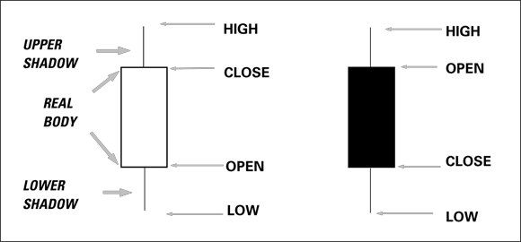
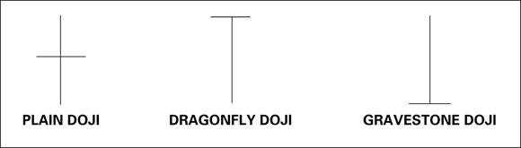
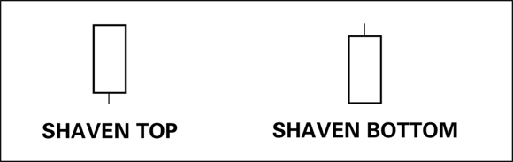
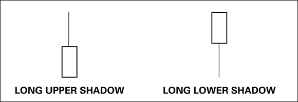
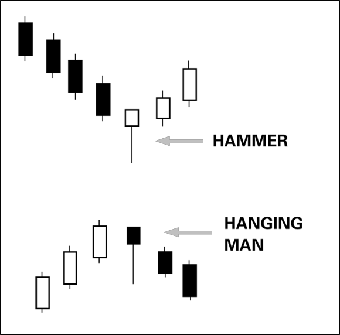
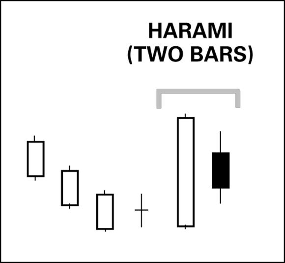
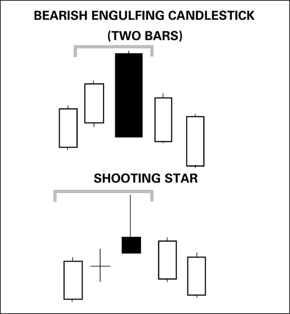
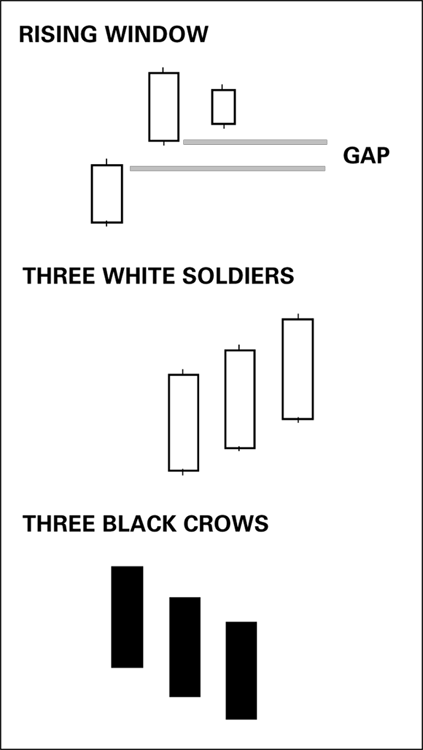

# Candlestick Charting

## Definition

Candlestick charting is a method of displaying price bars that emphasizes the open-to-close range (the **real body**) rather than the high-to-low range used in standard bar charts. Developed in Japan approximately 250 years ago for rice market trading, it was introduced to Western traders by Steve Nison in 1990 (source: TA4D 2020). Named patterns — numbering in the dozens — encode trader sentiment directly in the bar's shape and color.

## Why It Matters For Trading

- Visually compelling: the real body color (white = bullish, black = bearish) and shadow lengths immediately convey who won the day's battle between bulls and bears.
- Candlestick patterns excel at identifying **strategic turning points** — reversals from uptrend to downtrend or vice versa — often earlier than standard bars (source: TA4D 2020).
- Pattern names (e.g., "hanging man," "gravestone doji") are memorable and contain interpretive seeds.
- Patterns are widely known, so market participants tend to act on them, creating partial self-fulfillment.
- Usable with any other indicator (moving averages, oscillators, channels) without modification.

## Anatomy of a Candlestick

| Component | Description |
|-----------|-------------|
| **Real body** | Box from open to close. Width is fixed; height encodes conviction. |
| **White / hollow body** | Close > open — bulls won. Longer body = stronger bullish sentiment. |
| **Black / filled body** | Close < open — bears won. Longer body = stronger bearish sentiment. |
| **Upper shadow (wick)** | Thin line above the body from body top to session high. |
| **Lower shadow (tail)** | Thin line below the body from body bottom to session low. |

**Context is crucial.** A single candlestick gains most of its meaning from the bars that precede it. One small white bar inside a sea of black bars signals only a minor bull win, not a trend reversal (source: TA4D 2020).

## Single-Bar Patterns

### Doji

A doji has no real body (or a negligibly small one): open ≈ close. It signals **indecision** — neither bulls nor bears achieved dominance. On its own a doji is neutral; its significance depends entirely on placement within the surrounding trend (source: TA4D 2020).

| Doji Type | Shape | Signal |
|-----------|-------|--------|
| **Plain doji** | Cross — equal shadows both directions | Pure indecision; watch context |
| **Dragonfly doji** | T-shape — long lower shadow only | Sellers drove price down but buyers recovered it; **bullish signal** in a downtrend |
| **Gravestone doji** | Inverted T — long upper shadow only | Buyers pushed price up but sellers drove it back; **bearish signal** in an uptrend |
| **Bearish doji star** | Doji immediately after a big white bar in an uptrend | Buyers exhausted; reversal likely |
| **Bullish doji star** | Doji immediately after a big black bar in a downtrend | Sellers exhausted; reversal likely |

### Shaven Top and Shaven Bottom (Marubozu Candles)

When a shadow is entirely absent, the open or close was exactly at the session extreme.

| Pattern | Condition | Sentiment |
|---------|-----------|-----------|
| **Shaven top — close at high** | White bar, no upper shadow | Strongly bullish — buyers dominated to the close |
| **Shaven top — open at high** | Black bar, no upper shadow | Doubly bearish — selling commenced at the open with no recovery |
| **Shaven bottom — open at low** | White bar, no lower shadow | Strongly bullish — bulls dominated from the open |
| **Shaven bottom — close at low** | Black bar, no lower shadow | Doubly bearish — bears held control all day |

### Long Shadows

When a shadow equals or exceeds the real body length, traders expressed a sentiment extreme but **failed to sustain it** — interpretation requires context (source: TA4D 2020).

| Shadow | In an uptrend | In a downtrend |
|--------|---------------|----------------|
| **Long upper shadow** | Failure to close near high; uptrend at risk, especially if following a doji | Buyers emerging; downtrend may be ending |
| **Long lower shadow** | Sellers found support but buyers kept the close off the low; potential deceleration warning | Failure to close near low; downtrend weakening, especially near support |

## Multi-Bar Emotional Patterns

### Hammer and Hanging Man

Both feature a **small real body** near the top of the session range with a **long lower shadow** and little or no upper shadow. The pattern's meaning flips depending on placement (source: TA4D 2020).

| Pattern | Placement | Interpretation |
|---------|-----------|----------------|
| **Hammer** | Appears after a series of downtrending bars | Bullish reversal signal — sellers achieved a new low but buyers recovered the close above the open |
| **Hanging man** | Appears after a series of uptrending bars | Bearish warning — bears made a new low; bulls failed to keep the close above the open; take profits |

Body color (white or black) is secondary — placement determines the signal.

### Harami

A **harami** ("pregnant" in Japanese) is a two-bar pattern: a small real body whose range is entirely contained within the prior large bar's real body. The smaller the second body, the stronger the signal (source: TA4D 2020).

- A **bearish harami** is a small black bar following a large white bar — the upmove may be stalling.
- A **bullish harami** is a small white bar following a large black bar — the downmove may be ending.
- If the second bar is a doji the pattern is called a **harami cross** — strongest form.

### Bearish Engulfing Candlestick and Shooting Star

Two additional reversal signals that appear in the same pattern family (source: TA4D 2020):

| Pattern | Description | Signal |
|---------|-------------|--------|
| **Bearish engulfing** | Two-bar pattern: large black bar's real body fully engulfs the prior white bar's real body | Strong bearish reversal; bears took control from an opening gap up |
| **Bullish engulfing** | Two-bar pattern: large white bar's real body fully engulfs the prior black bar's real body | Strong bullish reversal; bulls took control from an opening gap down |
| **Shooting star** | Single bar: small real body at bottom of session range with a long upper shadow, in an uptrend | Bears failed to let bulls hold the high; uptrend likely ending |

### Continuation Patterns — Rising Window, Three White Soldiers, Three Black Crows

Candlestick continuation patterns confirm a trend in progress rather than forecasting a reversal (source: TA4D 2020).

| Pattern | Description | Signal |
|---------|-------------|--------|
| **Rising window** | An upward gap between two white candlesticks that remains unfilled the next session | Bullish continuation; gap = support |
| **Falling window** | A downward gap between two black candlesticks that remains unfilled | Bearish continuation; gap = resistance |
| **Three white soldiers** | Three consecutive sizable white bars each closing above the prior close | Strong bullish continuation (or reversal when after a downmove); strongest when tops have small or no upper wicks |
| **Three black crows** | Three consecutive sizable black bars each closing below the prior close | Strong bearish continuation (or reversal when after an upmove) |

## Combining Candlesticks With Other Indicators

Candlesticks work alongside any standard indicator. Common combinations:

- **Moving averages** (the Japanese favorite): a bullish candlestick pattern at a rising moving average adds confirmation.
- **Support and resistance / channels**: engulfing or doji bars near channel boundaries flag turning points.
- **Oscillators (RSI, stochastic)**: a reversal candlestick pattern when an oscillator is deeply oversold or overbought creates high-probability setups.

Many traders who do not trade candlestick patterns directly still display candlestick notation on all charts for the visual clarity it adds to other indicators (source: TA4D 2020).

## Practical Signals and Setup Logic

A classic high-probability long setup example (source: TA4D 2020):

1. Prolonged downtrend.
2. Doji or harami that closes near the upper end of the prior candle — indecision.
3. Bullish engulfing candlestick follows.
4. Stochastic oscillator or RSI shows the security deeply oversold at the same time.

All four conditions together sharply increase the probability of a sustained reversal.

## Common Mistakes

- **Ignoring context**: treating single candlesticks as stand-alone buy/sell signals without checking the preceding trend.
- **Over-counting patterns**: Bulkowski's study of 103 patterns on 500 U.S. equities over ten years found that only ~6% (13 candles) met a two-out-of-three success rate — called "investment-grade" candles. These include the bearish doji star, bearish engulfing candle, and rising/falling windows (source: TA4D 2020).
- **Expecting all-time reliability**: like all technical indicators, candlestick patterns work only some of the time. The predictive power often extends only one to a few sessions forward.
- **Confusing hammer and hanging man**: both look identical in isolation; only placement (after a downtrend vs. after an uptrend) determines the signal.
- **Skipping confirmation**: evaluating candlesticks without a second indicator is difficult even for experienced traders. Candlestick charting is an art, not a mechanical system.

## Related Pages

- [Price Bars](price-bars.md)
- [Chart Patterns](chart-patterns.md)
- [Trading Psychology](trading-psychology.md)

## Source Notes

- [Technical Analysis For Dummies (TA4D 2020) — Chapter 8](../source-notes/2026-06-24-technical-analysis-for-dummies.md)
