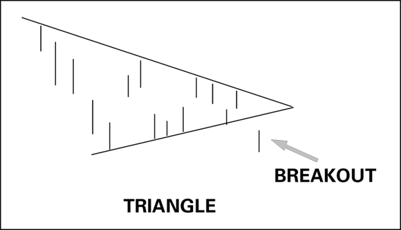
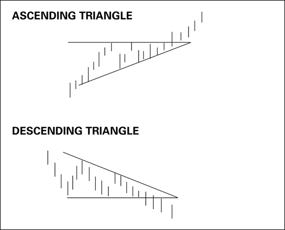
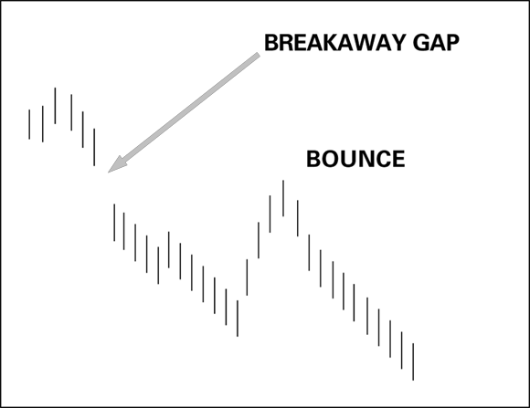
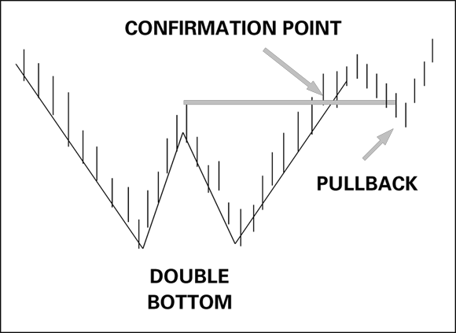
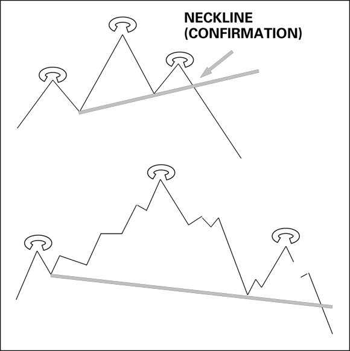
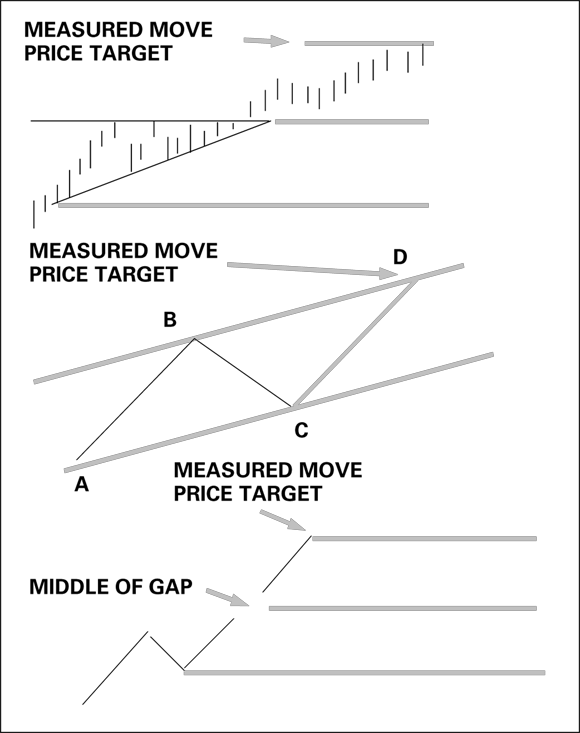

# Chart Patterns

Chart patterns are geometric shapes drawn on a price chart that embed a price forecast. They fall into two broad families: **continuation patterns** (the existing trend pauses, then resumes) and **reversal patterns** (the trend ends and turns). Popularized in *Technical Analysis of Stock Market Trends* (Edwards and McGee, 1949) and statistically catalogued by Thomas Bulkowski in *Encyclopedia of Chart Patterns* (cited throughout; source: TA4D 2020), patterns remain widely used because their visibility can make them self-fulfilling.

Key principle: a pattern is always a work in progress. Not every formation completes — price action can abort mid-pattern. Rules must be applied; software pattern-detection is no substitute for judgment. Volume often provides confirmation: low volume frequently precedes a triangle breakout; high volume commonly accompanies a breakout on the completion day (source: TA4D 2020).

Related pages: [Support and Resistance](support-resistance.md) · [Trendlines and Channels](trendlines-channels.md) · [Price Bars](price-bars.md) · [Candlestick Charting](candlestick-charting.md) · [Ascending Triangle Breakout Setup](../setups/ascending-triangle-breakout.md)

---

## Continuation Patterns

A continuation pattern marks a pause in a well-established trend before it accelerates. They tend to be short-term (sometimes days) and easy to miss. They also pinpoint natural stop-loss levels — for example, the rising support line of an ascending triangle.

### Symmetrical Triangle (Coil)

Formed by a series of lower highs (falling resistance line) and higher lows (rising support line) that converge to an apex. Neither buyers nor sellers are dominant; a breakout must occur before the apex is reached.

- **Bias**: neutral at formation time; direction of breakout usually follows the prior trend
- **Breakout statistics** (Bulkowski): downside breakout >50% of the time when the prior move was downward; upside breakout 43% (source: TA4D 2020)
- Volume typically declines inside the triangle, then spikes sharply on the breakout bar

*Figure 9-2: Symmetrical triangle (coil) with downside breakout. Converging trendlines create the apex; the breakout bar pierces the lower line with a volume surge. (Source: TA4D, p. 227)*

### Ascending Triangle

Flat horizontal resistance line across a series of comparable highs + rising support line across higher lows. The price fails to break out to the upside yet refuses to make new lows.

- **Bias**: bullish continuation
- **Setup rule**: wait for a close *above* the flat resistance line; failure rate drops to ~2% with this confirmation (source: TA4D 2020)
- Natural stop: the rising support line
- **Measured move target**: height of the triangle (distance from the flat top to the lowest low inside the pattern) projected upward from the breakout point

### Descending Triangle

Mirror image of the ascending triangle: flat horizontal support line + falling resistance line of lower highs.

- **Bias**: bearish continuation
- Confirmation: close *below* the flat support line
- Natural stop: the falling resistance line

*Figure 9-3: Ascending triangle (left) — flat resistance + rising lows, bullish breakout. Descending triangle (right) — flat support + falling highs, bearish breakdown. (Source: TA4D, p. 230)*

### Flags and Pennants

Both appear after a sharp, nearly vertical price move (the "pole") and represent tight consolidation before the trend resumes.

- **Flag**: two parallel trendlines sloping *against* the prior move (prices drift back slightly); tight rectangular consolidation
- **Pennant**: small symmetrical triangle formed after the pole; similar to a flag but triangular
- **Bias**: continuation in the direction of the pole
- Measured move target: project the length of the pole from the breakout point of the flag/pennant

### Rectangle / Trading Range

Horizontal support line + horizontal resistance line; price oscillates between them. Can act as continuation (if the breakout is in the direction of the prior trend) or reversal (if it is against the prior trend). Stop is placed just outside the broken boundary.

### Dead-Cat Bounce

A continuation pattern within a downtrend that fools traders into thinking the decline is over.

- Triggered by a severe negative fundamental event; average initial drop ~25%, sometimes 70%+ in days (source: TA4D 2020)
- ~80% of cases include a **breakaway downside gap** on the first drop
- The "bounce" is an upward retracement — sometimes partially filling the gap — before the downtrend resumes
- **Success rate**: ~90% over three decades (Bulkowski; source: TA4D 2020)
- Key error to avoid: assuming a partially filled gap means the downmove is over

*Figure 9-4: Dead-cat bounce. Breakaway gap down, temporary bounce, then resumption of the downtrend to new lows. (Source: TA4D, p. 232)*

---

## Reversal Patterns

Reversal patterns signal that the prevailing trend is exhausted. Confirmation — the price surpassing the pattern's confirmation/neckline level — is essential; without it the pattern fails more than half the time.

General note from Bulkowski: nearly all **bottom** patterns perform better than top patterns. Bull markets are more orderly; greed tends to be steadier than fear. Topping patterns are typically shorter-lived and more volatile than bottoming patterns (source: TA4D 2020).

### Double Bottom (W)

Two price lows at approximately the same level, separated by an intervening peak. Bullish reversal.

**Identification criteria** (source: TA4D 2020):
- Minimum 10 days between the two lows (often 1–3 months)
- Variation between the two lows ≤ 4%
- Center upmove ≥ 10% from the lower of the two bottoms
- Price must close **above the confirmation line** (horizontal line drawn from the highest high between the two bottoms) — this is the buy trigger

**Statistics** (Bulkowski; source: TA4D 2020):
- Only ~one-third of W-shaped formations meet the confirmation criterion
- When confirmation is met, pattern delivers a profit **>90% of the time**
- **Throwback** (pullback to the confirmation line after the upside breakout) occurs ~68% of confirmed double bottoms — do not mistake this for pattern failure

Variants: Adam & Adam (two pointed lows), Adam & Eve (first pointed, second rounded), Eve & Eve (both rounded).

*Figure 9-5: Double bottom. Two lows near the same level, confirmation line across the intervening peak, confirmation point (buy trigger), and subsequent pullback/throwback. (Source: TA4D, p. 233)*

### Double Top (M)

Mirror image of the double bottom — price makes a high, pulls back, then bulls fail to surpass the first high. Bearish reversal.

- Confirmation: close **below** the lowest point in the center of the M (the confirmation/neckline level)
- Volume typically falls as the second top forms
- Without confirmation, twin tops fail to deliver a sustained downmove >50% of the time; with confirmation, success rate improves materially (source: TA4D 2020)
- **Pullback** to the confirmation line after the downside break occurs frequently — "the only free lunch in technical analysis" (source: TA4D 2020); use it as a late exit, not a reason to re-enter long

### Triple Top / Triple Bottom

Three tests of the same resistance or support level. The same confirmation logic applies as double tops/bottoms. Rarer than the double version but carries the same interpretation: failure to surpass the previous extreme signals a trend reversal.

### Head-and-Shoulders (H&S)

The most widely recognized reversal pattern; effectively a triple top where the center peak (head) is higher than the two flanking peaks (shoulders).

**Structure**:
- Left shoulder → pullback to neckline
- Head (higher high) → deeper pullback to neckline
- Right shoulder (lower than head; similar height to left shoulder) → break of neckline = confirmation

**Neckline**: line connecting the two troughs between the three peaks. Can slope upward or downward; a **downward-sloping neckline** tends to produce the largest subsequent move (source: TA4D 2020).

**Volume**: highest at left shoulder or head (~50/50 split); low at right shoulder; spikes sharply on and after the neckline break.

**Statistics** (Bulkowski; source: TA4D 2020): delivers the expected downmove **>90% of the time** after neckline confirmation — highest reliability of any reversal pattern cited in TA4D.

**Inverse Head-and-Shoulders**: upside-down H&S at market bottoms; bullish; confirmation is a close above the neckline.

**Pullback after neckline break**: common. "Last chance to exit before the price hits the wall." Short-lived (1–2 weeks) before the decline resumes (source: TA4D 2020).

*Figure 9-6: Head-and-shoulders. Top: clean version with upward-sloping neckline. Bottom: realistic jagged version with downward-sloping neckline. Breakout below neckline = confirmation of trend reversal. (Source: TA4D, p. 237)*

### Island Reversal

A cluster of price bars isolated from the surrounding price action by gaps on both sides (gap up then gap down, or vice versa). Creates a lone "island" on the chart.

- **Bullish island reversal**: gap down into the cluster, then gap up out — prices below the island have been rejected
- **Bearish island reversal**: gap up into the cluster, then gap down out
- Considered a strong reversal signal; covered in more detail in the price bars chapter

---

## Measured Move (Price Targets)

A measured move is a forecast of the price change expected after a pattern completes. Three common methods (source: TA4D 2020):

### 1. Pattern-Height Projection

The most common method. Project the height of the completed pattern from the breakout point.

- **Ascending triangle**: height from flat resistance to lowest low inside the pattern → add to the breakout level
- **Head-and-shoulders**: distance from top of head to neckline → subtract from the neckline at the breakout point
- **Important caveat**: these are *proportional* guides, rarely exact. The actual move is more likely to be proportional to the pattern size than a perfect 100% replica. Target is met **>50%** of the time for H&S; varies by pattern type (source: TA4D 2020)

### 2. ABCD Channel / Trend Resumption

Within an established channel (A = start of move, B = end of move, C = end of retracement):
- Project the A→B distance from point C to derive price target D
- **Statistics** (Bulkowski, mid-2018 data; source: TA4D 2020): measured upmove hit target 67% of the time; measured downmove hit target 55%

### 3. Gap Midpoint Projection

When a gap appears mid-trend:
- Measure from the lowest low of the upmove to the midpoint of the gap
- Project that same distance above the gap midpoint for the upside target (reverse for downtrends)
- **Reliability**: low — the gap itself indicates elevated uncertainty and unpredictable trader behavior (source: TA4D 2020)

*Figure 9-7: Three measured-move methods. Top: pattern-height projection from breakout. Middle: ABCD channel — copy A-to-B distance from C to find D. Bottom: gap-midpoint projection. (Source: TA4D, p. 240)*

---

## Failed Breakouts

When a pattern completes and the price breaks out but then immediately reverses back through the boundary, the resulting move in the opposite direction is often stronger than the original breakout. This dynamic arises because:

1. Traders who entered on the breakout are trapped and forced to exit, adding fuel to the counter-move
2. Contrarian traders recognize the failure and enter aggressively in the opposite direction

A failed H&S breakout, for example, can produce a sharp rally as short-sellers scramble to cover. Treat every failed breakout as a signal in its own right.

---

## Pattern Reliability Summary

| Pattern | Type | Confirmation trigger | Success rate (Bulkowski) |
|---|---|---|---|
| Double bottom | Reversal (bullish) | Close above center peak | >90% when confirmed |
| Double top | Reversal (bearish) | Close below center trough | Materially improved with confirmation |
| Head-and-shoulders | Reversal (bearish) | Close below neckline | >90% |
| Inverse H&S | Reversal (bullish) | Close above neckline | >90% |
| Ascending triangle | Continuation (bullish) | Close above flat resistance | ~98% (2% failure) |
| Descending triangle | Continuation (bearish) | Close below flat support | High |
| Symmetrical triangle | Continuation (neutral) | Close beyond either line | Downside ~57%, upside ~43% |
| Dead-cat bounce | Continuation (bearish) | N/A — trade the bounce fade | ~90% |

*All statistics from Bulkowski's Encyclopedia of Chart Patterns; source: TA4D 2020.*

---

## Key Risk Controls and Failure Modes

- **Never trade a pattern without confirmation.** Pre-confirmation entry dramatically increases failure rate.
- **Pullbacks/throwbacks** are normal and frequent (~68% in double bottoms). Do not exit on a pullback that is still above the confirmation line.
- **Volume divergence warning**: if a breakout lacks a corresponding volume spike, the probability of a false breakout rises.
- **False breakouts** occur when the price temporarily pierces a pattern boundary then retreats. Using a **close** rather than the intrabar high/low as the trigger reduces false-breakout entries.
- **Regime assumption**: patterns work best in markets with meaningful trend participation. In choppy, low-trend environments pattern completion rates fall.
- **Pattern failure rate** in general: most patterns fail to complete their formation. The 90%+ success statistics for H&S and double bottoms apply only *after confirmed breakout*, not from the moment of identification.
- **Time-frame sensitivity**: some analysts observe patterns on hourly, daily, or weekly charts. Interpretation is the same across time frames, but only if enough participants are watching that time frame.

---

## Reference

- Source: [Technical Analysis for Dummies (TA4D)](../source-notes/2026-06-24-technical-analysis-for-dummies.md), Chapter 9 ("Seeing Patterns"), pp. 224–242 (source: TA4D 2020)
- Bulkowski, Thomas. *Encyclopedia of Chart Patterns, 2nd ed.* John Wiley & Sons. Statistical data cited throughout as Bulkowski/TA4D 2020.
- Edwards, R.D. and Magee, J. *Technical Analysis of Stock Market Trends* (1949). Foundation reference for classical patterns.
- Sperandeo, Victor. *Trader Vic: Methods of a Wall Street Master.* John Wiley & Sons. Cited for strict trendline rules.
