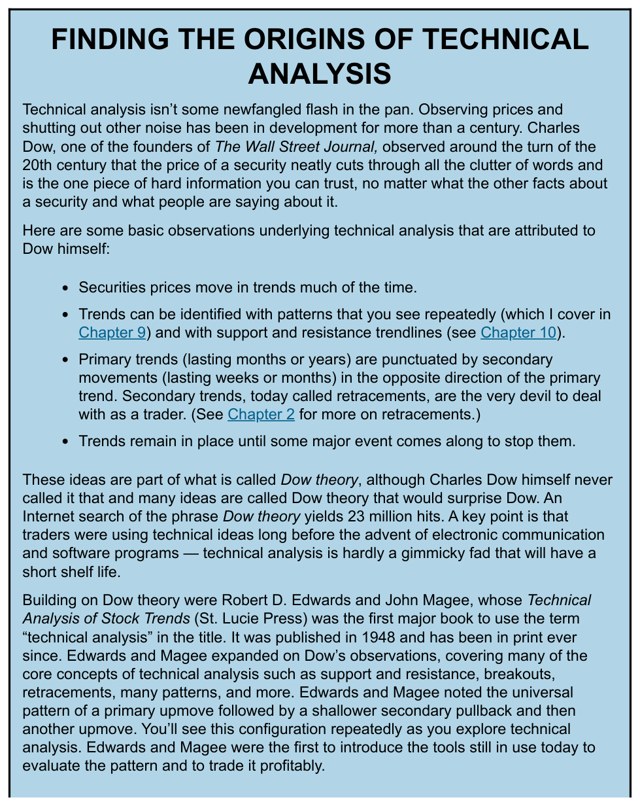
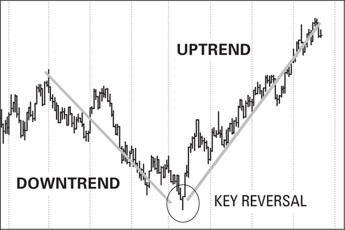

# Dow Theory

The foundational framework of technical analysis, originating from Charles Dow's observations around the turn of the 20th century. Dow argued that the price of a security "cuts through all the clutter of words and is the one piece of hard information you can trust" (source: TA4D 2020). The term "Dow Theory" was coined by others — Dow himself never used it.

## Core Observations (attributed to Dow)

1. **Prices move in trends** — securities prices exhibit a directional bias much of the time (source: TA4D 2020).
2. **Trends are identifiable** — via recurring chart patterns and support/resistance trendlines (source: TA4D 2020).
3. **Primary and secondary trends** — primary trends last months to years; secondary movements (retracements) last weeks to months and run opposite to the primary trend (source: TA4D 2020).
4. **Trends persist** — a trend remains in place until a major event stops it (source: TA4D 2020).

## Historical Development

**Charles Dow (~1900):** Founding editor of *The Wall Street Journal*. Observed that price is the single reliable data point, cutting through noise from management commentary, earnings forecasts, and market opinion.

**Robert D. Edwards and John Magee (1948):** Authors of *Technical Analysis of Stock Trends* (St. Lucie Press) — the first major book to use the term "technical analysis" in its title, still in print as of the source date. They expanded on Dow's framework, introducing:

- The universal pattern: primary upmove → shallower secondary pullback → another upmove
- Formalized support and resistance, breakouts, and retracements
- Tools still in active use today for evaluating patterns and trading them profitably (source: TA4D 2020)

## Trend Anatomy

A **trend** is a discernible directional bias in price: upward, downward, or sideways. Sideways movement is often a transition phase from one direction to the other, frequently resolving in a sudden breakout (source: TA4D 2020).

**Trendedness vs. trendiness** (distinction from TA4D 2020):
- *Trendiness* — a fashion or fad, potentially short-lived
- *Trendedness* — a measurable, enduring directional bias in price

The practical goal for a technical trader: identify the reversal point (key reversal) as early as possible after a downtrend, then ride the ensuing uptrend.

*Figure: A classic downtrend, key reversal point (circled), and subsequent uptrend with trendlines.*

## The Fractal Property of Price Charts

Price charts exhibit a **fractal property**: a 1-hour chart cannot be visually distinguished from a 4-hour, daily, or weekly chart if the time axis is unlabeled. Technical indicators applied across any timeframe yield equivalent analytical output. This property means techniques rooted in Dow's 1900-era observations remain as applicable today as when first developed (source: TA4D 2020).

## Why Trend Matters: The Buy-and-Hold Counterargument

Dow's emphasis on timing versus passive holding is supported by historical data (source: TA4D 2020, figures for illustrative purposes):

- S&P 500 average annual return 1950–2018: ~11.1% (equities); ~8% over the past 30 years
- 25 bull market phases (S&P, 1927–2018), each averaging ~3 years and ~127% return
- 25 bear market phases (>20% decline) over the same period
- An investor buying at the 1929 price peak would have needed more than 20 years to recover initial capital
- S&P 500 fell 50% from Jan 2000 to Oct 2002, requiring a 100% gain to break even

Timing entry and exit is therefore not optional for preserving capital — it is the central function technical analysis is designed to serve.

## Invalidation / Limitations

- Dow Theory identifies trends but does not define position sizing, holding period, or risk quantity
- Secondary movements (retracements) are described as "the very devil to deal with as a trader" — they are real and frequent
- The scientific rigor of technical analysis depends on repeated testing of observations; many Dow Theory extensions were never formally backtested
- Human variability in market sentiment introduces more noise than physical systems, making forecasts probabilistic rather than deterministic (source: TA4D 2020)

## Regime Assumptions

Dow Theory describes behavior of securities markets under normal trending conditions. It does not specify performance during:
- Prolonged sideways/range-bound regimes
- Liquidity crises or market structure breaks
- Periods dominated by algorithmic or high-frequency activity

## Related Pages

- [Support and Resistance](support-resistance.md)
- [Trendlines and Channels](trendlines-channels.md)
- [Market Structure](market-structure.md)
- [Trend Template](trend-template.md)
- [TA4D Source Note](../source-notes/2026-06-24-technical-analysis-for-dummies.md)
