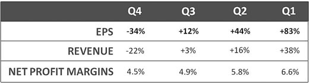
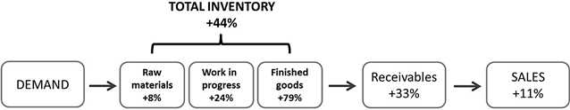

# Earnings Quality

**Context:** Growth-stock fundamental analysis
**Used in:** [SEPA Strategy](../strategies/sepa-strategy.md)

## Definition

Earnings quality is a multi-dimensional assessment of whether reported earnings reflect genuine, sustainable business strength. Strong reported EPS numbers can be misleading if they are driven by cost-cutting, accounting adjustments, or if balance-sheet signals (inventory, receivables) warn of future weakness.

## Margin Analysis

Three profit drivers determine the quality of earnings growth:

1. **Revenue (sales) growth** — the top line expanding
2. **Gross margin** — pricing power and cost-of-goods control
3. **Net profit margin** — operating efficiency (operating income ÷ sales)

The highest-quality earnings growth comes from all three expanding simultaneously, indicating genuine demand exceeding costs — not one-time fixes or financial engineering.

### Code 33

"Code 33" is Minervini's label for a specific multi-quarter signal: **three consecutive quarters in which the EPS growth rate, sales growth rate, and net profit margin all accelerate simultaneously**. When all three business drivers fire together, subsequent price advances have historically been the largest.

*Table showing the Code 33 pattern: three consecutive quarters with simultaneous acceleration in EPS, sales growth, and net profit margin.*

**Monster Beverage (MNST) 2003–2006** is the book's marquee Code 33 example — annual acceleration in all three metrics across multiple years with a major corresponding stock advance.

Code 33 is a screening signal, not a trade trigger. It identifies a business inflection worth investigating. Combine with the [Trend Template](../concepts/trend-template.md) and [VCP](../setups/volatility-contraction-pattern.md) for entry timing.

## Guidance Quality

Management guidance is a key lead indicator of future earnings surprises:

- **Upside guidance** (raising forward estimates): drives positive price gaps and sustained advances — often more powerful than the earnings beat itself
- **Guidance reversal** (raised then cut): major red flag, often precedes Stage 3 topping behaviour
- **Dick's Sporting Goods (2003):** explicit upside guidance with large volume gap — textbook positive signal
- **Rosetta Stone:** guidance raised then reversed — early warning of fundamental deterioration

## Post-Earnings Drift (PED)

After a significant positive earnings surprise, stocks often **continue moving in the direction of the surprise for weeks or months afterward** — this is post-earnings drift. It reflects the gradual adjustment of institutional positions as analysts revise estimates upward and more investors discover the new growth trajectory.

**Lululemon (LULU)** showed extended price appreciation in the weeks following positive earnings surprises, not just on the report day itself.

The implication: entering or adding shortly after a confirmed large positive earnings surprise — rather than waiting for the next base formation — can capture PED momentum. This must be balanced against the risk that the stock is already extended from its base.

## Inventory and Receivables Analysis

Two balance-sheet metrics that can predict earnings deterioration before it appears in reported EPS:

### Inventory Red Flags
- **Rising inventory faster than sales:** Product is piling up — demand is weakening before the income statement shows it
- **Finished goods rising faster than raw materials:** The problem is at the output (sales) stage, not the input (supply) stage — more severe warning
- Businesses with depreciating inventory (technology, fashion, perishables) face the worst consequences of a build-up

### Receivables Red Flags
- **Receivables rising faster than sales:** Customers are slower to pay — potential collection problems or channel-stuffing (shipping more than customers ordered to inflate near-term revenue)

### The Double Trouble Signal
When inventories **and** receivables are both rising at 2× or more the rate of sales growth simultaneously, this is a near-definitive warning to exit or avoid — regardless of stated EPS.

**Dell Computer** (late 1990s): built its competitive advantage on a build-to-order model that eliminated inventory risk entirely, which was a key quality differentiator over traditional PC manufacturers who held large finished-goods inventories.

*Inventories and receivables both rising sharply relative to sales — a near-definitive warning of upcoming earnings deterioration.*

## Return on Equity (ROE) and Debt Quality

- **Expanding ROE** signals improving capital efficiency — management creating more value per dollar invested; a sign of competitive advantage
- **Debt quality:** Bank debt (callable, covenant-heavy) is higher risk than bond debt (fixed term, known maturity)
- For turnaround situations: assess cash burn rate relative to available capital

## Limitations

- Companies can manage earnings (accelerate recognition, defer expenses) over short periods — multi-quarter trends are more reliable than any single quarter
- Sarbanes-Oxley (2002) and Regulation FD (2000) changed how companies communicate with analysts; the "whisper number" dynamic from the 1990s is less pronounced today
- All earnings analysis is backward-looking; the market prices the *next* quarter, not the *last* one
- A single quarter of inventory build or slowing guidance is not definitive — look for patterns across 2+ quarters

## Common Mistakes

- Focusing on absolute EPS without checking whether margins are expanding or compressing
- Ignoring inventory/receivables signals because EPS is still growing
- Treating a single quarter of deceleration as definitive when it may be a one-time event
- Buying stocks with high EPS driven entirely by share buybacks rather than genuine revenue and margin growth

## Related Pages

- [Earnings Acceleration](../concepts/earnings-acceleration.md) — the growth rate trend within earnings
- [SEPA Strategy](../strategies/sepa-strategy.md)
- [Risk Management](../concepts/risk-management.md)
- [Stage Analysis](../concepts/stage-analysis.md) — Stage 3 tops often coincide with earnings quality deterioration

## Source Notes

- [Trade Like a Stock Market Wizard — Mark Minervini](../source-notes/2026-06-18-trade-like-a-stock-market-wizard.md)
