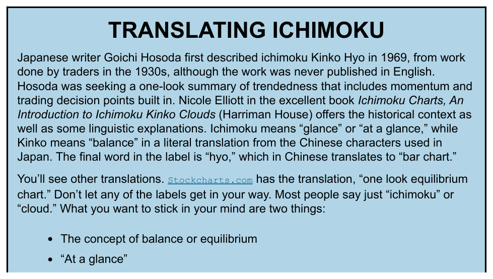
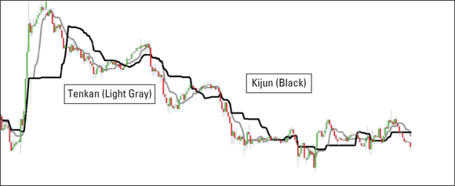
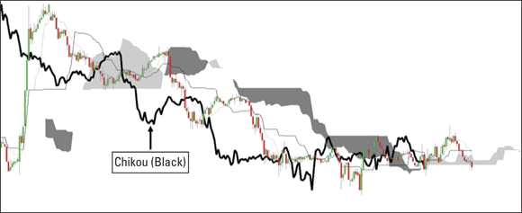
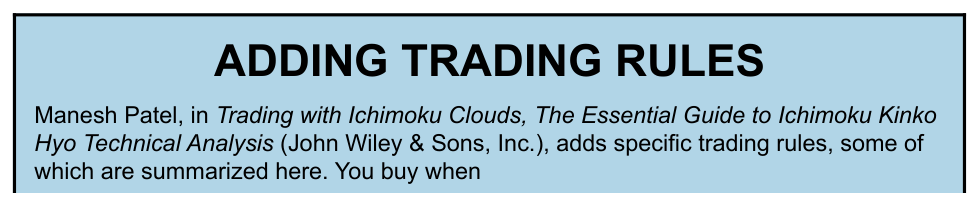

# Ichimoku Kinko Hyo

A Japanese charting system that delivers a visual snapshot of trend direction, momentum, and self-adjusting support/resistance in a single view. The name translates roughly as "one-glance equilibrium bar chart": *ichimoku* = "at a glance," *kinko* = "balance/equilibrium," *hyo* = "bar chart" (source: TA4D 2020).

## Origins

Goichi Hosoda (pen name Ichimoku Sanjin) developed the methodology during the 1930s based on work by earlier Japanese traders. He wrote it down in 1969 — the first published account — after manual backtesting by dozens of students, without computers. The work was not translated into English for decades; Western adoption accelerated with the foreign-exchange retail boom of the 1980s–1990s and is now mainstream, included in most charting platforms (source: TA4D 2020).

A notable coincidence: the 26-day parameter Hosoda validated through backtesting was independently chosen by Gerald Appel when he devised the MACD in the late 1970s, solely through computational optimisation over large data sets. Both arrived at 26 days because Japanese trading weeks at the time included Saturday, making 26 sessions one calendar month (source: TA4D 2020).

## The Five Components

| Component | Japanese name | Calculation | Time offset |
|---|---|---|---|
| Conversion Line | **Tenkan-sen** | (9-period high + 9-period low) / 2 | None — current |
| Base Line | **Kijun-sen** | (26-period high + 26-period low) / 2 | None — current |
| Leading Span A | **Senkou Span A** | (Tenkan + Kijun) / 2 | Plotted **26 periods ahead** |
| Leading Span B | **Senkou Span B** | (52-period high + 52-period low) / 2 | Plotted **26 periods ahead** |
| Lagging Span | **Chikou Span** | Today's close | Plotted **26 periods back** |
| Cloud | **Kumo** | Zone between Senkou A and Senkou B | Projected forward |

All calculations except the Chikou span use the **midpoint of the high-low range**, not the close. This "moving midpoint" approach produces smoother lines with fewer whipsaws than close-based moving averages (source: TA4D 2020).

### Tenkan and Kijun — the TK Cross

The Tenkan (9-period) tracks short-term momentum closely. The Kijun (26-period) is slower and often flattens during consolidation, acting as a visible equilibrium level. Their crossover — the **TK cross** — is the primary buy/sell signal, analogous to a moving-average crossover but evaluated in the context of the cloud (see Signals below).

### The Kumo (Cloud)

The cloud is the region between Senkou Span A (upper boundary in a bull trend) and Senkou Span B (lower boundary). Because both spans are projected 26 periods ahead, the cloud offers a **forward view of anticipated support and resistance**.

Cloud characteristics (source: TA4D 2020):

- **Thick cloud** → wide high-low range in recent history; implies stronger support/resistance and lower probability of a breakout in the opposite direction.
- **Thin cloud** → compressed price action; warns of a possible reversal; a crossover of Span A and Span B occurs here.
- **Green cloud** (Span A > Span B) → bullish bias.
- **Red/dark cloud** (Span B > Span A) → bearish bias.

When the cloud's two spans swap sides, they do so at a zero-width point — this exact crossover marks the theoretical equilibrium point but carries no direct trade signal (source: TA4D 2020).

### Chikou Span — Embedded Momentum

The Chikou is today's close plotted 26 bars in the past. It is the only component that uses the close directly. Ichimoku practitioners consider it the most important element because it shows, at a glance, whether today's price is above or below the price regime of 26 periods ago:

- **Chikou above prior price bars** → current market sentiment is stronger than 26 periods ago; bullish confirmation.
- **Chikou poking into or below prior bars** → early warning that momentum is turning before the moving averages have yet crossed.
- **Chikou far below both price and cloud** → deeply oversold reading; watch for a potential recovery (source: TA4D 2020).

## Signals

### Bullish conditions

1. Price is **above** the cloud.
2. Cloud is **green** (Senkou A > Senkou B).
3. Tenkan crosses **above** Kijun (TK cross).
4. Chikou is **above** price from 26 periods ago.

All four aligning = strongest possible bullish signal. Each condition satisfied adds incremental confidence.

### Bearish conditions

1. Price is **below** the cloud.
2. Cloud is **red** (Senkou B > Senkou A).
3. Kijun crosses **above** Tenkan (bear TK cross).
4. Chikou is **below** prior price.

### Signal strength — cloud location filter

| TK cross location | Signal quality |
|---|---|
| Above cloud | Strong bull signal |
| Below cloud | Strong bear signal |
| Inside cloud | Weak / ambiguous — high whipsaw risk |

Price trading inside the cloud = indeterminate zone. Most practitioners avoid new entries until price exits the cloud (source: TA4D 2020).

## Whipsaw Reduction

Using ichimoku's full rules — TK cross plus price-above/below-cloud confirmation — reduces the total number of trades significantly compared to a plain moving-average crossover. In the book's worked example, a plain crossover generated 12 trades; adding the cloud position filter reduced that to four (source: TA4D 2020). This is cited as one of ichimoku's primary practical advantages.

## Cloud as Built-in Stop

Because the cloud is a zone, not a single line, practitioners use its edges as graduated stops:

- Long trade: stop the first half at the cloud top, stop the remaining half just below the cloud bottom.
- These stops must be updated daily as the cloud shifts.

The stop requires no separate indicator; it is an inherent feature of the system (source: TA4D 2020).

## Using Ichimoku in Practice

### Inside the cloud

Some traders exit immediately when price enters the cloud (strict rule). Others hold a long position as long as the **bottom** of the cloud holds, using the cloud as a two-tiered stop. Either approach requires daily stop adjustment (source: TA4D 2020).

### Time-frame flexibility

Ichimoku works on any time frame — daily, hourly, or intraday. FX retail traders, who were among the first Western adopters, commonly use 60-minute and 240-minute charts. On sub-daily charts prices tend to trade closer to the cloud than on the daily chart (source: TA4D 2020).

### Combining with other indicators

Ichimoku is self-contained but not exclusive. The book demonstrates two complementary combinations:

- **Stochastic oscillator**: ichimoku is a strong trending tool; after a large move the market may enter range-trading, where the stochastic is most useful. A stochastic bearish crossover while price is testing the cloud top confirms resistance (source: TA4D 2020).
- **Linear regression channel**: mathematically independent of ichimoku; when both the cloud boundary and the channel boundary coincide, resistance conviction is higher (source: TA4D 2020).

Elliott Wave, support/resistance lines, and channels can also be overlaid.

## Manesh Patel's Specific Buy Rules

From *Trading with Ichimoku Clouds* (Patel, John Wiley & Sons), the following conditions must all be met to enter long (source: TA4D 2020):

1. Price is **above** the cloud.
2. Tenkan crosses **above** kijun.
3. Chikou has **large space** between itself and price (implies strong momentum).
4. Price is at least **50 points** from the far edge of the cloud in the opposite direction.
5. Entry is **less than 200 points** from Tenkan and **less than 300 points** from Kijun.

Patel also stipulates stops must be adjusted **every day**. His backtests — comprising over 100 pages of a 198-page book — showed that adding specific trading rules typically introduces **signal delay** as the tradeoff for fewer failed entries (source: TA4D 2020).

**Parameter note**: standard settings (9, 26, 52) should not be adjusted. Instead, refine the number of points (or dollars) away from conventional entry/stop levels to suit the specific security being traded (source: TA4D 2020).

## Ichimoku vs. Conventional Technical Analysis

| Ichimoku | Conventional TA |
|---|---|
| Uses only candlestick notation | Multiple bar notation types available |
| Always time-based x-axis | Option to remove time axis (e.g. point-and-figure) |
| Uses midpoint of high-low range | Uses high and low separately |
| Moving average of midpoints (except Chikou uses close) | Moving average of the close |
| Self-adjusting support/resistance (the cloud) | User must draw support/resistance manually |
| Implicit 50% retracement built into midpoint methodology | 50% retracement can be added; not self-adjusting |
| Stair-step appearance | Smooth lines |
| Momentum is implicit (Chikou) | Momentum indicators are explicit and separate |
| Projects lines forward and backward in time | No time projection |
| Self-contained and self-sufficient | Extensible with any number of additions |

(source: TA4D 2020, Table 18-1)

## Key Limitations and Failure Modes

- **Signal delay**: the midpoint-based calculation and cloud-confirmation requirement delay entries versus simpler crossover systems.
- **Inside-the-cloud ambiguity**: no reliable signal; risk of whipsaw.
- **Thin-cloud risk**: when the cloud narrows to near-zero, a reversal is more likely; entering new positions here is risky.
- **Backtesting complexity**: properly backtesting ichimoku with custom trading rules is described as "hideously complicated" and computationally demanding (source: TA4D 2020).
- **Stop maintenance burden**: all stop levels based on cloud boundaries must be recalculated and adjusted daily.
- **Self-fulfilling caution**: as ichimoku has grown popular ("all the rage" per TA4D), signals may increasingly be self-fulfilling and more susceptible to crowd behaviour shifts.

## Related Pages

- [Moving Averages](../indicators/moving-averages.md)
- [MACD](../indicators/macd.md)
- [Stochastic Oscillator](../indicators/stochastic-oscillator.md)
- [Bollinger Bands](../indicators/bollinger-bands.md)
- [Trendlines and Channels](trendlines-channels.md)
- [Support and Resistance](support-resistance.md)
- [Candlestick Charting](candlestick-charting.md)
- [TA4D Source Note](../source-notes/2026-06-24-technical-analysis-for-dummies.md)
