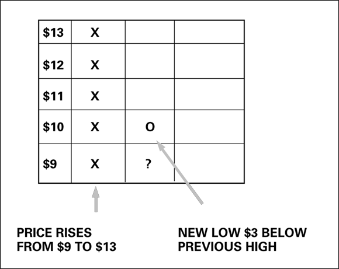
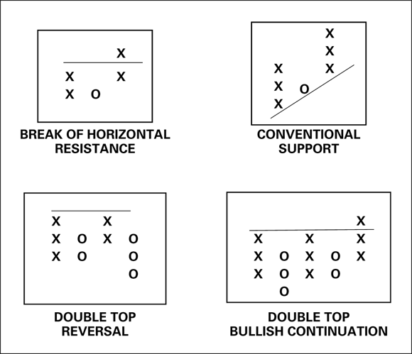
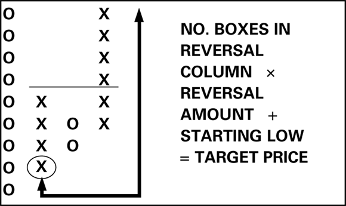
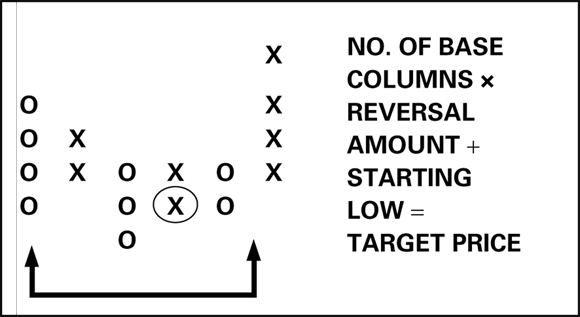

# Point-and-Figure (P&F) Charting

Point-and-figure (P&F) charts have existed for more than 100 years, likely invented by floor traders in the 1870s as a pre-electronic method to record only relevant price moves. P&F strips away the time axis entirely and records only significant price movements, filtering out noise that would otherwise obscure authentic support, resistance, and trend direction. (source: TA4D 2020)

Related: [Chart Patterns](chart-patterns.md) | [Trendlines and Channels](trendlines-channels.md) | [Bollinger Bands](../indicators/bollinger-bands.md)

Source: [TA4D](../source-notes/2026-06-24-technical-analysis-for-dummies.md)

---

## Core Concept

P&F is the only major charting technique that ignores time and volume entirely. A standard bar chart has an entry for every day — even when nothing meaningful happened. P&F makes no entry unless price moves by a defined minimum amount beyond the most recent recorded extreme. The result is filtered, event-driven price action. A P&F column can represent 2 days or 200 days; that is irrelevant. What matters is that a significant price move occurred. (source: TA4D 2020)

P&F is also described as the only computational method unique to financial prices — engineers and scientists use standard deviation but never use P&F. (source: TA4D 2020)

P&F analysis is best suited to medium- to long-term holding periods — weeks and months. (source: TA4D 2020)

---

## Construction

### Xs and Os

- **X column** — records rising prices. Each X represents one box increment upward.
- **O column** — records falling prices. Each O represents one box increment downward.
- Columns alternate: all Xs in one column, all Os in the next.
- When price is going sideways (no new high, no new low beyond the box size), nothing is recorded.

Example from source: price rises from $9 to $13, producing a column of five Xs (one per $1 box). When price then falls to $10 (a $3 drop, meeting the 3-box reversal threshold), a new O column begins at $10. (source: TA4D 2020)

### Box Size

The box size is the minimum price increment required to add another X or O. Approximate standard guidelines (source: TA4D 2020):

| Security Price | Box Size |
|---------------|----------|
| $5 – $20      | $0.50    |
| $20 – $100    | $1.00    |
| $100 – $200   | $2.00    |
| $200 – $300   | $4.00    |
| $300 – $400   | $6.00    |

Choosing box size:
- **Small box** — more sensitive; shows small retracements; higher noise.
- **Large box** — less sensitive; shows the big picture; filters more data.

Do not leave box size to software defaults. Software adjusts box size to fit the data window, producing inconsistent charts across different time ranges. Fix the box size manually to the standard round number that other traders are using. (source: TA4D 2020)

### Reversal Amount

The reversal amount defines how far price must move in the opposite direction of the current column before a new opposing column begins. The standard is **3-box reversal**.

With a $1 box and 3-box reversal: price must drop $3 below the current column low before a new O column starts. Using a $4 box (for securities over $200), a 3-box reversal = $12 per share — a meaningful stop-loss threshold to budget for. (source: TA4D 2020)

Outside day rule: if on the same day price makes a new high by one box AND a new low by the reversal amount (3 boxes), the new low takes precedence and a new O column begins. (source: TA4D 2020)

---

## Patterns

### Horizontal Support and Resistance

P&F compresses time, making long-term S/R levels visible that would be invisible on a regular daily chart. A horizontal line is drawn across the tops or bottoms of multiple columns at the same price level. A column of Xs rising above that line is a breakout buy. A column of Os falling below the floor is a breakdown sell. (source: TA4D 2020)

After a support line is broken, do not erase it — it may become the new resistance. After a resistance line is broken to the upside, it may become the new support. (source: TA4D 2020)

### Bullish Support Line and Bearish Resistance Line

When boxes are perfectly square, a 45-degree line can be drawn from just two columns where one column is one box higher or lower than the other:
- **Bullish support line** — upward-sloping 45-degree line below rising lows.
- **Bearish resistance line** — downward-sloping 45-degree line above falling highs.

The 45-degree technique allows drawing support/resistance lines earlier than in conventional bar charting. (source: TA4D 2020)

### Double and Triple Tops / Bottoms

- **Double top reversal** — two X columns reach the same resistance level and fail. Then an O column breaks below the prior O column low — confirms the reversal.
- **Double top bullish continuation** — in an uptrend where the intervening O columns are on a rising line (each O column's low is higher than the prior O column's low), a double top may instead break out to the upside as a continuation, not a reversal.
- **Triple tops/bottoms** — three tests of the same level produce a stronger signal.
- The horizontal / sideways behavior of the opposing columns determines whether a double top is a reversal or a continuation. (source: TA4D 2020)

### Triangles

Converging support and resistance lines (support rising, resistance falling) form triangles on P&F charts just as on bar charts. (source: TA4D 2020)

---

## Price Projections

Projections are estimates, not guarantees. Do not automatically sell at the projected target if price is still making new highs. Evaluate the projection as the reward side of the risk-reward ratio; the lowest low of the starting column serves as the initial stop reference. (source: TA4D 2020)

### Vertical Projection (more reliable)

Used when a security makes a new breakout from a prior column.

**Steps:**
1. Find the bottom of the last X (upward) column — the starting low.
2. Count the number of boxes in that column.
3. Multiply boxes × reversal amount (standard: 3).
4. Multiply that product × box size.
5. Add to the starting low.

**Formula:**  
`Target = (boxes in column × reversal amount × box size) + starting low`

Example: 4 boxes, 3-box reversal, $1 box, starting low $10:
`(4 × 3 × $1) + $10 = $22 target` (source: TA4D 2020)

For a downside projection: start from the highest-high box before the downmove column, count boxes, multiply by 3, multiply by box size, subtract from the starting high.

### Horizontal Projection

Used after a consolidation base before a breakout. Measures the width of the base rather than the height of a column.

**Steps:**
1. Count the number of columns in the base (the sideways period before the breakout), excluding the breakout column.
2. Multiply base columns × reversal amount (standard: 3).
3. Add to the lowest low in the base.

**Formula:**  
`Target = (base columns × reversal amount × box size) + lowest low in base`

Example: 5 base columns, 3-box reversal, $1 box, lowest low $10:
`(5 × 3 × $1) + $10 = $25 target` (source: TA4D 2020)

---

## Combining P&F with Other Indicators

Because P&F is time-independent, combining it with time-based indicators requires adaptation. (source: TA4D 2020)

### Moving Averages

Instead of averaging prices over a fixed number of calendar periods, use the price at the center of each P&F column. This gives an average price per reversal rather than per day. If the moving average shows a prior downtrend and a new X column rises above the moving average, confidence in the new uptrend signal increases. (source: TA4D 2020)

### Bollinger Bands

Apply Bollinger Bands to the P&F data:
- X columns repeatedly pressing and breaking the upper band confirm the uptrend.
- When the next O column crosses the centerline (moving average) to the downside, expect a swing toward the lower band.
- **Squeeze signal**: narrow Bollinger Bands combined with short P&F columns = price is congested, not trending. Avoid trading in this condition. (source: TA4D 2020)

### Parabolic SAR

The parabolic stop-and-reverse indicator delivers a faster reversal signal than waiting for a new column of Xs or Os. The Parabolic SAR tightens the stop as the momentum of a price move decelerates, which is complementary to the coarser reversal signals of P&F. (source: TA4D 2020)

---

## P&F vs Standard Bar Charts

| Feature | Standard Bar Chart | Point-and-Figure |
|---------|-------------------|-----------------|
| Time axis | Always present | Absent |
| Volume | Recorded | Ignored entirely |
| Noise filtering | None built-in | Built-in via box size |
| Long-term S/R visibility | Limited | High — time compression reveals historic levels |
| Reversal signals | Time-dependent | Price-movement-dependent |
| Suitable holding period | Any | Medium to long term |

---

## Failure Modes and Limitations

- Box size set too small: produces many single-entry reversal columns and excessive noise; a sign the box is wrong.
- Box size set too large (especially $4+ box at high prices): 3-box reversal threshold is large in dollar terms; position sizing must account for this stop width.
- Software default box sizes vary with the time range selected, producing inconsistent charts — always fix box size manually.
- Vertical projections work more often than horizontal projections; treat both as rough guides only.
- P&F does not display overbought/oversold conditions; Bollinger Bands or other momentum tools are needed to fill this gap.
- P&F ignores volume, which removes one dimension of confirmation available on bar charts.
