# Price Bars

The price bar is the basic building block of technical analysis. Each bar encodes four data points — open, high, low, close (OHLC) — and embodies all supply-demand dynamics of the trading period. A series of bars on a chart shows the evolution of those dynamics over time. (source: TA4D 2020, Ch 6–7)

Source: [Technical Analysis for Dummies (TA4D)](../source-notes/2026-06-24-technical-analysis-for-dummies.md)

---

## OHLC Components

### Open

The opening price sets the tone for the day and its most important relationship is the prior day's close.

- Open above prior close: fresh bullish sentiment; first trader sees a reason to pay more.
- Open below prior close: caution — bad news likely arrived overnight.

Caveat: In U.S. equities the open is sometimes a synthetic price (average of the first few trades) and varies by data source. It is directionally useful over a series of days, but any single day's open may not be the literal first trade. (source: TA4D 2020, p. 152)

### Close

The close is the most important bar component. It is the last price agreed upon before the bell and summarises the net verdict of all buyers and sellers after a full day of information.

- A series of higher closes = buyers willing to pay ever-more; uptrend signal.
- A series of lower closes = sellers accepting ever-less; downtrend signal.
- Close at the exact high of the day: strongly bullish — buyers were active right to the final bell, offsetting the usual end-of-day profit-taking. (source: TA4D 2020, p. 153–156)
- Mark-to-market valuations use the close; professionals actively manage the close to influence period-end portfolio values. (source: TA4D 2020, p. 153)

Line charts on financial websites (Yahoo Finance, WSJ) plot closing prices only.

### High

The high is the price where the most optimistic buyer and a willing seller last met. It has meaning relative to other bar components (especially the close) and to the prior day's high.

- Higher high: bullish signal; no confirming power without also checking higher lows.
- Close well below the high: buyers could not sustain the move; bearish reading relative to the high.

Event risk note: New highs often arise from scheduled events (earnings, Fed statements, economic releases) or unexpected shocks. The "buy the rumor, sell the news" dynamic causes prices to peak before the event and reverse after, even when news matches expectations. (source: TA4D 2020, p. 157–158)

### Low

The low is the price where the most pessimistic seller and a willing buyer last met.

- Close at or near the low: bears dominated the entire session.
- Lower low + close near the low: double confirmation of bearish pressure.
- Low below the open: fresh negative news arrived after the opening bell. (source: TA4D 2020, p. 157)

---

## Reading Bar Series: Trend Identification

An uptrend requires a majority of bars showing **higher highs and higher lows**. The higher lows are the more important confirming factor — an occasional missed higher high is acceptable if lows keep rising.

A downtrend requires **lower lows and lower highs** in a preponderance of bars, with the close typically moving below the open.

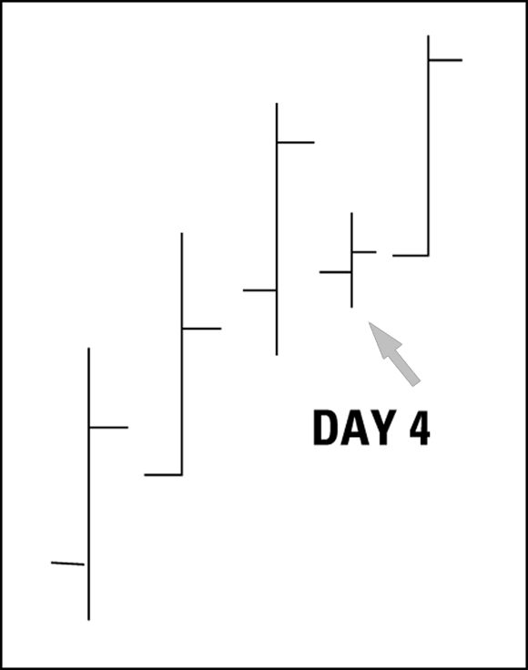

*Figure 6-2: Five up-day bars. Day 4 fails to make a new high but maintains a higher low, keeping the uptrend intact. (source: TA4D 2020, p. 154)*

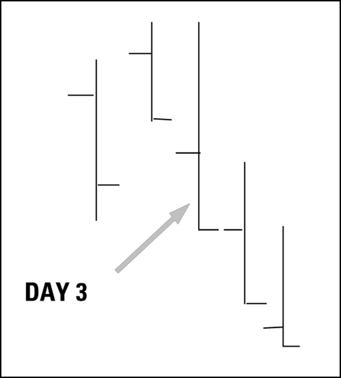

*Figure 6-3: Down-day sequence beginning at Day 3. Each close is lower than the prior close. (source: TA4D 2020, p. 155)*

**When bars are unreadable:** If higher highs are followed by lower lows with no consistency in up/down closes, the market is changing direction multiple times intraday. Do not trade based on bar-reading alone in such conditions — the probability of picking the correct direction is near random. (source: TA4D 2020, p. 163)

**Fractality:** Price bars are fractal. A 15-minute bar chart is indistinguishable in appearance from a daily bar chart. All bar-reading concepts apply equally across time frames: daily, weekly, monthly, or intraday. (source: TA4D 2020, p. 165)

---

## Bar Scoring (Fitschen)

Keith Fitschen tested a systematic bar-scoring method across 3.5 million equity bars (3,372 stocks, 2000–June 2011, minimum $20 M daily liquidity) and 363,000 futures bars (56 contracts, back to 1980). He defined four bar types based on the open-to-close and close-within-range positions, then doubled them to eight by adding whether today's close is above or below the prior close. (source: TA4D 2020, p. 168–170)

| # | Close vs Open | Close in Range | Prior Close | Equity result (next-day close) |
|---|---------------|----------------|-------------|-------------------------------|
| 1 | Above open | Top half | Higher | Not the winner |
| 2 | Above open | Lower half | Higher | — |
| 3 | Near/below open | Top half | Higher | — |
| **4** | **Near/below open** | **Lower half** | **Higher** | **+0.1045% (~$5 on $5,000) — equity winner** |
| 5–8 | (mirror with lower prior close) | — | Lower | Futures bars 5–8 all profitable |

**Key finding — equities:** Bar-type 4 (close below open, close in lower half, but still a higher close than yesterday) is the best predictor of a gain on the next close.

**Key finding — futures:** Bar-type 7 is the winner; bars 5–8 are all profitable even though the close is below the prior close, suggesting futures closes are counter-trend because many futures traders exit near the close to avoid overnight exposure. (source: TA4D 2020, p. 169–170)

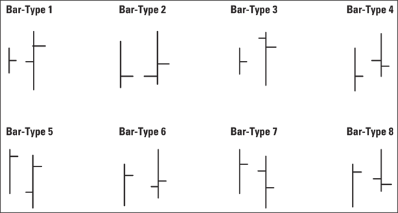

*Figure 6-5: Fitschen's eight bar-type configurations for systematic bar-scoring. (source: TA4D 2020, p. 169)*

---

## Special Bars (Chapter 7)

Special bars are two-to-five-bar configurations that stand out visually. They are either trend-confirmation or trend-reversal patterns, though their reliability varies by security and market regime. (source: TA4D 2020, p. 171–172)

The daily **trading range** (high minus low) defines the emotional extremes of the session. A small range in a sea of larger bars signals indecision; a single very large bar in a sea of smaller ones signals a significant event.

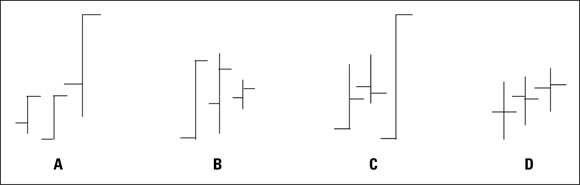

*Figure 7-1: Common special bars — (A) closes at high, (B) inside day, (C) outside day, (D) close near open. (source: TA4D 2020, p. 174)*

### Closes at the High / Low (Config A)

A series of bars where each close is at the bar's high = trend continuation, bulls dominating to the final bell. Downtrend mirror: closes at the low. A fat single-session gain in this configuration usually triggers profit-taking the next day, creating a brief dent without reversing the trend. (source: TA4D 2020, p. 175)

### Inside Day (Config B)

Today's high is lower than yesterday's high **and** today's low is higher than yesterday's low. The bar is entirely inside the prior bar's range.

- Reflects indecision; neither buyers nor sellers were motivated to extend the range.
- Does not reliably signal continuation or reversal — statistical work finds roughly 50/50 split over large samples. Watch the second day after the inside day for a directional resolution. (source: TA4D 2020, p. 175)

### Outside Day (Config C)

Today's high is higher than yesterday's high **and** today's low is lower than yesterday's low. The bar engulfs the prior bar's entire range.

- Open at the low, close at the high: fresh bullish buying dominated.
- Open at the high, close at the low: bearish selling overwhelmed buyers to the close.
- In a non-trending price series the outside day alerts to a possible new trend beginning. In a trending series, the close placement hints at direction but is not definitive alone. (source: TA4D 2020, p. 175–176)

### Close at Open / Doji (Config D)

Close at or near the open = trader opinion is divided; no net directional conviction for the day. In candlestick analysis this is the **doji** (see [Candlestick Charting](candlestick-charting.md)). Treat as a signal to examine other context: volume, trend age, nearby support/resistance. (source: TA4D 2020, p. 176)

---

## Spikes and Key Reversal Bars

A **spike** is a bar whose high-low range is dramatically wider than the bars immediately surrounding it.

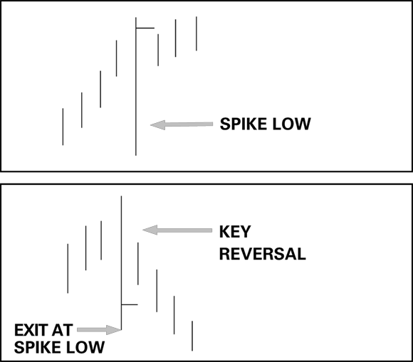

*Figure 7-2: Top — spike low that proved to be noise (price resumed uptrend); Bottom — key reversal spike where subsequent bars confirmed trend reversal with lower highs and lower lows. (source: TA4D 2020, p. 177)*

**Continuation spike:** Close is near the bar's high. Despite the wide range and extreme low, the bullish close trumps the fear signal. Likely noise or temporary panic. If price returns to and surpasses the spike extreme, the signal has failed. (source: TA4D 2020, p. 178)

**Key reversal bar:** Close is near the bar's low, combined with wide range and lower low. The confirmation comes from the bars that follow: a series of lower highs and lower lows confirms the reversal. You do not need to wait for a new higher high on the bar after the spike — the confirmation point is when the close surpasses the spike low (on a downside key reversal). (source: TA4D 2020, p. 138)

Tactical rule: place a sell stop at the spike low to catch the reversal as soon as it breaks — the crowd sees the same level and will cluster orders there. The bar immediately following a spike is frequently an inside day or inconclusive; wait for additional evidence. (source: TA4D 2020, p. 179)

---

## Gaps

A **gap** is a major visible discontinuity between two price bars: no transactions occurred at the prices covered by the gap. Measured from yesterday's high to today's low (upside gap) or yesterday's low to today's high (downside gap) — gaps are between the bars' highs and lows, not between opens and closes. (source: TA4D 2020, p. 180)

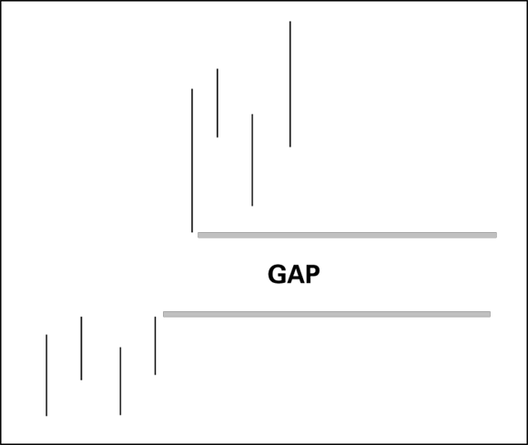

*Figure 7-3: A price gap — an upside void where no transactions took place; supply and demand could only meet at the higher price level. (source: TA4D 2020, p. 180)*

Gaps are usually triggered by news. Volume at the open is the primary filter: low/normal volume = probably common gap; abnormally high volume = gap likely to sustain a trend. (source: TA4D 2020, p. 182–183)

### Common Gap

Appears for no particular reason (noise, thinly traded security, a single errant order). Fails to start or change a trend. Often fills within days. Do not attempt to interpret gaps in thinly traded securities — they are almost always common gaps. (source: TA4D 2020, p. 182)

### Breakaway Gap

Marks the start of a new trend from a consolidation or slightly trending base. (source: TA4D 2020, p. 183–185)

Qualifiers:
1. Proportionately large relative to the normal daily trading range (e.g. normal range $3, gap $15).
2. Occurs when price was only slightly trending or moving sideways.
3. Accompanied by noticeably higher volume.
4. Often confirmed by a break of support, resistance, or a channel boundary.

Breakaway gaps **rarely fill** in the near term. Conditions have changed permanently and restoring the old price level would require reverting those conditions.

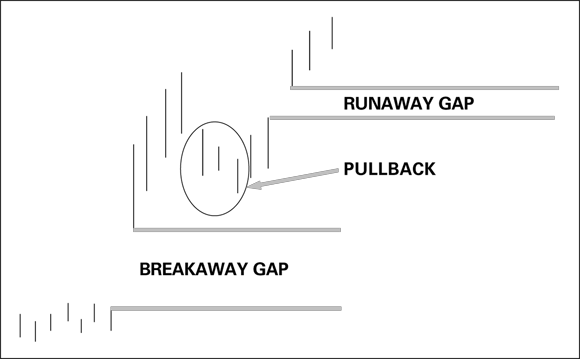

*Figure 7-4: Breakaway gap starts the trend; after a brief pullback, a runaway gap continues it. (source: TA4D 2020, p. 184)*

### Runaway (Measuring) Gap

Occurs mid-trend when fresh news or self-reinforcing buying frenzy accelerates an already-established trend. Distinguished from a breakaway gap solely by context: a breakaway gap starts a trend; a runaway gap continues one. A pullback after a runaway gap is common — professionals use it to "buy the dip." (source: TA4D 2020, p. 185)

### Exhaustion Gap

Occurs at the end of a trend. Key identifier: volume is **low** despite a new high (or low). The last buyers (or sellers) have acted; no new participants are joining.

- Exit or tighten stops when a gap appears with low volume near the end of a trend.
- Often followed quickly by a reversal and gap fill. (source: TA4D 2020, p. 185–186)

### Island Reversal

An exhaustion gap followed immediately by a breakaway gap in the opposite direction, leaving one bar (or small cluster) isolated as an "island." (source: TA4D 2020, p. 186–188)

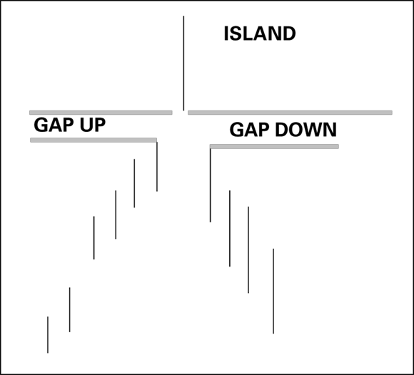

*Figure 7-5: Island reversal. A gap-up isolates the high bar; a gap-down breakaway then starts the reversal trend. (source: TA4D 2020, p. 187)*

- Island at the top: Sell.
- Island at the bottom: Buy.
- Volume pattern: island bar has low volume (exhaustion); the gap-down breakaway has high volume (new sellers entering). High volume on the breakaway gap indicates that the gap is unlikely to be filled. (source: TA4D 2020, p. 187–188)
- Rare but high-reliability signal; widely watched, so self-fulfilling once recognised.

### Gap Filling

"Gaps must fill" is misleading and applied indiscriminately. (source: TA4D 2020, p. 189)

| Gap type | Fill probability |
|----------|-----------------|
| Common / runaway | May fill; bargain hunters and self-fulfilling chatter can cause fills |
| Breakaway | Unlikely to fill near-term; fundamentals have changed |
| Exhaustion | Usually fills quickly (trend reversal follows) |

Use momentum indicators and context — not the blanket "gaps always fill" rule — to judge fill risk. (source: TA4D 2020, p. 189–190)

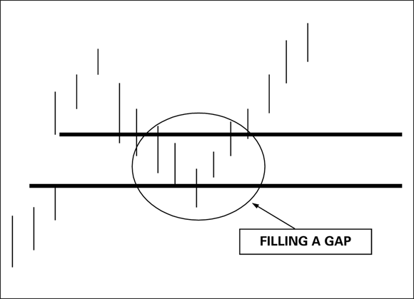

*Figure 7-6: An upside gap is later retraced ("filled") before the trend resumes. (source: TA4D 2020, p. 189)*

---

## Trading Range: Expansion and Contraction

The trading range (high minus low) is a direct measure of volatility and emotional intensity for the session.

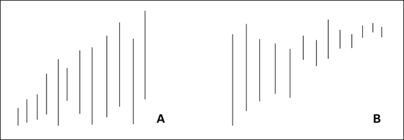

*Figure 7-7: Chart A — range expansion (bars lengthening) = continuation signal; Chart B — range contraction (bars shortening) = reversal warning. (source: TA4D 2020, p. 191)*

**Range expansion:** Bars are getting wider session over session. Usually a continuation signal — more participants are willing to take the price further. A change in range often **precedes** a change in trend direction, so it can be a leading indicator. (source: TA4D 2020, p. 191)

**Range contraction:** Bars are narrowing. Suggests energy is leaving the move; a trend reversal may be approaching. Confirming context:

| Range + Volume | Open-Close | Reading |
|---------------|------------|---------|
| Expanding + rising | Higher closes | Accelerating uptrend |
| Expanding + rising | Lower closes | Accelerating downtrend |
| Contracting + shrinking | Higher closes | Trend slowing, but higher closes partially offset |
| Contracting + high volume | Lower closes | Doubly negative — sellers active in shrinking range; consider exit |

(source: TA4D 2020, p. 192–193)

---

## Average True Range (ATR)

A standard high-low average fails to account for gaps: if a security gaps up $4 but the new day's high-low range is only $2, the averaged number shows no change even though the total move was $6.

**True range** for a gap day: measure from the **prior close** to today's high (upside gap) or today's low (downside gap). This substitutes the prior close for the current-day open, incorporating the gap's full price displacement. (source: TA4D 2020, p. 194–196)

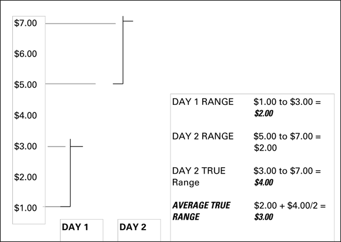

*Figure 7-9: Calculating average true range across a gap. Day 1 range = $2; Day 2 true range (from Day 1 close $3 to Day 2 high $7) = $4; ATR = $3. (source: TA4D 2020, p. 196)*

ATR is displayed as a 14-period moving average by default (Wilder's ATR). It is a **non-directional** volatility measure.

Practical uses:
- ATR falling during an uptrend = trend losing energy, potential reversal ahead (confirmed when a large down-bar spikes ATR sharply). (source: TA4D 2020, p. 197–198)
- ATR rising on a gap = confirms the gap is significant (breakaway-type); ATR steady/shrinking on a gap = probably common gap.
- ATR sets realistic expectation: the maximum daily gain from a position equals roughly one ATR under average conditions.
- Use as a supplemental confirmer alongside a primary indicator. (source: TA4D 2020, p. 198)

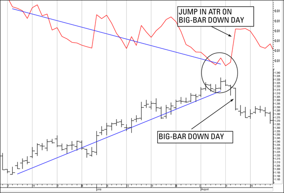

*Figure 7-10: ATR falls as the uptrend ages (circled low), then spikes on the big-bar reversal day — the ATR contraction was the only early warning available. (source: TA4D 2020, p. 197)*

Full ATR indicator page: [Average True Range](../indicators/average-true-range.md)

---

## Key Principles Summary

1. The **close** is the most important bar component; it summarises full-day sentiment.
2. An uptrend = majority of bars with higher highs **and** higher lows; downtrend = lower lows and lower highs.
3. Special bars (inside, outside, spike, key reversal) are statistically rare configurations worth monitoring; interpret with context, not in isolation.
4. Gaps are not equal — breakaway, runaway, exhaustion, and common gaps call for different responses. Volume is the primary classifier.
5. The rule "gaps must fill" applies to common and exhaustion gaps, not to breakaway gaps.
6. Range expansion = continuation; range contraction = reversal warning. ATR quantifies this objectively.
7. Bar-scoring (Fitschen) demonstrates that intuitive bar-types (close near high, above open) are not always the most predictive; systematic testing reveals counter-intuitive results in equities vs. futures.

---

## Related Pages

- [Candlestick Charting](candlestick-charting.md)
- [Support and Resistance](support-resistance.md)
- [Average True Range](../indicators/average-true-range.md)
- [Market Structure](market-structure.md)
- [Chart Patterns](chart-patterns.md) *(page not yet created)*
- [TA4D Source Note](../source-notes/2026-06-24-technical-analysis-for-dummies.md)
