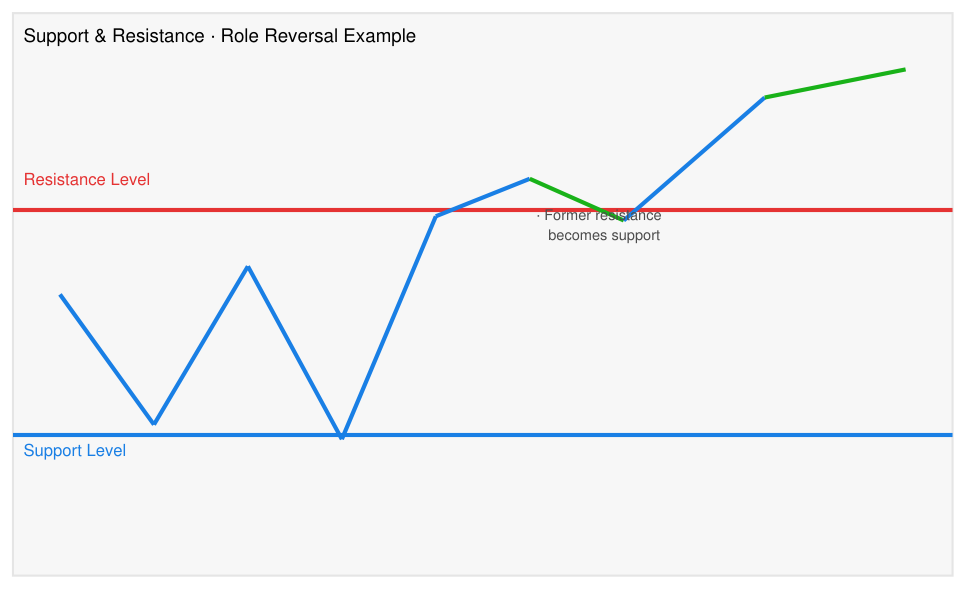

# Support and Resistance

## Definition

**Support** is a price level where buying pressure has historically been strong enough to halt or reverse a decline — a floor. **Resistance** is a price level where selling pressure has historically been strong enough to halt or reverse a rally — a ceiling. These levels are not precise prices but zones.

## Why It Matters For Trading

Support and resistance are the structural skeleton of price action. Entry, exit, and stop-loss decisions almost universally reference S/R levels. They also define risk: placing a stop just below support limits loss if the level fails.

## Mechanism

Price levels gain significance when many participants act on them. Round numbers, prior highs/lows, gap edges, and volume-at-price clusters all attract orders. As price approaches these levels, the concentration of resting orders creates visible friction.

### Role Reversal

When price **breaks above a resistance level** on sufficient momentum, the former resistance often becomes the new support. Rationale:

- Traders who were short at resistance may cover (buy) near that level on any pullback.
- Traders who missed the breakout wait to buy at the "breakout price."
- The convergence of these buyers at the old resistance creates a support floor.

The reverse is also true: a broken support level often becomes resistance on rallies.

Role reversal is considered **confirmed** when price pulls back to the former resistance level and holds there, closing above it (source: Technical Analysis Masterclass sample, 2026-06-14).

### Role Reversal — Annotated Diagram

*Source: Technical Analysis Masterclass sample, ingested 2026-06-14.*

**Chart description:** The chart illustrates the concept of role reversal using two horizontal lines and a price line. A blue horizontal line at the bottom represents the Support Level; a red horizontal line in the middle represents the Resistance Level. A blue price line oscillates near the support level, bounces twice, then rallies upward to break through the resistance level. After breaking through, the price (now shown in green) pulls back slightly to the former resistance level, then continues rising sharply, demonstrating that the former resistance has become new support. The annotation "Former resistance becomes support" marks this transition point.

**Key observations:**
- Resistance acts as a ceiling that price struggles to break above; support acts as a floor that prevents further decline.
- When price breaks above resistance, that former resistance level often becomes new support — role reversal.
- The pullback to the former resistance that holds (green line bouncing off the red line) confirms the role reversal; this is the conservative re-entry point.
- Role reversal applies symmetrically: a broken support level often becomes resistance on subsequent rallies.

## Practical Signals

| Situation | Trading Implication |
|-----------|---------------------|
| Price tests resistance repeatedly without breaking | Accumulating pressure; watch for breakout with volume |
| Price breaks resistance on volume | Potential trend continuation; old resistance is new support |
| Pullback to former resistance holds | Role reversal confirmed; lower-risk entry opportunity |
| Pullback to former resistance fails | False breakout; original resistance reasserting |
| Price breaks support on volume | Potential trend reversal or acceleration lower |

## Common Mistakes

- Treating S/R as precise prices rather than zones; stops placed exactly at the "line" are frequently triggered before price reverses.
- Confusing minor intraday levels with major structural levels; weight significance by timeframe, number of prior touches, and recency.
- Entering on a breakout without confirming volume; low-volume breakouts fail more often.
- Ignoring role reversal as a re-entry opportunity after a missed breakout.

## Breakout Authentication (TA4D, 2020)

Breakouts from S/R levels require authentication before acting. From TA4D:

- **Close filter:** Wait for price to CLOSE beyond the level, not just print a high or low there — closes are less random than intraday extremes
- **Volume filter:** Authentic upside breakouts are usually accompanied by a volume increase; volume drying up before a base breakout is also a confirming signal (all buyers/sellers have transacted)
- **Size filter:** Require price to clear the level by a minimum percentage (e.g. 5%) — avoids acting on trivial breaches
- **Duration filter:** Require the breach to persist for 2–3 bars — filters single-day accidents
- **Orderliness bonus:** Breakout from a low-volatility (orderly) base is more reliable than from a choppy base

Trading range definition: the "normal" price range between established S/R is where supply and demand are in equilibrium (source: TA4D 2020). A violation requiring explanation is a breakout.

See also: [TA4D Pivot Points](../indicators/ta4d-pivot-points.md) for formula-based intraday S/R zones.

## Related Pages

- [Ascending Triangle Breakout](../setups/ascending-triangle-breakout.md) — uses resistance breakout + role reversal re-entry.
- [RSI](../indicators/rsi.md) — RSI divergence near resistance/support strengthens reversal signals.
- [Market Structure](market-structure.md) — broader context on how S/R fits into market microstructure.
- [Breakout After Normal Reaction](../setups/breakout-after-normal-reaction.md) — Livermore-style breakout using S/R concepts.

## Source Notes

- [Technical Analysis Masterclass – Sample](../source-notes/2026-06-14-technical-analysis-masterclass-sample.md)

## Moving Averages as Dynamic Support (Minervini / SEPA Perspective)

As of publication date 2013. Source: [Trade Like a Stock Market Wizard](../source-notes/2026-06-18-trade-like-a-stock-market-wizard.md).

In the [SEPA Strategy](../strategies/sepa-strategy.md), moving averages function as **dynamic support lines** during a [Stage 2](../concepts/stage-analysis.md) uptrend — price levels the stock is expected to hold on pullbacks when the trend is healthy.

| Moving Average | Role in Stage 2 |
|----------------|----------------|
| 50-day MA | Near-term support; healthy Stage 2 stocks pull back to it and reverse higher on lighter volume |
| 150-day (30-week) MA | Intermediate support; deeper pullback that holds the 150-day may signal a base formation |
| 200-day (40-week) MA | Critical support; losing this on heavy volume is a serious Stage 3 warning |

### Practical Distinction from Fixed S/R

| | Fixed price S/R | Moving average S/R |
|-|-----------------|-------------------|
| Level | Static (previous high/low) | Dynamic (moves with price history) |
| Relevance | Tied to specific past price events | Reflects current trend momentum |
| Use in SEPA | Secondary | Primary |

A Stage 2 stock pulling back to the 200-day MA on light volume (a normal reaction) is a potential [VCP](../setups/volatility-contraction-pattern.md) or base-formation opportunity. The same stock breaking the 200-day MA on heavy volume is a potential Stage 3 or Stage 4 transition signal — not a buying opportunity.

Related pages: [Stage Analysis](../concepts/stage-analysis.md), [Trend Template](../concepts/trend-template.md)
