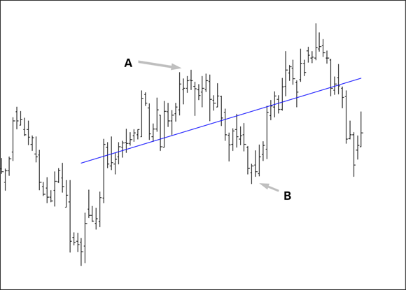
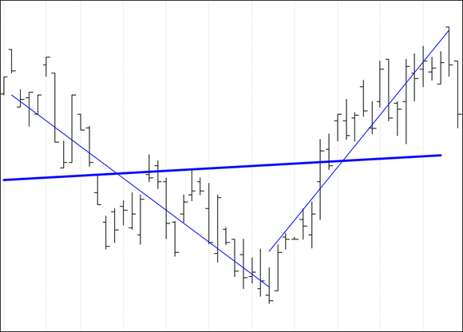
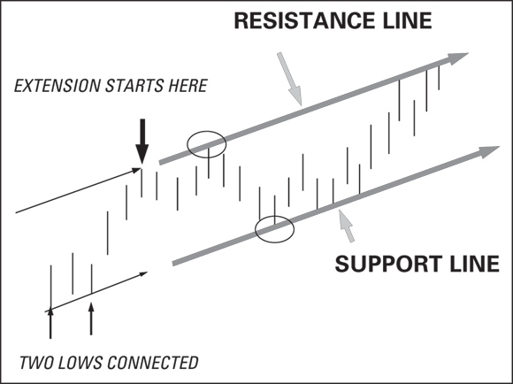
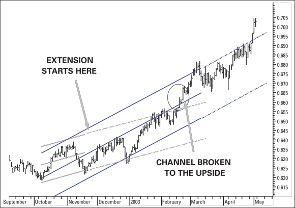
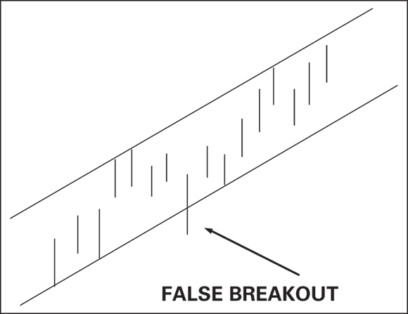
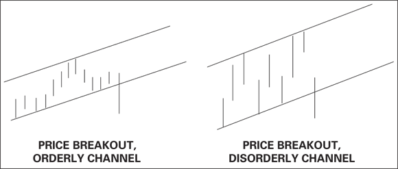
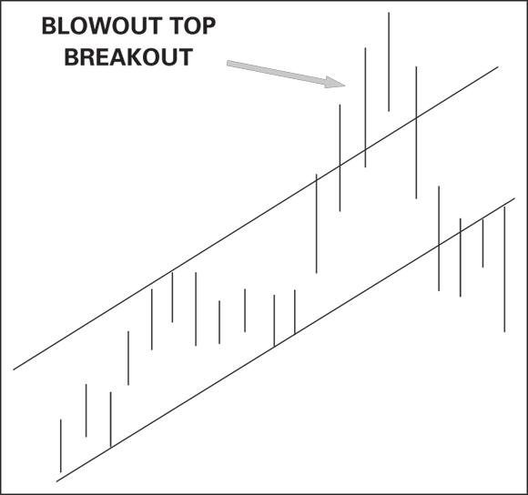

# Trendlines and Channels

Trendlines and channels are the foundational tools for estimating price range, identifying trend direction, and detecting when a trend ends. They are drawn by hand or calculated statistically, and their value depends on how many market participants are watching the same lines. (source: TA4D 2020, Chapters 10–11)

Related: [Support and Resistance](support-resistance.md) | [Chart Patterns](chart-patterns.md) | [Moving Averages](../indicators/moving-averages.md) | [TA4D Pivot Points](../indicators/ta4d-pivot-points.md) | [TA4D Source Note](../source-notes/2026-06-24-technical-analysis-for-dummies.md)

---

## Trendlines

A trendline is a straight line connecting a series of significant price highs or lows.

- **Support trendline**: connect a series of rising lows (uptrend floor).
- **Resistance trendline**: connect a series of declining highs (downtrend ceiling).
- **Minimum requirement**: 2 touch points to draw; a 3rd touch confirms reliability.
- Each touch that holds without breaking adds confidence to the line.

### Internal Trendlines (Linear Regression)

A hand-drawn support or resistance line runs along the edge of price action. An internal trendline — the **linear regression line** — runs through the center, minimizing the sum of squared distances from each close to the line. (source: TA4D 2020, p. 256–258)

Key properties:
- Mathematically objective: given identical start/end points, every analyst gets the same line.
- Reveals "pure trend" and orderliness simultaneously — tight clusters around the line = orderly trend; scattered outliers = disorderly or unreliable trend.
- Does not embed trading rules by itself; used as a confirming indicator.
- Start/end-point selection remains subjective, even though the math is not.
- **Invalid use**: a single linear regression across a V-shaped reversal yields a flat line that describes neither trend. Segment the series at the turning point.
- **Bubble detection**: if the regression line steepens dramatically versus its long-run slope, the move may be statistically abnormal and unsustainable (see Nasdaq 2000, S&P 2007–09). (source: TA4D 2020, p. 261–262)

---

## Channels

A **channel** is a pair of parallel trendlines encasing a price series. The upper line acts as a ceiling (resistance); the lower line acts as a floor (support). (source: TA4D 2020, p. 263–264)

### Construction — Hand-Drawn Channel

1. Connect two relative lows to form the support line; extend it into the future.
2. Wait for a relative high; draw a parallel line from it to form the resistance line; extend.
3. The lines are hypothetical until a third touch validates them without breaking through.
4. Sometimes a higher high forces the resistance line to shift up; in that case, two valid resistance lines may co-exist — treat the farther one as the more important. (source: TA4D 2020, p. 264–266)

Why channels are parallel: orderly crowds collectively recognize when price is relatively high (sell at the ceiling) and relatively cheap (buy at the floor). This is common enough that most charting software includes a "create parallel line" command. Channels are not inevitable — they are crowd behavior, not laws. (source: TA4D 2020, p. 267)

### Using a Channel for Trading and Risk

- **Buy near channel bottom, sell near channel top** — repeat as long as the channel holds.
- **Estimate maximum probable gain**: channel width defines the upside target from the support line.
- **Calculate stop-loss**: place a stop at the channel support line; a close below it invalidates the channel and likely ends the trend.
- Channels also serve as a **sanity check** on external forecasts: a forecast requiring a price far outside the channel is suspect unless a news event is anticipated. (source: TA4D 2020, p. 268–269)

### Standard Error Channel (Linear Regression Channel)

Built from the inside out: the centerline is the linear regression; the outer rails are placed at ±2 standard errors, enclosing approximately 95% of prices. (source: TA4D 2020, p. 269–270)

- Also called the **Raff channel** when an additional standard error is added to widen it.
- 3-error version encloses 99% of prices but is usually too wide for practical use.
- **Self-adjusting**: the channel recalculates as new bars are added; you must freeze it at a chosen endpoint to detect a breakout.
- **Validation**: overlay the standard error channel on a hand-drawn channel from the same starting point. When both align closely, the trend is strongly confirmed. Trading a "double channel" (hand-drawn + regression) reduces stress. (source: TA4D 2020, p. 272–273)
- **Drawbacks**: start/end point selection is subjective; multiple valid channels can be drawn on the same chart pointing to different outcomes ("dueling channels") — most common near turning points.

---

## Breakouts

A **breakout** is a price move beyond a channel or trendline boundary, signaling that the trend — in its current form — has likely ended. It is one of the most important concepts in technical analysis. (source: TA4D 2020, p. 275)

### Authentication Filters

Use one or more of the following filters before acting on a breakout. More filters reduce false positives but increase lag.

| Filter | Rule | Rationale |
|--------|------|-----------|
| **Close filter** | Require a close beyond the line, not just a high or low | Closes reflect sentiment; extreme H/L can be noise |
| **Size filter** | Require price to surpass the line by x% of channel width (e.g. 5%) | Prevents action on trivial breaches |
| **Duration filter** | Require y bars of sustained breach (e.g. 2–3 bars) | Distinguishes one-day spikes from sustained moves |
| **Volume filter** | Look for a volume spike (trend exhaustion) or volume dry-up preceding the break (logjam) | Supply/demand confirmation |
| **Momentum / RS** | Confirm with momentum or relative strength indicators | Loss of momentum in an uptrend precedes downside breakouts |

Filters are security-specific: the "right" percentage or bar count must be tested on each security's price history. A blended average filter tends to be too small for orderly moves and too large for volatile ones. (source: TA4D 2020, p. 277–279)

### False Breakouts

A **false breakout** is a temporary breach of a channel line that fails to follow through — price returns inside the channel and the prior trend resumes.

- The breach is real; what is "false" is the conclusion that the trend ended.
- Single high/low violations are the most common source of false breakouts; the close filter eliminates many of these.
- Accept that channels will occasionally see 1–2 bar violations. If a security generates excessive false breakouts, consider trading a different, more orderly security. (source: TA4D 2020, p. 275–276)

---

## Orderliness vs. Disorderliness

**Orderliness** = low volatility; price bars cluster tightly within the channel.
**Disorderliness** = high volatility; price bars jump widely inside and outside the channel.

Rule: a breakout from an orderly channel is more likely genuine; a breakout from a disorderly channel is more likely a false signal. The same breakout bar that is decisive in an orderly channel may be meaningless in a disorderly channel. (source: TA4D 2020, p. 279–281)

**Volatility transition signals**:
- Orderly → disorderly: almost always accompanied by a breakout and volume change.
- Disorderly → orderly (volatility squeeze): the sharp decrease in volatility warns that a breakout is impending; once the breakout occurs, volume surges.

---

## Blowout Top (and Blowout Bottom)

A **blowout top** (or blowoff top) is an upside breakout within an existing uptrend — price accelerates above the upper channel line. It is counterintuitively bearish. (source: TA4D 2020, p. 281–283)

Mechanism:
1. Crowd enthusiasm drives price above the upper channel boundary.
2. Everyone who intended to buy has bought.
3. When price slows and puts in a lower high or lower low, short-term traders exit in a herd.
4. The resulting oversupply drives price back through the channel and below the support line.

Trading implication: an upside breakout in an uptrend is a valid short-term **buy signal** ("buy high, sell higher" — Larry Williams) but has a **short shelf life**. Treat it as a warning of an imminent downside reversal, not a long-term hold. (source: TA4D 2020, p. 282–283)

The mirror image — a downside blowout in a downtrend — exhausts sellers; when supply dries up, buyers bid price back up through the channel.

---

## Pivot Point Support and Resistance in Sideways Channels

When price stops making higher highs (uptrend) or lower lows (downtrend) but remains inside the channel, it enters a **sideways / range-trading phase**. Horizontal pivot-point lines provide precise buy/sell levels within this range. See [TA4D Pivot Points](../indicators/ta4d-pivot-points.md) for full formulas and figures.

Key use within channel context:
- Pivot **P** (median of high + close + low) anchors the zone.
- **R1/R2/R3** are target resistances; **S1/S2/S3** are target supports.
- If price breaks horizontal pivot S/R decisively, the direction reveals whether the prior trend will resume or reverse.
- Pivot lines are "leading" in the sense that they are projected before price arrives — but all such projections are based on past data and still lag the fundamental cause. (source: TA4D 2020, p. 283–288)

---

## Decision Summary

| Situation | Action |
|-----------|--------|
| Price touches channel support, holds | High-probability long entry; target resistance |
| Price closes beyond channel line | Discard old channel; confirm with volume/momentum before acting |
| Single high/low breach, price returns | Likely false breakout; maintain position |
| Orderly → disorderly shift | Widen filters or step aside |
| Disorderly → orderly (volatility squeeze) | Prepare for imminent breakout; watch volume |
| Upside breakout in uptrend | Short-term buy, set tight stop; watch for blowout top reversal |
| Price moving sideways in channel | Switch to pivot-point S/R for entry/exit levels |

---

## Limitations and Failure Modes

- Channels are probabilistic forecasts, not certainties. Markets can and do stay outside channels.
- Self-fulfilling: many traders act on the same lines, which can cause lines to work — until a large player deliberately pushes through them to flush amateurs.
- Dueling channels: multiple mathematically valid channels can be drawn from nearby starting points, pointing to different outcomes.
- Regression channel is self-adjusting; freeze it to detect breakouts.
- No universal filter value; each security's optimal filter must be discovered empirically.
- Steep linear regression slope vs. historical norms = potential bubble; extension forecasts become unreliable.
