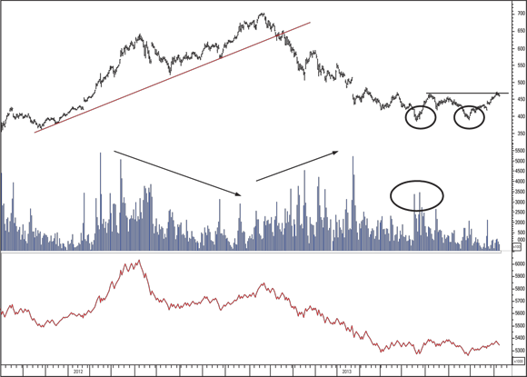

# Volume Analysis

Volume is the number of shares or contracts of a security traded in a given period. It is the primary confirmation tool in technical analysis — it tells you how many traders participated in a price move, not just the direction of the move. A price move with no volume support is untrustworthy. (source: TA4D Ch.3, 2020)

Related pages: [Market Structure](market-structure.md) | [Support and Resistance](support-resistance.md) | [Trading Psychology](trading-psychology.md)

---

## Why Volume Matters

Price can move on a single large purchase or sale, especially in an illiquid market. Volume is the only nonprice factor that genuinely raises the probability that a technical signal is correct. The principle: **the trend is your friend — until the end**, and volume often signals that end before price does. (source: TA4D Ch.3, 2020)

Ignoring volume is a common beginner error — a price move with no volume conviction behind it should not be trusted. This is sometimes called "blindsiding yourself": a trader sees the signal but dismisses it. (source: TA4D Ch.3, p.85, 2020)

---

## Volume and Price Relationships

| Price | Volume | Interpretation |
|-------|--------|---------------|
| Rising | Rising | Healthy uptrend — demand confirmed |
| Rising | Falling | Uptrend weakening — demand fading, participation shrinking |
| Falling | Rising | Healthy downtrend — supply pressure strong |
| Falling | Falling | Potential downtrend exhaustion — supply drying up, often a paradoxically bullish signal |

(source: TA4D Ch.3, 2020)

**Key principle:** When price rises on falling volume, the bulls may be persisting but participation is not expanding. That is a warning, not a sell signal by itself — watch for confirmation. When price falls on falling volume, fewer and fewer sellers remain; the move may be exhausting itself. (source: TA4D Ch.3, p.80, 2020)

---

## On-Balance Volume (OBV)

**Inventor:** Joe Granville. OBV is a running cumulative volume indicator designed to show whether volume is flowing into or out of a security. (source: TA4D Ch.3, p.80, 2020)

### Construction

- If today's close is **higher** than yesterday's close → **add** today's full volume to the running total.
- If today's close is **lower** than yesterday's close → **subtract** today's full volume from the running total.
- If unchanged → OBV is unchanged.

The result is a single cumulative line plotted below the price chart.

**Important caveat:** Attributing all volume to buying or selling is a simplification — it is not realistic, but the signal value still holds empirically. (source: TA4D Ch.3, p.80, 2020)

### Reading OBV

- **Rising OBV** = accumulation — buyers are more active overall, net money is flowing in.
- **Falling OBV** = distribution — sellers are more active, net money is flowing out.
- **OBV leads price:** If OBV rises while price is flat or still declining, accumulation is occurring beneath the surface — a potential upside breakout may follow.
- **OBV divergence (bearish):** Price makes a new high but OBV fails to confirm it → participation is not expanding → warning that the rally may be running out of buyers.
- **OBV divergence (bullish):** Price makes a new low but OBV does not follow → selling pressure is contracting → potential bottom forming.

### OBV in Action — Apple 2012–2013 Example

The chart below (Figure 3-1 from TA4D) shows Apple stock with price (top), daily volume (middle), and OBV (bottom):

**The downmove:** Price was rising but volume was falling. OBV peaked in April and began declining, warning that participation was fading — months before the price broke its support line in October. A trader who acted on the OBV warning would have sold at approximately $646.88 and covered any short at approximately $385.10 in April (circle on chart), capturing a ~41% gain. (source: TA4D Ch.3, p.81–82, 2020)

**The upmove:** Apple formed a double bottom. Volume and OBV were falling into the bottoms (sellers exhausted). On the right side of the chart, price surged above the prior horizontal resistance, but volume was still falling. OBV had not yet confirmed new participation. The instruction: get ready to buy, but wait for a volume spike that confirms new buyers are entering. (source: TA4D Ch.3, p.82–83, 2020)

### OBV Limitations

OBV does not work all the time. Joe Granville himself famously missed the entire bull market that began in 1982 and persisted in calling it false for 14 years. Use OBV as one input among several, not as a standalone signal. (source: TA4D Ch.3, p.83, 2020)

---

## Accumulation/Distribution — Chaikin's Refinement

Marc Chaikin improved on OBV by attributing only a **portion** of the day's volume to buying or selling, based on where price closed within the day's high-low range. (source: TA4D Ch.3, p.83–84, 2020)

**Midpoint** = (Day's High + Day's Low) / 2

- Close **above** midpoint → **accumulation** (bullish sentiment dominated). The closer to the day's high, the greater the bullish portion. Close exactly at the high = 100% of volume attributed to buying.
- Close **below** midpoint → **distribution** (bearish sentiment dominated). The closer to the day's low, the greater the bearish portion.
- Close exactly **at** midpoint → no change; no volume added or subtracted.

This is considered a more realistic measure of net buying and selling pressure than raw OBV. (source: TA4D Ch.3, p.83–84, 2020)

---

## Volume Spikes

A **spike** is a volume reading that is roughly double (or more) the preceding average daily volume, with volume returning to normal the following session. (source: TA4D Ch.3, p.84, 2020)

### Spike at a Price Bottom (Selling Climax)

If price has been in a downtrend and volume suddenly explodes, the crowd is throwing in the towel and exiting en masse — **everyone who wanted to sell has sold**. No sellers are left to push the price lower. This is called a **selling climax** and is a warning that the downtrend may be exhausted. Look for a second volume spike shortly after to confirm buyers are returning. (source: TA4D Ch.3, p.84, 2020)

### Spike at a Price Top (Buying Climax)

A volume spike as price makes new highs means the crowd has used up its supply of cash. **Everyone who wanted to buy has bought.** This is called a **buying climax**. If there is no fresh fundamental news justifying the surge in demand, the top is likely in. Think about taking profit or avoiding a new entry. (source: TA4D Ch.3, p.84–85, 2020)

**Fundamental cross-check:** If legitimate news (earnings surprise, new product, macro shift) explains why new buyers suddenly appeared, the usual spike interpretation may not apply — the demand may be durable. The spike alone is not a mechanical sell signal; it requires judgment. (source: TA4D Ch.3, p.85, 2020)

---

## Volume and Breakouts

A breakout accompanied by a **volume surge** is far more reliable than one on thin volume. Low-volume breakouts are frequently false — the price slips back into its prior range. (source: TA4D Ch.2–3, 2020)

The extended-position detection rule: when many traders have crowded into a position (volume rising) but price barely moves, the move is ending — participation is maxed out. (source: TA4D Ch.2, p.64, 2020)

---

## Volume in the Context of Market Sentiment

Volume is one of two quantitative methods for measuring crowd sentiment, alongside price-based sentiment indicators. The others — bull/bear ratio, advance/decline line, put/call ratio, VIX — describe the broader market environment. Volume is unique: it is the only nonprice factor that directly measures **participation** in the specific security you are trading. (source: TA4D Ch.3, p.79, 2020)

The guiding principle: **"A change in volume often predicts a change in price."** The OBV indicator (and Chaikin's refinement) make this relationship visible as a divergence signal. (source: TA4D Ch.3, p.83, 2020)

---

## Key Figures Referenced

| Figure | Description | Source |
|--------|-------------|--------|
| Figure 3-1 | Apple OBV chart 2012–2013 — price, volume bars, OBV line | TA4D Ch.3, p.81 |

---

## Failure Modes and Limitations

- OBV is a simplification; it assigns 100% of a day's volume to net buying or selling, which is rarely accurate in practice.
- Volume spikes can be caused by a handful of large players, not broad crowd participation — the inference about sentiment may be wrong.
- OBV can diverge from price for months before the divergence resolves, making it an early but imprecise timing tool.
- In low-liquidity securities, a single large trade distorts volume readings and can produce false signals.
- Chaikin's accumulation/distribution is more nuanced than OBV but still does not distinguish buying intent from forced liquidation.

---

## Cross-References

- [Market Structure](market-structure.md) — supply/demand, breakouts, and retracements where volume confirms or refutes the move
- [Support and Resistance](support-resistance.md) — breakouts on volume are more reliable
- [Trading Psychology](trading-psychology.md) — volume spikes reflect crowd extremes (buying/selling climaxes); behavioral biases that cause traders to ignore volume signals ("blindsiding yourself")
- [TA4D Source Note](../source-notes/2026-06-24-technical-analysis-for-dummies.md)
