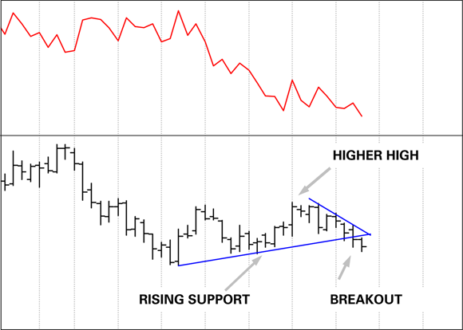
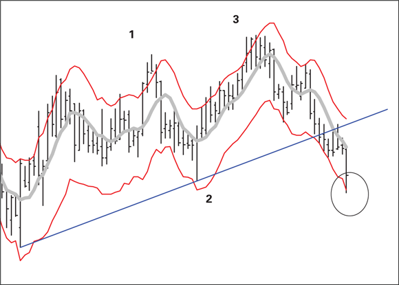

# Average True Range (ATR)

ATR is a volatility indicator invented by J. Welles Wilder, Jr. that measures the true range of price movement by incorporating overnight gaps. It is a pure volatility measure — it carries no directional information.

Source: [Technical Analysis for Dummies](../source-notes/2026-06-24-technical-analysis-for-dummies.md) (TA4D 2020).

---

## The Problem ATR Solves

A simple high-minus-low daily range understates volatility when a gap occurs. If Day 1 closes at $3 and Day 2 opens at $5 and reaches $7, the naive H-L range is $2 — identical to Day 1's $2 range — even though prices moved $4 in total. The averaging of those two identical $2 values would suggest volatility had not changed, when in fact it expanded significantly (source: TA4D 2020, Chapter 7, p. 195–196).

---

## Calculation

**True Range** for any single bar is the greatest of three values:

| Candidate | Formula |
|-----------|---------|
| Intraday range | High − Low |
| Gap-up capture | \|High − Previous Close\| |
| Gap-down capture | \|Low − Previous Close\| |

When a gap up occurs, the True Range is measured from the prior day's close to today's high. When a gap down occurs, it is measured from the prior day's close to today's low. The prior close substitutes for the open in order to capture the full price displacement experienced by holders of overnight positions (source: TA4D 2020, Chapter 7, p. 196).

**Average True Range (ATR)** is then an N-period moving average of True Range values. The standard default is **14 periods**, which Wilder selected and which remains well-tested across U.S. equities (source: TA4D 2020, Chapter 7, p. 196).

**Worked example from the book (source: TA4D 2020, p. 196):**

- Day 1 range: $1–$3, so True Range = $2
- Day 2 range: $5–$7 (gap up from Day 1 close of $3), True Range = $7 − $3 = **$4**
- 2-period ATR = ($2 + $4) / 2 = **$3**

Without the gap adjustment, the naive average would be ($2 + $2) / 2 = $2 — understating volatility by 33%.

---

## Interpretation

### Higher ATR = wider stops required

When ATR is large, intraday price swings are large. A stop placed at the standard distance will be hit by normal noise before any real adverse move occurs. Wider ATR demands wider stops — and justifies them, because the expected price movement is also larger (source: TA4D 2020, Chapter 7).

### ATR is non-directional

ATR rises in both sharp rallies and sharp sell-offs. A rising ATR during a downtrend is not a buy signal — it simply confirms that the downtrend is energetic (source: TA4D 2020, Chapter 7, p. 197).

### ATR as a warning signal: divergence from price

When price is making higher highs but ATR is falling, volatility is contracting while price extends. This divergence is a warning that the trend may be exhausting. In the source example, the ATR reaches a multi-period low just as the uptrend ends; the subsequent big-bar down day is accompanied by a sharp jump in ATR, confirming the reversal (source: TA4D 2020, Chapter 7, p. 197).

> "A rise in the ATR confirms the move is likely significant, whereas a steady or shrinking ATR means nothing much is really happening." — TA4D 2020, p. 197

### Range expansion and contraction

- **Range expansion** (rising ATR): highs and lows are widening; volatility and profit opportunity both increase, as does risk.
- **Range contraction** (falling ATR): bars are narrowing; apparent calm often precedes a breakout. Do not interpret low ATR as low risk — it frequently signals that a breakout is imminent (source: TA4D 2020, Chapter 14, p. 360).

In the Chapter 14 illustration, ATR falls progressively as price rises along a support line, then breaks sharply after the highest high. The ATR divergence preceded the support break by several bars (source: TA4D 2020, p. 360).

---

## Stop Placement with ATR

ATR provides an objective, volatility-scaled distance for stop placement. The principle: set the stop far enough away that normal noise will not trigger it, but close enough that a genuine adverse move will.

**General rule:** place initial stop at entry price ± (ATR × multiplier), where multiplier typically ranges from **1.5 to 2.5** depending on risk tolerance and time frame (source: TA4D 2020, Chapter 14).

Two well-known ATR-based stop mechanisms:

- **Chandelier Exit** (Chuck LeBeau): stop is set below the highest high (or highest close) since entry by a multiple of ATR — e.g., entry-high minus 3 × ATR. This makes the stop trailing and self-adjusting (source: TA4D 2020, Chapter 5, p. 79).
- **Parabolic Stop-and-Reverse** (Welles Wilder): the indicator rises by a factor of ATR as new highs accumulate, accelerating in fast trends and decelerating as momentum fades (source: TA4D 2020, Chapter 5, p. 79).

---

## ATR Bands as Dynamic Trailing Stops

ATR can be used to construct asymmetric bands around a moving average of the **median price** (average of high, low, close). The bands are formed by adding and subtracting a moving average of ATR from this centerline.

Unlike Bollinger Bands, ATR bands can be made **asymmetric** to reflect trend direction:

- In an **uptrend**: widen the lower band (e.g., to 150% of ATR) so that a downside reversal must be more severe than recent corrective pullbacks to trigger the stop.
- In a **downtrend**: widen the upper band by the same logic.

This creates a "prove it" filter: a downside break from an uptrend has to surpass both the support trendline and the widened ATR band to qualify as a true reversal — not just a normal retracement (source: TA4D 2020, Chapter 14, p. 363–365).

In the source example, the lower band is set at 150% of ATR during an uptrend. The final bar breaks both the trendline support and the lower ATR band simultaneously, providing a double confirmation of the reversal (source: TA4D 2020, Chapter 14, p. 365).

**ATR bands vs. Bollinger Bands:**

| Feature | Bollinger Bands | ATR Bands |
|---------|----------------|-----------|
| Width basis | Standard deviation of price | Multiple of ATR |
| Symmetry | Equal on both sides | Can be asymmetric |
| Stop application | Not generally used for stops | Well-suited for adaptive stops |
| Directional read | No | No |

---

## ATR in Constant Range Bar Construction

ATR also informs the design of constant range bars (momentum bars). A common rule of thumb is to set the constant bar range at approximately 50% of the ATR, so that a new bar appears only when price has moved a meaningful fraction of its average daily range. This filters noise and ensures each bar represents genuine momentum (source: TA4D 2020, Chapter 15, p. 370).

---

## Practical Guidelines

- Use **14 periods** as the default; shorter periods make ATR more sensitive to recent spikes, longer periods smooth it further.
- ATR is plotted as a separate subpanel, not overlaid on price. Use it to size positions and stops, not to generate buy/sell signals on its own.
- Rising ATR after a prolonged low-ATR period signals volatility expansion — potential trend change or acceleration. Treat it as a warning, not a directional signal.
- ATR can be "choppy" on its own; its primary value is confirming whether a move (especially a gap or a breakout) is significant relative to recent price behavior (source: TA4D 2020, Chapter 7, p. 197).
- Do not use ATR in isolation. It works best as a confirming indicator alongside a primary trend or momentum signal (source: TA4D 2020, Chapter 7, p. 197).

---

## Related Pages

- [Bollinger Bands](bollinger-bands.md)
- [Risk Management](../concepts/risk-management.md)
- [Price Bars](../concepts/price-bars.md)
- [Trendlines and Channels](../concepts/trendlines-channels.md)
- [RSI](rsi.md)
