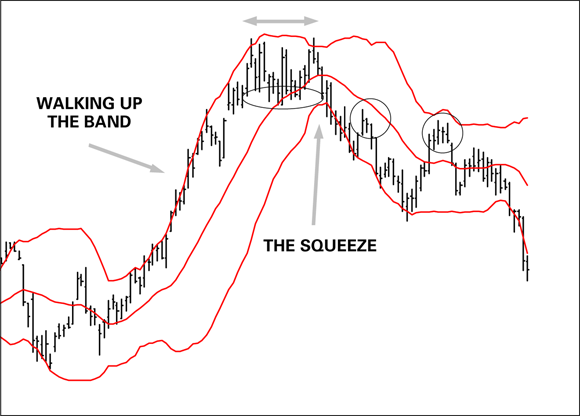

# Bollinger Bands

## Definition

Bollinger Bands, invented by John Bollinger, are a volatility envelope plotted around a 20-day simple moving average (SMA). The bands expand and contract with market volatility, showing price in the context of its own recent norm. The 20-day period was chosen because Bollinger's research showed it is the most effective window for detecting variance in U.S. equities (source: TA4D 2020).

## Construction

```
Middle band  = 20-day SMA of closing price
Upper band   = 20-day SMA + (2 × standard deviation of closing price over 20 days)
Lower band   = 20-day SMA − (2 × standard deviation of closing price over 20 days)
```

The two-standard-deviation offset captures approximately 95% of price variation away from the average. The bands are adaptive — they widen automatically when volatility rises and narrow when it falls, making them "moving standard deviations" (source: TA4D 2020).

**Band width as volatility proxy:** Wide bands = high current volatility; narrow bands = low current volatility.

## Interpretation

### Walking the Band (Strong Trend)

Price touching or slightly breaking the upper band is a **continuation signal**, not a sell signal. In a strong uptrend, price can repeatedly ride the upper band — a pattern called "walking up the band" (source: TA4D 2020). Symmetrically, price walking the lower band signals a strong downtrend.



*Chart description: Candlestick chart with red Bollinger Bands. Left section shows price riding the upper band during a strong uptrend ("WALKING UP THE BAND"). Right section shows the bands constricting tightly together ("THE SQUEEZE"), indicating compressed volatility before a directional breakout. Circles highlight retreats to the middle moving-average line. Source: TA4D 2020, Fig. 14-5.*

### End of an Upmove — Two Signals

1. **Retreat from band:** Price stops hugging the upper band and slides back to the middle SMA (or lower). Failure to make a relative new high is a warning that the move is exhausting. In Figure 14-5 of TA4D the retreat corresponds to a double-top formation (source: TA4D 2020).
2. **Band contraction:** When the bands narrow, the trading range is compressing. Traders are unwilling to test new highs or generate new lows — a standoff. This compression is the Squeeze (see below).

### The Squeeze

The Squeeze occurs when the upper and lower bands contract significantly, signaling **compressed volatility and an impending breakout**. Critical limitations (source: TA4D 2020):

- The squeeze predicts that a breakout is coming but **does not indicate direction**.
- Direction must be inferred from other signals: candlestick patterns, momentum indicators (RSI, MACD), or broader trend context.
- After an upside breakout of the top band, a rapid break of the bottom band may be a **head fake** — an over-reaction by profit-takers rather than a genuine reversal. Use confirming indicators before acting on the opposite-band break.

### Overbought / Oversold

| Condition | Interpretation |
|-----------|---------------|
| Price at or beyond upper band | Overbought zone — extended relative to recent norm |
| Price at or beyond lower band | Oversold zone — depressed relative to recent norm |
| Price crosses middle band (20-day SMA) | Momentum shift — useful as a centerline signal on its own |

**Caveat:** In strong trends, overbought or oversold readings can persist for extended periods. Treating a band touch as an automatic reversal signal will produce losses in trending markets (source: TA4D 2020).

### Centerline (Middle Band)

The 20-day SMA in the center is itself a useful signal boundary. A sustained price position above the centerline is bullish; below is bearish. After the price retreats from the upper band, a failure to hold the centerline in an alleged uptrend is a bearish warning.

## Trading Use Cases

1. **Trend confirmation (walk the band):** When price rides the upper band, hold or add to long positions. Exiting on the first band touch in a strong trend is premature.
2. **Squeeze + breakout entry:** Identify the squeeze (bands at multi-week or multi-month tightness). Wait for a directional breakout, then enter in the direction of the break with a stop on the opposite side of the middle band or opposite band.
3. **Head-fake filter:** After a rapid opposite-band break following a strong move, require a confirming momentum signal (RSI, MACD) before trading the reversal. Without confirmation, assume head fake.
4. **Centerline re-test:** Price pulling back to the 20-day SMA after a breakout provides a lower-risk re-entry in the direction of the trend, with the centerline acting as support/resistance.
5. **P&F pairing:** Tight Bollinger Bands combined with short, compact P&F columns signal a sideways, low-volatility market — avoid initiating new trades until either widens (source: TA4D 2020, Ch. 14 context).

## Failure Modes

- **Persistent overbought in strong trends:** Price can "walk" the upper band for weeks. Shorting on band touches during a powerful uptrend leads to repeated losses.
- **Squeeze without breakout:** Bands can remain narrow for a prolonged period before resolving. Premature breakout entries on minor wiggles cause whipsaws.
- **Direction ambiguity:** The squeeze signals compression, not direction. Without additional context (pattern, momentum, sector), the trade has no directional edge.
- **Symmetrical bands limit stop utility:** Because upper and lower bands are equidistant from the center, a downside break does not face a proportionally tougher test than an upside break, even in a strongly trending security. For asymmetric stops, consider ATR-based bands instead (source: TA4D 2020, Ch. 14, Notis method).
- **Parameter sensitivity:** The standard settings are 20-period SMA and 2 standard deviations. Shortening the period or reducing the deviation multiplier generates more, noisier signals. Widening them suppresses signals but increases lag.

## ATR Bands as an Alternative for Stops

Bollinger Bands are not designed for setting stops because they are symmetric. An asymmetric approach uses [Average True Range](average-true-range.md) bands:

- **In an uptrend:** widen the lower band (e.g., 150% of ATR below the median-price moving average) so that only a statistically severe downmove triggers the stop, filtering normal retracements.
- **In a downtrend:** widen the upper band.

A double breakout — price simultaneously breaching a trendline and an ATR band — is a stronger reversal signal than either alone (source: TA4D 2020, Ch. 14, Fig. 14-6).

## Evidence

- Source: *Technical Analysis for Dummies* (Barbara Rockefeller, 2020 edition), Chapter 14 — volatility and Bollinger Bands. Confidence: high (dedicated primary chapter with annotated charts).
- Bollinger's original research parameter (20-day SMA for U.S. equities) widely adopted across charting platforms.
- No quantitative backtests in vault as of 2026-06-24.

## Related Strategies / Setups

- [Average True Range](average-true-range.md) — ATR is the complementary volatility measure; used for asymmetric stop bands.
- [Moving Averages](moving-averages.md) — the 20-day SMA is the middle band; centerline signals share moving-average logic.
- [Trendlines and Channels](../concepts/trendlines-channels.md) — Bollinger Bands are adaptive envelopes; trendline channels are fixed; both frame price within a volatility context.
- [Point and Figure](../concepts/point-and-figure.md) — P&F chart compactness (short columns, tight range) is a useful companion signal to the Bollinger squeeze.
- [RSI](rsi.md) — momentum indicator recommended as a confirming signal alongside Bollinger Band readings, especially for head-fake detection.

## Source Notes

- [Technical Analysis for Dummies (2026-06-24)](../source-notes/2026-06-24-technical-analysis-for-dummies.md)
