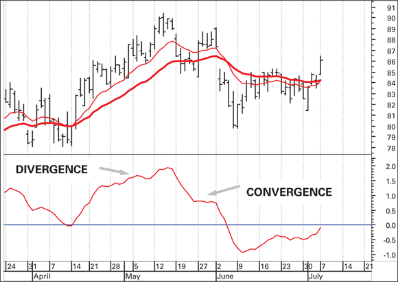
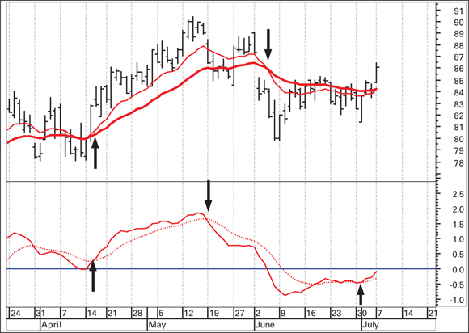
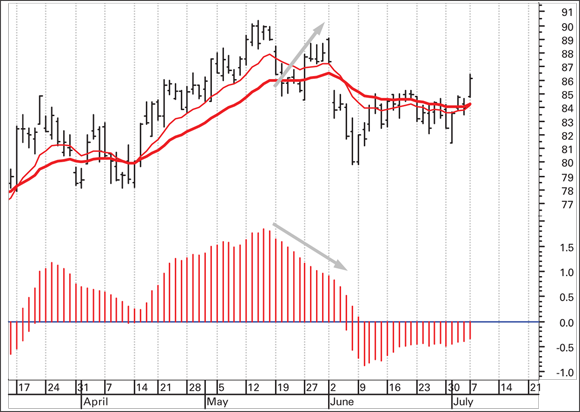

# MACD (Moving Average Convergence-Divergence)

The MACD is one of the most reliable and widely used technical indicators, combining trend-following and momentum characteristics into a single tool. It was invented by Gerald Appel and remains a benchmark indicator after decades of use. (source: TA4D 2020)

## Construction

**MACD line** = 12-day EMA minus 26-day EMA (Appel's original parameters).

The subtraction captures the convergence and divergence between two exponential moving averages. When price is rising, the short-term (12-day) EMA is numerically larger than the long-term (26-day) EMA. As price peaks and the trend weakens, the gap between the two averages narrows — this is convergence. As the trend strengthens, the gap widens — this is divergence. (source: TA4D 2020)

**Signal line** = 9-day EMA of the MACD line, superimposed on the MACD line. The signal line acts as a trigger for buy and sell decisions.

**Parameters:** The standard 26/12/9 parameters are well-tested over decades. Curve-fitting alternative parameters usually degrades out-of-sample performance — Appel's originals are hard to beat over long periods. (source: TA4D 2020)

## Trading Rules

**Buy signal:** MACD line crosses above the signal line.

**Sell signal:** MACD line crosses below the signal line.

**Stronger signal:** When both the MACD and signal lines are above zero at a bullish crossover (or below zero at a bearish crossover), the signal is considered more reliable. The source recommends waiting for both lines to be on the correct side of zero before acting. (source: TA4D 2020)

## Advantage Over Simple MA Crossovers

The MACD generates signals earlier than a plain moving average crossover, because the signal line crosses the MACD line before the two underlying moving averages have actually crossed on the price chart. A documented example from the source shows:

- **Buy signal** issued two days earlier than the equivalent MA crossover.
- **Sell (exit) signal** issued more than two weeks ahead of the MA crossover, saving approximately $4.68 (~5%) per share.
- **Re-entry signal** triggered roughly two weeks ahead of the underlying MA crossover.

The earlier exit in particular is the primary practical benefit — it gets the trader out before the major breakdown. (source: TA4D 2020)

## MACD Histogram

**Formula:** MACD histogram bar = MACD line minus signal line.

The histogram plots the difference between the MACD and signal lines as vertical bars above and below a zero line. This format makes convergence and divergence easier to read visually without requiring close inspection of two overlapping lines. (source: TA4D 2020)

- **Bars above zero and growing taller:** divergence — the two averages are moving further apart, trend is strengthening.
- **Bars above zero and shrinking:** convergence — the two averages are drawing together, trend is weakening, signal change approaching.
- **Bars below zero:** sell territory; bars becoming less negative signals supply exhaustion.

**Buy signal on histogram:** Bars crossing above zero. Anticipatory entries are possible when bars are negative but clearly shrinking, though the strict rule is to wait for the zero-line crossover. (source: TA4D 2020)

## Histogram Divergence (Bearish and Bullish)

Divergence between the price chart and the histogram is an early warning of potential reversal:

**Bearish divergence:** Price makes a new high but the histogram makes a lower high — momentum is fading even as price advances. This warns of an impending reversal. (source: TA4D 2020)

**Bullish divergence:** Price makes a new low but the histogram makes a less negative (higher) low — selling momentum is exhausting ahead of a price recovery.

Divergence is early but imprecise on timing — it signals the setup, not the exact reversal point.

## MACD as a Momentum Indicator

Although constructed entirely from moving averages, MACD is fundamentally a momentum indicator — it depicts how quickly price is changing rather than the price level itself. The MACD is still a lagging indicator: in a wild new price move it will lag like any other moving-average-based tool. Its edge is in anticipating trend changes relative to simple MA crossovers, not in predicting moves from scratch. (source: TA4D 2020)

## Failure Modes

- **Choppy or sideways markets:** MACD generates frequent false crossover signals when there is no clear trend. It performs best in trending conditions.
- **Histogram divergence timing:** Divergence is an early warning but does not pinpoint when the reversal will occur. Acting too early on divergence can result in premature exits or entries.
- **Lagging on fast moves:** As with all moving-average-based indicators, sharp sudden price moves are lagged. The MACD will not protect against gap downs or shock events.

## Key Reference

Gerald Appel. *Understanding MACD* (with Edward Dobson, Traders Press, 2008 reissue). Despite being a short paperback of fewer than 100 pages, it commands collector prices secondhand — a testament to the lasting value of Appel's contribution. (source: TA4D 2020)

## Related Pages

- [Moving Averages](moving-averages.md)
- [RSI](rsi.md)
- [Stochastic Oscillator](stochastic-oscillator.md)
- [Trading Edge](../concepts/trading-edge.md)
- [TA4D Source Note](../source-notes/2026-06-24-technical-analysis-for-dummies.md)
