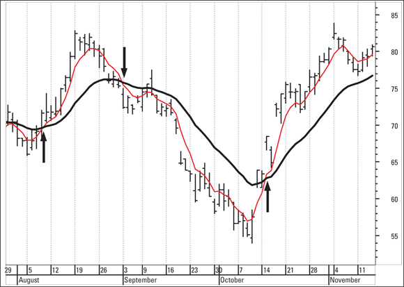
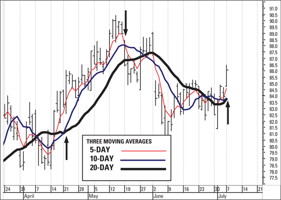
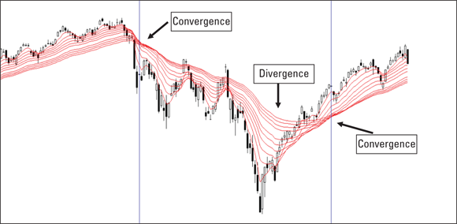

# Moving Averages

Moving averages smooth a price series to reveal trend direction and generate objective buy/sell signals. They are the foundation of many trend-following systems and serve as the building block for derived indicators such as [MACD](macd.md).

## Types of Moving Averages

### Simple Moving Average (SMA)

The SMA is the equal-weighted arithmetic mean of N closing prices. Each bar in the lookback window contributes identically to the result. It is the most transparent and widely understood form.

- A 20-day SMA is often plotted on every chart as a market benchmark; many traders watch it as a dynamic support/resistance level (source: TA4D 2020).
- The 50-day and 200-day SMA are widely reported in financial media. The 200-day describes general market tone; the so-called "golden cross" (50-day crossing above 200-day) and "death cross" (50-day crossing below 200-day) are semantically loaded terms with no statistically proven predictive basis — they are barometers of environment, not precise trading tools (source: TA4D 2020).

### Weighted Moving Average (WMA)

The WMA multiplies each closing price by a recency weight before averaging. In a 5-day WMA, today's close is multiplied by 5, yesterday's by 4, and so on; divide by the sum of the weights (15), not the count of days. This makes the WMA more responsive to recent price moves than the SMA.

### Exponential Moving Average (EMA)

The EMA applies a smoothing factor that minimises the gap between yesterday's EMA and today's close, giving recent prices more influence without the abrupt weight-drop of the WMA. The fewer the days in the period, the larger the smoothing factor. The EMA is more popular than the WMA in practice because all charting software computes it automatically and it balances responsiveness with noise reduction (source: TA4D 2020).

Standard default periods: **12-day and 26-day EMA** (used in MACD), **9-day EMA** (signal line). These defaults were selected by MACD inventor Gerald Appel and have proven difficult to beat out-of-sample over decades (source: TA4D 2020).

### Adaptive Moving Average (AMA / KAMA)

Invented by Perry Kaufman (KAMA), the adaptive MA automatically adjusts its smoothing constant based on market volatility. When price is noisy, it behaves like a long-period MA; when price is trending cleanly, it behaves like a short-period MA. The KAMA best suppresses whipsaw losses among the four types but is slow to enter breakaway trend reversals (source: TA4D 2020).

Ranking by responsiveness to recent price, fastest to slowest: WMA > EMA > SMA > AMA.

## The Noise-Lag Tradeoff

All moving averages face a fundamental tradeoff:

- **Fewer periods** → less lag, faster signals, but more whipsaw losses from noise.
- **More periods** → more lag, slower signals, but fewer false crossovers.

A 3-day MA on a typical trending stock cuts profitability below a buy-and-hold result. A 50-day MA enters and exits trends so late that much of the move is lost. The best period is the shortest that keeps whipsaw losses manageable for a given security's noise level — and this optimum shifts over time (source: TA4D 2020).

Filters can reduce whipsaws without changing the period:

- **Time filter**: price must remain above/below the MA for an additional x periods after the crossover.
- **Extent filter**: price must surpass the MA by x percent or x standard deviations.
- **Volume filter**: crossover must be accompanied by a significant rise in volume.
- **Extreme filter**: the close's low (uptrend) or high (downtrend) must clear the MA, not just the close itself.

Filters delay entry further but reduce overtrading costs (commissions, bid-ask spread).

## Single MA Crossover

The simplest rule: **buy when price closes above the MA; sell (or go short) when price closes below it.** Execute at the next day's open.

The main problem is the **whipsaw** — a false crossover that reverses within a few bars. Whipsaws are common in sideways or volatile markets and erode profits through repeated small losses and brokerage costs (source: TA4D 2020).

The **moving average level rule** is a variant: call the end of an uptrend when today's MA value is lower than yesterday's, rather than waiting for price to cross. This typically exits a trade earlier than the crossover rule, though not always (source: TA4D 2020).

## Dual MA Crossover (Two Moving Average Model)

Instead of crossing price against one MA, you cross a **short MA against a long MA** — for example, 5-day against 20-day (one week vs. one month).

- **Buy**: short MA crosses above long MA.
- **Sell / go short**: short MA crosses below long MA.

The dual crossover filters out single-period outliers because the short MA must digest them before crossing the long MA. The result is **fewer trades, fewer false signals, but more lag than the single MA crossover** (source: TA4D 2020).

**Daylight between the lines = trend confidence.** When the two MAs have visible separation (daylight), the signal is reliable and the trend is intact. When the lines converge (narrow gap), the trend is weakening and a crossover may be imminent (source: TA4D 2020).

*Figure: 5-day MA (red) vs 20-day MA (black). Upward arrows = buy signals; downward arrow = sell signal. Note the visible daylight during the confirmed uptrend and narrowing during the outlier period.*

Common parameter pairs: 5/20 (week/month), 3/30, 12/26, 4/18/40. The "best" pair is the one that minimises whipsaws without sacrificing too much trend capture for the specific security and timeframe. Curve-fitting to find a superior pair usually fails out-of-sample (source: TA4D 2020).

## Three MA Model (5/10/20)

Adding a third MA creates a belt-and-suspenders filter:

- **Buy**: the short MA (5-day) AND the medium MA (10-day) must BOTH cross above the long MA (20-day).
- **Exit long**: the short MA crosses below either of the other two.
- **No short entry**: the model stays flat (out of market) rather than reversing.

The critical advantage: **the three MA model refuses to give a confirmed signal in sideways or choppy markets.** When price chops without direction, the three lines do not align, so no trade is taken. This avoids the overtrading and whipsaw losses that destroy the always-in two MA model during ranging periods (source: TA4D 2020).

*Figure: 5-day (red), 10-day (blue), 20-day (thick black). First arrow = confirmed buy (both short and medium above long). Center arrow = exit (short crosses below medium during choppy period — no short taken). Final arrow = re-entry confirmed after the range resolves.*

The three MA model is compatible with the [SEPA Strategy](../strategies/sepa-strategy.md) preference for staying out of the market during choppy, trendless conditions.

Standard defaults (5/10/20 or 4/18/40) are well-tested and difficult to improve with optimisation — any apparent improvement from curve-fitting to historical data is likely to underperform out-of-sample (source: TA4D 2020).

## Moving Average Ribbon

A ribbon plots many MAs simultaneously — typically 5, 10, 20, 30, 40, 50, and more, each in a different colour — to give a panoramic view of trend strength across timeframes.

**Reading the ribbon:**

- **Widening / diverging ribbon**: shorter MAs are outrunning longer MAs. Trend is strengthening and robust. A simple rule: hold or buy only when price is above all ribbon lines.
- **Narrowing / converging ribbon**: MAs contract toward a single line. Trend momentum is fading; a reversal or sideways period may be near.
- **Flat, tangled ribbon**: no clear trend direction; the market is ranging.

*Figure: Candlestick chart overlaid with ribbon of multiple red MA lines. Arrows label convergence zones (ribbon tightens, trend fading) and divergence zones (ribbon fans out, trend strengthening).*

The ribbon does not easily generate mechanical buy/sell rules beyond the "price above all lines = long" heuristic. Its primary value is visual diagnosis of trend strength and early warning of regime change (source: TA4D 2020).

## Convergence and Divergence Quantified

To anticipate a crossover rather than wait for it, subtract the long MA from the short MA each day. This produces a numerical measure of the gap:

- **Rising difference** (positive and growing): the two MAs are diverging — trend is confirmed.
- **Falling difference** (positive but shrinking): the two MAs are converging — trend may be weakening.
- **Zero crossing**: the two MAs have crossed.
- **Negative difference**: short MA is below long MA — downtrend is in force.

This arithmetic is the foundation of the [MACD](macd.md) indicator (Gerald Appel, 26/12-day EMA, 9-day signal line), which adds a trigger line and histogram display to this convergence-divergence measure.

## Always-In vs. Out-of-Market Design

| Model | Behaviour when trend is absent |
|---|---|
| Single MA crossover | Always in (long or short); gets chopped up in ranges |
| Dual MA crossover (stop-and-reverse) | Always in; same problem |
| Three MA model | Exits and stays flat; avoids range-period losses |
| Ribbon + price-above-all rule | Exits when ribbon converges; partially out-of-market |

For traders who do not sell short, the three MA model and ribbon approach are preferable because they preserve capital during sideways markets rather than repeatedly entering and reversing (source: TA4D 2020).

## Failure Modes and Limitations

- **Sideways markets**: all MA systems lose money in non-trending conditions. A sideways move defeats trend-following by definition (source: TA4D 2020).
- **Lag**: MAs always lag price. In the TA4D example, a 10-day MA took ten days after a price peak before its value declined, by which time the price had fallen 8.6% (source: TA4D 2020).
- **Noisy charts**: high-outlier price series produce frequent false crossovers regardless of period selection.
- **Curve-fitting**: optimising MA periods on historical data almost always degrades out-of-sample performance. Standard parameters (5/10/20, 12/26/9) are well-tested defaults (source: TA4D 2020).
- **Magic numbers**: popular periods (28-day, 200-day) often persist due to self-fulfilling crowd belief rather than any intrinsic mathematical property. The 200-day is best treated as a market-tone barometer, not a precise trading tool (source: TA4D 2020).
- **Breakaway gaps**: MAs ride roughshod over gap events. The KAMA, in particular, assigns near-zero weight to a gap bar, causing it to miss the start of a new trend after a gap reversal (source: TA4D 2020).

## Related Pages

- [MACD](macd.md)
- [Support and Resistance](../concepts/support-resistance.md)
- [Trendlines and Channels](../concepts/trendlines-channels.md)
- [SEPA Strategy](../strategies/sepa-strategy.md)
- [TA4D Source Note](../source-notes/2026-06-24-technical-analysis-for-dummies.md)
