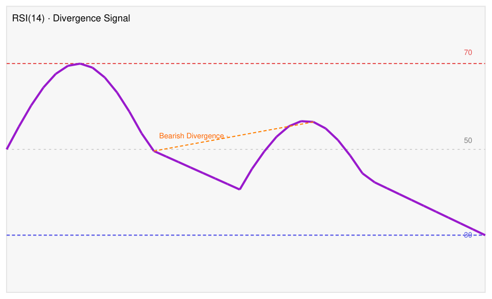

# RSI (Relative Strength Index)

## Definition

RSI is a bounded momentum oscillator developed by J. Welles Wilder Jr. It measures the speed and magnitude of recent price changes on a 0–100 scale. The standard lookback is 14 periods.

## Construction

```
RS  = Average Gain over N periods / Average Lose over N periods
RSI = 100 - (100 / (1 + RS))
```

The first average is a simple mean; subsequent averages use Wilder's smoothing (exponential with factor 1/N). Most charting platforms default to RSI(14).

## Interpretation

| Reading | Signal |
|---------|--------|
| > 70 | Overbought — upward momentum is extended; watch for reversal signals |
| 50–70 | Bullish momentum |
| 30–50 | Bearish momentum |
| < 30 | Oversold — downward momentum is extended; watch for reversal signals |

**RSI > 60 on breakout:** When RSI crosses above 60 simultaneously with a price breakout above resistance, it adds confirmation to the breakout (source: Technical Analysis Masterclass sample, 2026-06-14).

**Bearish divergence:** RSI makes a lower high while price makes a higher high. Signals weakening upward momentum and potential trend reversal. Most useful when the first RSI peak is overbought (>70) and the second peak is clearly lower.

**Bullish divergence:** RSI makes a higher low while price makes a lower low. Signals weakening downward momentum and potential reversal to the upside.

### RSI(14) Bearish Divergence — Annotated Chart



*Source: Technical Analysis Masterclass sample, ingested 2026-06-14.*

**Chart description:** A line chart displaying RSI(14) with three key horizontal reference levels: overbought at 70 (red dashed), midpoint at 50 (gray dashed), and oversold at 30 (blue dashed). The purple RSI line shows two peaks — a higher first peak near 70 and a lower second peak around 55 — connected by an orange dashed trendline labeled "Bearish Divergence." The RSI line trends downward after the second peak, approaching the oversold level of 30 by the right edge of the chart.

**Key observations:**
- The first RSI peak approaches the overbought zone (70); the second peak only reaches ~55. The downward-sloping trendline connecting them is the bearish divergence signal.
- Bearish divergence is identified by drawing a trendline across the two RSI highs: a falling line while price may still be rising confirms weakening momentum.
- After the bearish divergence completes, the RSI in this example trends sharply to the oversold zone (30), illustrating the potential for a significant price decline.
- The 50 midline acts as a regime boundary: RSI trending below 50 shifts bias from bullish to bearish momentum.

## Trading Use Cases

1. **Breakout confirmation** — RSI crossing above 60 alongside a price breakout increases breakout validity.
2. **Divergence warning** — Bearish divergence during a sustained uptrend is an early caution signal for long holders; prompts tightening stops or partial profit-taking.
3. **Regime filter** — Trend-following strategies often suppress short signals while RSI > 50, and long signals while RSI < 50.
4. **Overbought/oversold in ranging markets** — Mean-reversion entries at RSI < 30 or > 70 can work in sideways markets but are hazardous in strong trends.

## Failure Modes

- In strong trends, RSI can remain overbought (>70) or oversold (<30) for extended periods, causing premature contrarian entries.
- Divergences can precede reversals by many candles; acting on divergence alone without price confirmation leads to early exits.
- RSI is computed from closing prices only; intraday swings within a candle are invisible.
- Parameter sensitivity: RSI(14) is standard, but shorter periods (e.g., 7) generate more signals with more noise; longer periods (e.g., 21) are smoother but lag more.

## Evidence

- Source: Technical Analysis Masterclass sample (ingested 2026-06-14) — illustrative charts on BTC/USD 4H.
- No quantitative backtests in the vault as of 2026-06-14. Confidence: medium (introductory source only).

## RSI in Multi-Indicator Systems (TA4D, 2020)

- **RSI vs. Stochastic:** RSI uses closing prices only; Stochastic uses H, L, and C — "the rest of the price bar." RSI is less prone to whipsaw in trending markets; Stochastic is more sensitive and better suited to range-bound conditions (source: TA4D 2020, Ch. 13).
- **Divergence confirmation:** MACD histogram divergence + RSI divergence both present simultaneously = higher-confidence reversal warning than either alone (source: TA4D 2020, Ch. 13).
- **Validator role:** RSI commonly used as a validator indicator to confirm or deny moving average signals; when RSI diverges from the MA signal, re-examine the trade before entering (source: TA4D 2020, Ch. 13).
- **Extended overbought/oversold:** in strong trends RSI can remain above 70 (or below 30) for extended periods — an overbought reading alone is not a sell signal; require a second signal for confirmation (source: TA4D 2020, Ch. 13).

Source: [TA4D](../source-notes/2026-06-24-technical-analysis-for-dummies.md)

## Related Strategies / Setups

- [Ascending Triangle Breakout](../setups/ascending-triangle-breakout.md) — RSI > 60 provides confirmation signal.
- [Support & Resistance](../concepts/support-resistance.md) — RSI divergence often appears near key S/R levels.

## Source Notes

- [Technical Analysis Masterclass – Sample](../source-notes/2026-06-14-technical-analysis-masterclass-sample.md)

## Disambiguation: RSI Oscillator vs. IBD Relative Strength Ranking

The term **"relative strength"** is used in two fundamentally different ways in trading literature:

| | RSI (Relative Strength Index) — this page | IBD RS Ranking |
|-|------------------------------------------|---------------|
| **What it measures** | A stock's recent price changes vs. its own history (momentum oscillator) | A stock's 12-month price return vs. all other stocks (cross-sectional ranking) |
| **Output** | Oscillator, 0–100 | Percentile rank, 1–99 |
| **Creator** | J. Welles Wilder (1978) | Investor's Business Daily |
| **Used by** | Technical analysts for overbought/oversold and divergence signals | Minervini's SEPA, IBD/O'Neil CAN SLIM |
| **Wiki page** | This page | [Relative Strength Ranking](../indicators/relative-strength-ranking.md) |

When Mark Minervini and William O'Neil reference "relative strength" or "RS rating" in their books, they mean the **IBD RS Ranking**, not this RSI momentum oscillator. The two metrics are conceptually unrelated despite the shared name.

Source: [Trade Like a Stock Market Wizard](../source-notes/2026-06-18-trade-like-a-stock-market-wizard.md)
