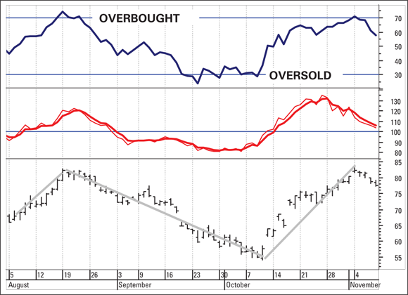
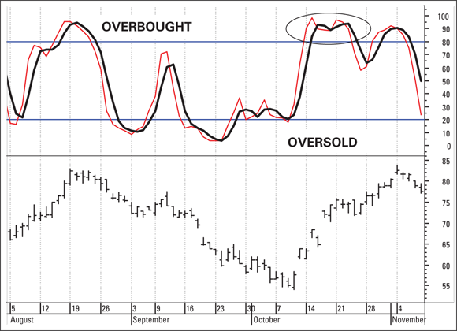
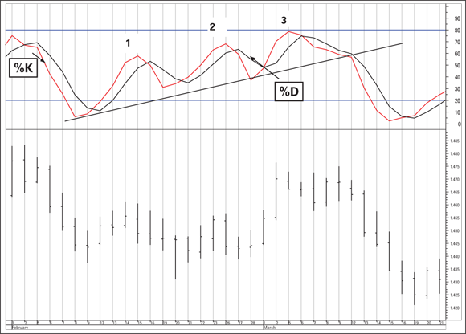

# Stochastic Oscillator

A momentum oscillator that measures where the current close falls within the high-low range of the past N periods. Invented by George Lane, who assigned the working labels %K and %D to the two formula components. The word "stochastic" means random — an ironic name for an indicator designed to find order in price action (source: TA4D 2020).

Related: [RSI](rsi.md) | [MACD](macd.md) | [Ichimoku](../concepts/ichimoku.md) | [TA4D source note](../source-notes/2026-06-24-technical-analysis-for-dummies.md)

---

## Construction

### %K — Fast Stochastic

```
%K = (Current Close − Lowest Low over N periods) /
     (Highest High over N periods − Lowest Low over N periods) × 100
```

- **N** = commonly 14 periods (5 is also standard in Lane's original formulation).
- Result is bounded 0–100.
- Reads 100 when the close equals the N-period highest high; reads 0 when the close equals the N-period lowest low.
- **Key insight:** Unlike RSI (which uses closes only), %K incorporates the full price bar — highs and lows — making it sensitive to where the close sits within the bar's range (source: TA4D 2020, Ch. 13).

### %D — Slow Stochastic (Signal Line)

```
%D = 3-period Simple Moving Average of %K
```

- Acts as a crossover line for buy/sell signals.
- %D smooths and slightly lags %K, reducing false triggers.
- Sometimes called the "slow" or "smoothed" stochastic.

### Slow vs. Fast Stochastic

| Version | Description |
|---|---|
| Fast stochastic | Raw %K with %D as 3-SMA of %K |
| Slow stochastic | The original %K is smoothed (3-SMA), becoming the new %K; %D is then a 3-SMA of the new %K |

Slow stochastic reduces whipsaws and is more commonly used in practice (source: TA4D 2020).

---

## Interpretation

### Overbought / Oversold

- **Overbought:** %K or %D above **80** (some practitioners use 70).
- **Oversold:** %K or %D below **20** (some practitioners use 30).
- Normal working range: 20–80 (source: TA4D 2020).

### Buy and Sell Signals

| Signal | Condition |
|---|---|
| Buy | %K crosses **above** %D, ideally in oversold territory (below 20) |
| Sell | %K crosses **below** %D, ideally in overbought territory (above 80) |

Crossovers that occur between the 20–80 band are less reliable. Signals carry higher conviction when the crossover occurs at or near the overbought/oversold thresholds (source: TA4D 2020).



*Fig 13-3 (p. 339): RSI and momentum comparison chart — shows stochastic context alongside RSI for comparison.*

---

## Divergence

**Bullish divergence:** Price makes a new low, but %K forms a higher low. Momentum is not confirming the price weakness — signals potential reversal up.

**Bearish divergence:** Price makes a new high, but %K forms a lower high. Momentum is not confirming the price strength — signals potential reversal down.

Divergences above the 50% midpoint carry more weight for bulls; divergences below 50 carry more weight for bears (source: TA4D 2020).

George Lane's followers also watch for a series of ascending "knees" (higher lows in the oscillator) as a support-line pattern within the stochastic itself — an early confirmation of underlying strength.



*Fig 13-4 / 13-5 (p. 344–346): Stochastic with sustained overbought reading during a strong rally (oval), and bullish divergence with three successive higher peaks in %K/%D.*

---

## Comparison with RSI

| Attribute | Stochastic Oscillator | RSI |
|---|---|---|
| Inputs | Close, High, Low (full bar) | Close only |
| Sensitivity | Higher — more whipsaw-prone | Moderate |
| Best regime | Sideways / range-bound markets | Both trending and range-bound |
| Signal line | %D (3-SMA of %K) | None by default (uses 70/30 levels) |
| Overbought/Oversold | 80 / 20 | 70 / 30 |

The stochastic is more responsive than RSI in spotting short-term momentum shifts, but this sensitivity becomes a liability in trending markets (source: TA4D 2020).

---

## Failure Modes

### 1. Stochastic in a Strong Trend

The most dangerous misuse. In a strongly trending market, the stochastic can remain overbought (above 80) or oversold (below 20) for an **extended period** without any price reversal. Crossing the 80 level is not a valid sell trigger in isolation when the trend is intact.

- Example: during a strong rally, %K repeatedly reaches 100% (highest close = highest high over the lookback period) — the indicator mechanically reads "overbought" even as the price continues higher by $10 or more (source: TA4D 2020).
- In a strong downtrend, the oscillator can stay pinned below 20 for weeks while the security continues to fall.



*Fig 13-6 (p. 348): Stochastic oscillator in error — oscillator rises from oversold during a strong downtrend, briefly crosses resistance, then price puts in a lower low. Premature entry signal.*

**Rule:** Do not use the stochastic oscillator as a buy/sell signal in a strongly trending market. Confirm with a trend filter (e.g., ADX, moving averages) before acting on stochastic signals (source: TA4D 2020).

### 2. False Overbought/Oversold at New Extremes

When the close equals the N-period highest high, both numerator and denominator are identical, producing a reading of 100 — an automatic "overbought" flag regardless of trend context. The same applies in reverse at a new N-period low (reading of 0). This is a mechanical artefact, not a signal (source: TA4D 2020).

The Williams %R indicator is essentially the stochastic inverted (using the high instead of the low in the ratio) and shares this same arithmetic limitation.

### 3. Premature Exit Signals

The stochastic has "almost no trend identification capability" and often signals a premature exit during a healthy trend (source: TA4D 2020). The indicator became faddishly popular in 1990s swing-trading culture, which led to overstated claims about its reliability.

### 4. Whipsaw in Non-Trending Conditions

Even in sideways markets, frequent %K/%D crossovers between the 20–80 band produce whipsaw trades with small losses. Using the slow stochastic and requiring crossovers at the overbought/oversold extremes reduces (but does not eliminate) this problem.

---

## Best Use Cases

- **Sideways / range-bound markets**: the stochastic performs best when prices oscillate between support and resistance without a dominant trend.
- **Short-term swing trading**: spotting overbought/oversold extremes within a trading range.
- **Confirming indicator**: use to confirm entries signaled by a trend-following indicator (e.g., wait for a moving-average crossover, then confirm with %K crossing above %D in oversold territory).
- **Divergence scanning**: as an early warning of trend exhaustion before the price reverses.

---

## Parameters

| Parameter | Default | Notes |
|---|---|---|
| %K lookback (N) | 14 periods | 5 also common (Lane's original) |
| %D smoothing | 3-period SMA | Can be extended to reduce whipsaw |
| Overbought threshold | 80 | Some use 70 |
| Oversold threshold | 20 | Some use 30 |

Most charting platforms allow a "slowing factor" to be applied to %K before computing %D, which is the standard slow-stochastic configuration.

---

## Sources

- [Technical Analysis For Dummies (TA4D)](../source-notes/2026-06-24-technical-analysis-for-dummies.md), Ch. 13, pp. 342–348 (source date: 2020 edition)
