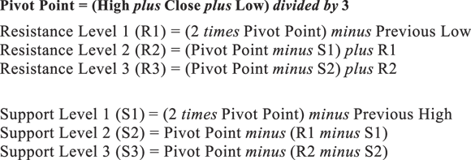
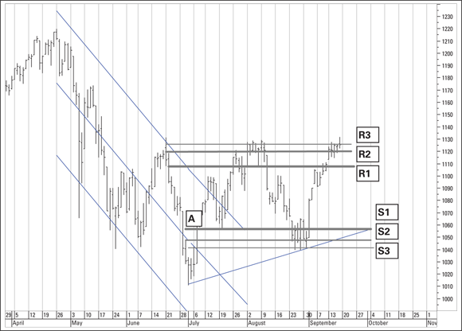
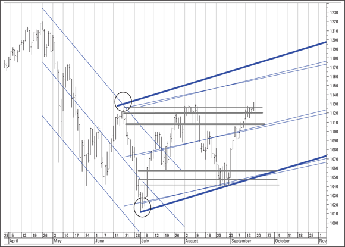

> **Disambiguation:** This page covers the mathematical Pivot Point indicator (PP formula) used by day traders to project support and resistance levels. For Jesse Livermore's "Pivotal Point" strategy concept — a strategic price level signalling directional conviction — see [Pivotal Point Trading](../strategies/pivotal-point-trading.md).

# Pivot Points (Mathematical Formula Indicator)

Pivot Points are a set of horizontal support and resistance levels calculated from the prior period's high, low, and close. They project a "normal" forward range that traders use to anticipate where price may stall or break. Popular in intraday and day trading; widely used in FX markets (source: TA4D 2020).

---

## Definition

The **Pivot Point (PP)** is the median price of the prior period:

```
PP = (High + Low + Close) / 3
```

This is the most universally applied definition. Some analysts define the pivot differently — as the center bar of three bars where the center bar contains the highest high or lowest low — but this is a separate interpretation with different usage (source: TA4D 2020).

---

## Formulas

### Resistance Levels

| Level | Formula |
|-------|---------|
| R1 | (2 × PP) − Low |
| R2 | PP + (High − Low) |
| R3 | High + 2 × (PP − Low) |

### Support Levels

| Level | Formula |
|-------|---------|
| S1 | (2 × PP) − High |
| S2 | PP − (High − Low) |
| S3 | Low − 2 × (High − PP) |



---

## Logic and Interpretation

The pivot point establishes a median reference. The support and resistance levels project a "normal" range forward:

- Prices trading between S1 and R1 indicate indecision — neither bulls nor bears have broken through.
- A break above R1, R2, or R3 signals increasing upward conviction.
- A break below S1, S2, or S3 signals increasing downward pressure.
- **R3 / S3 as extremes:** R3 typically approaches the prior period's highest high; S3 approaches the prior period's lowest low. A price reaching or exceeding these outer levels signals a meaningful breakout beyond the "normal" range (source: TA4D 2020).

The levels are useful precisely because many market participants watch the same calculations simultaneously — making them partly self-fulfilling (source: TA4D 2020).



---

## Application

### Entry and target framework (day traders)

- Buy at a low: set initial target at R1 (conservative), R2 (moderate), or R3 (aggressive).
- Short at R3: target S3, which often coincides with a hand-drawn support line.
- Works standalone or layered with other indicators such as a two moving average crossover (source: TA4D 2020).

### Combined with standard error channels

Overlaying pivot levels with standard error channels helps resolve ambiguity in sideways markets. When both an upward-sloping channel and pivot support converge near the same price, the confluence strengthens the support case even when price action is choppy and failing to produce new highs or lows (source: TA4D 2020).



### Sideways / range-trading markets

Pivot lines are particularly useful when a trend pauses and price moves sideways within a channel. The horizontal lines give concrete buy and sell targets without requiring directional commitment before a breakout occurs (source: TA4D 2020).

---

## Limitations

- **All indicators lag.** Pivot points are based entirely on prior period data. Claims that pivot points are "leading" indicators are incorrect — like all indicators, they lag (source: TA4D 2020).
- **Chart clutter.** Six support/resistance lines plus the pivot itself can crowd a chart, especially when combined with trendlines and channels.
- **Popularity cycles.** The utility of pivot points waxes and wanes; not all platforms include them as a standard indicator.
- **No universal timeframe.** Prior period can be defined as the prior day, week, or month depending on the trader's timeframe.

---

## Practical Notes

- Calculations are straightforward in a spreadsheet or by hand.
- Most trading platforms offer pivot points as a standard option.
- A good FX-focused resource for pivot level calculations: [www.earnforex.com](https://www.earnforex.com) (source: TA4D 2020).

---

## Related Pages

- [Support and Resistance](../concepts/support-resistance.md)
- [Trendlines and Channels](../concepts/trendlines-channels.md)
- [TA4D Source Note](../source-notes/2026-06-24-technical-analysis-for-dummies.md)
- [Pivotal Point Trading — Jesse Livermore's strategic concept](../strategies/pivotal-point-trading.md) (disambiguation)
