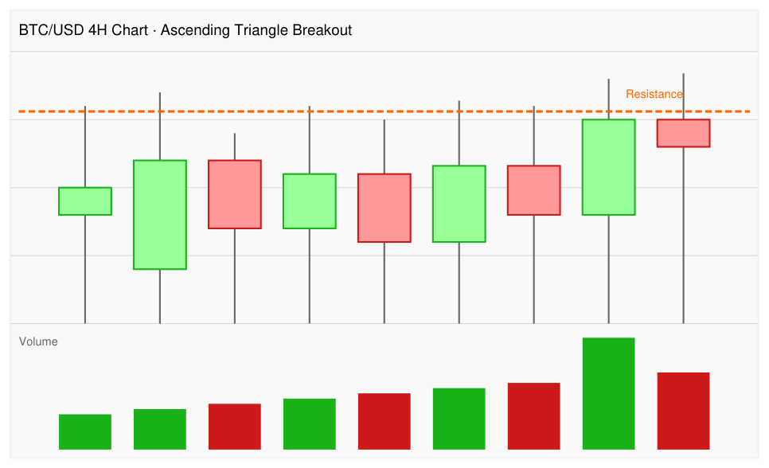

# Ascending Triangle Breakout

## Setup Summary

An ascending triangle forms when price makes a series of higher lows while repeatedly testing the same horizontal resistance level. The narrowing range coils bullish pressure. A breakout above resistance accompanied by elevated volume — ideally with RSI crossing above 60 — signals potential continuation of the prior uptrend.

Illustrated on BTC/USD 4H chart in the Technical Analysis Masterclass sample (ingested 2026-06-14).

## Preconditions

- An identifiable horizontal resistance level tested at least twice (more touches = stronger level).
- A series of rising lows forming an ascending trendline below resistance.
- Prior trend context: ideally the triangle forms as a continuation after an uptrend, not at a market bottom with no context.
- Volume declining as the triangle forms (coiling), then expanding sharply on the breakout candle.

## Checklist

- [ ] Horizontal resistance is clearly defined by at least two prior touches.
- [ ] Rising trendline connects at least two higher lows.
- [ ] Volume has contracted during triangle formation.
- [ ] Breakout candle closes above resistance (not just wicks above).
- [ ] Breakout volume is notably higher than recent average.
- [ ] RSI is at or above 60 at the time of breakout (optional but strengthens signal).
- [ ] Market regime supports trend continuation (avoid counter-trend setups).
- [ ] Liquidity and spread are acceptable for the instrument and size.
- [ ] Stop / invalidation is defined.
- [ ] Position size is within risk limits.
- [ ] Exit plan is defined (target or trailing stop).

## Entry

- **Aggressive:** Enter on close of the breakout candle above resistance.
- **Conservative (role reversal):** Wait for a pullback to the former resistance zone; enter if price holds and closes back above that level. This reduces false-breakout risk and improves risk/reward.

## Exit

- **Target:** Measured move = height of triangle (distance from trendline to resistance at the widest point) projected upward from the breakout level.
- **Trailing stop:** Trail below recent swing lows or the former resistance level (now support).
- **Stop loss:** Below the breakout candle's low, or below the former resistance zone on a conservative entry.

## Risk Controls

- Invalidation: price closes back below the breakout level (former resistance) — the role reversal has failed.
- RSI divergence after initial breakout run is a warning to tighten stops or take partial profits.
- Size to 1–2% risk per trade using the distance from entry to stop.

## Examples

### BTC/USD 4H — Ascending Triangle Breakout with Volume Confirmation

*Source: Technical Analysis Masterclass sample, ingested 2026-06-14.*

**Chart description:** A 4-hour candlestick chart of BTC/USD showing an ascending triangle pattern culminating in a breakout above a horizontal resistance level marked by an orange dashed line. The price candles show progressively higher lows while repeatedly testing the same resistance ceiling. The final two candles show a large green candle breaking above resistance and a subsequent red candle still above the resistance line. A volume panel below the price chart shows increasing volume bars over the sequence, with the breakout candle (large green bar) exhibiting the highest volume spike, confirming the breakout.

**Key observations from this chart:**
- The ascending triangle is clearly visible: a flat horizontal resistance line and a rising trendline of higher lows, indicating accumulating bullish pressure.
- The valid breakout is the large green candle closing above the orange dashed resistance line.
- Breakout validity is confirmed by the tallest volume bar in the lower panel, appearing precisely at the breakout candle.
- The subsequent red (bearish) candle staying above the former resistance line is an early sign that resistance has converted to support (role reversal in progress).
- Multiple candles of coiling price action precede the resolution — typical of well-formed ascending triangles.

## Failure Modes

- **Low-volume breakout:** Price gaps or drifts above resistance without a volume surge — higher failure rate.
- **False breakout / bear trap:** Price briefly pierces resistance then reverses below; avoided by waiting for a daily close above the level.
- **Resistance too fresh or too round:** Very round numbers or freshly set highs attract more supply; breakouts at these levels need stronger confirmation.
- **Overbought RSI at entry:** If RSI is already > 80 on the breakout, risk/reward is compressed; consider waiting for a role-reversal re-entry.
- **Broader market weakness:** Triangle breakouts in individual stocks/coins often fail if the overall market index is in a downtrend.

## Source Notes

- [Technical Analysis Masterclass – Sample](../source-notes/2026-06-14-technical-analysis-masterclass-sample.md)

## Breakout Confirmation Rules (TA4D, 2020)

Authentic breakouts require more evidence than a single bar piercing resistance:

1. **Close filter:** require the breakout bar to CLOSE above resistance — intraday highs that fail to hold are common noise (source: TA4D 2020, p. 277)
2. **Volume filter:** upside breakout on rising volume = demand confirmed; volume drying up during the base formation itself is also a positive sign (all sellers have transacted) (source: TA4D 2020, p. 277–278)
3. **Size filter:** require price to clear resistance by at least x% (e.g. 5%) before acting — prevents false positives from trivial breaches (source: TA4D 2020, p. 278)
4. **Duration filter:** require 2–3 bars of sustained close above resistance — filters one-day accidents (source: TA4D 2020, p. 278–279)
5. **Orderliness bonus:** breakout from a tight, low-volatility base is more reliable than from a choppy, high-volatility one; volatility contraction before breakout = positive sign (aligns with [VCP](../setups/volatility-contraction-pattern.md)) (source: TA4D 2020, p. 280)

Trade-off: more filters = later entry at worse price in exchange for fewer false breakouts. Match filter aggressiveness to your risk tolerance and the historical habits of the security. (source: TA4D 2020, p. 278–279)

See also: [TA4D](../source-notes/2026-06-24-technical-analysis-for-dummies.md)

## Related Pages

- [Support & Resistance](../concepts/support-resistance.md)
- [RSI](../indicators/rsi.md)
- [Breakout After Normal Reaction](breakout-after-normal-reaction.md) — Livermore-style breakout setup for comparison.
