# Trade Like a Stock Market Wizard — Mark Minervini (2013)

## One-Sentence Takeaway

Superperformance in stocks comes from requiring five factors — trend, fundamentals, relative strength, volatility pattern, and market condition — to align simultaneously at a precise low-risk entry point, combined with strict stop-loss discipline and a 3:1 win/loss ratio.

## Source Metadata

- **Raw folder:** `raw/inbox/trade_like_a_stock_market_wizard/`
- **Images:** 160 extracted (stored in `raw/inbox/trade_like_a_stock_market_wizard/assets/stock-trading/`)
- **Source type:** Book
- **Author:** Mark Minervini
- **Publisher:** McGraw-Hill
- **Published:** 2013
- **Ingested:** 2026-06-18
- **Examples span:** 1984–2012 (all historical)

> **Research posture:** All stock examples are historical. Performance claims (220% avg/year 1994–2000) are from Minervini's live-traded account and U.S. Investing Championship (1997) — not backtested simulations. These figures cover a period of exceptional bull market conditions (dot-com era). Performance attribution to the SEPA system vs. the macro regime is not independently verified. No survivorship-bias caveat is provided in the source; treat aggregate statistics with medium confidence.

---

## Chapter Map

| Chapter | Title | Core topic |
|---------|-------|-----------|
| 1 | An Introduction Worth Reading | Minervini's origin story; superperformance defined |
| 2 | What You Need to Know First | Mindset, ego vs. money, trading as a business |
| 3 | Specific Entry Point Analysis: The SEPA Strategy | SEPA framework overview |
| 4 | Value Comes at a Price | P/E ratio, PEG, valuation in growth context |
| 5 | Trading with the Trend | Stage Analysis, Trend Template |
| 6 | Categories, Industry Groups, and Catalysts | Sector leadership, catalysts, industry lifecycle |
| 7 | Fundamentals to Focus On | EPS growth, sales growth, earnings acceleration |
| 8 | Assessing Earnings Quality | Margins, guidance, Code 33, PED, inventory analysis |
| 9 | Follow the Leaders | Relative strength ranking, leader identification |
| 10 | A Picture Is Worth a Million Dollars | Chart patterns, VCP, cup-and-handle, base counting |
| 11 | Don't Just Buy What You Know | Sector and catalyst selection beyond familiarity |
| 12 | Risk Management Part 1 | Nature of risk, win/loss ratio, expectancy math |
| 13 | Risk Management Part 2 | Stop-loss execution, position sizing, difficult markets |

---

## Key Claims

| Claim | Evidence | Date / Scope | Confidence | Linked Pages |
|-------|----------|--------------|------------|--------------|
| 99% of superperformers were above their 200-day MA before their biggest advances | Author's historical study of major winners | 1984–2012 | Medium (selection bias possible) | [Stage Analysis](../concepts/stage-analysis.md) |
| 96% of biggest winners were above their 50-day MA before major moves | Same historical study | 1984–2012 | Medium | [Trend Template](../concepts/trend-template.md) |
| ~90% of biggest winners showed earnings acceleration in prior quarters | Author's historical study | 1984–2012 | Medium (not independently verified) | [Earnings Acceleration](../concepts/earnings-acceleration.md) |
| Averaged 220% per year from 1994–2000 (live account) | Author's own trading records; U.S. Investing Championship 1997 | 1994–2000 | Medium-high (live result, not backtest) | [SEPA Strategy](../strategies/sepa-strategy.md) |
| Stocks consistently top before earnings turn negative | Multiple examples (Dell, Crocs, Home Depot) | Various | Medium-high (consistent across examples) | [Earnings Acceleration](../concepts/earnings-acceleration.md) |
| Diversification does not protect from losses | Author's argument and experience | General | Low-medium (strategy posture, not empirical claim) | [Risk Management](../concepts/risk-management.md) |

---

## Trend Template (8 Criteria — All Required)

1. Price above 150-day and 200-day moving averages
2. 150-day MA above 200-day MA
3. 200-day MA trending up ≥1 month (ideally 4–5 months)
4. 50-day MA above both 150-day and 200-day MAs
5. Price above 50-day MA
6. Price ≥30% above 52-week low
7. Price within 25% of 52-week high
8. IBD RS Ranking ≥70 (preferably 80s–90s)

Full page: [Trend Template](../concepts/trend-template.md)

---

## Fundamental Minimums

- EPS growth ≥20–25% per quarter year-over-year (ideal: 40–100%+)
- Earnings acceleration: growth rate increasing quarter-to-quarter
- Sales acceleration alongside earnings (not just cost-cutting)
- Net margin expansion preferred
- P/E less important than growth trajectory; watch PEG ratio
- "Code 33": EPS + sales + margin all accelerating for 3+ consecutive quarters

---

## Risk Management Rules

- Hard stop-loss maximum: 10% below purchase price — no exceptions
- Ideal stop: ≤50% of expected average gain (e.g., 7.5% if avg gain is 15%)
- Stop determined and written before entry
- Minimum 2:1 win/loss ratio; target 3:1
- Never average down (cardinal rule)
- Raise stop to breakeven when position is up 3× initial risk
- Scale back size and tighten stops during losing streaks; never increase size to recoup losses

---

## Key Stock Examples (Historical)

| Stock | Period | Move | Key theme |
|-------|--------|------|-----------|
| Amgen (AMGN) | 1990 | +360% in 14 months | Stage 2 biotech leader; used for full stage analysis illustration |
| Apple (AAPL) | 2003 low→peak | +10,000%+ | Product catalyst turnaround (iPod→iTunes→iPhone) |
| Cisco (CSCO) | 1989–1993 | 13× | 15 of 17 quarters with 100%+ EPS growth |
| Home Depot (HD) | 1982–1992 | ~500–700% | Growth phase then deceleration warning 2000+ |
| Netflix (NFLX) | 2009–2010 | +500%+ | Category killer vs. Blockbuster; 8 quarters of sales acceleration |
| Panera Bread (PNRA) | 2000–2002 | +1,100% | Rose during Nasdaq −80% bear market |
| Pharmacyclics (PCYC) | 2009–2012 | +1,500% in 33 months | RS strength before advance; RS ranking example |
| Apollo Group (APOL) | 1999–2004 | $10→$96 | 45 consecutive quarters at/above estimates |
| Emulex (EMEX) | 2001 | +161% in 17 days | Tight base breakout, high RS in weak market |
| Monster Beverage (MNST) | 2003–2006 | — | Code 33 annual acceleration example |
| Crocs (CROX) | 2006–2009 | +400% then −99% | Fad stock — triple-digit EPS then collapse; Stage 3/4 example |
| Dell (DELL) | 1995–2009 | −80% from high | EPS deceleration leads price top by years |
| Amazon (AMZN) | 2001–2003 | +240% from buy | Bottomed ahead of Nasdaq; leadership example |
| Citigroup (C) | 2004–2009 | Stage 4 | Warning of 2008 crisis; Stage 3/4 example |

---

## Key Figures/Charts

### Stage Analysis — Amgen Sequence (Chapter 5)

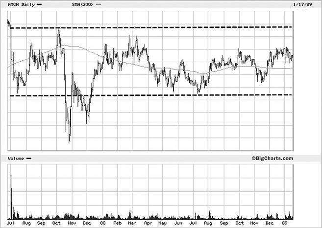

*Amgen weekly chart showing horizontal, low-volatility Stage 1 consolidation around the 200-day MA. Use in wiki: [Stage Analysis](../concepts/stage-analysis.md). Confidence: high.*

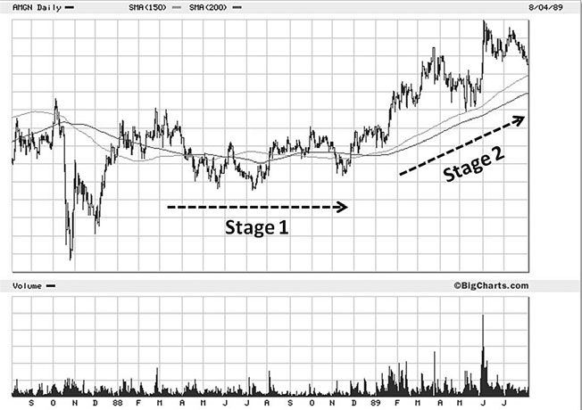

*Amgen beginning to trend above moving averages with increasing volume — transition from Stage 1 to Stage 2. Use in wiki: [Stage Analysis](../concepts/stage-analysis.md). Confidence: high.*

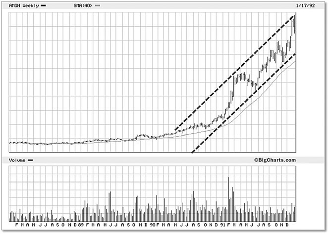

*Amgen in confirmed Stage 2 (1992) — staircase of higher highs and higher lows above all MAs. Use in wiki: [Stage Analysis](../concepts/stage-analysis.md). Confidence: high.*

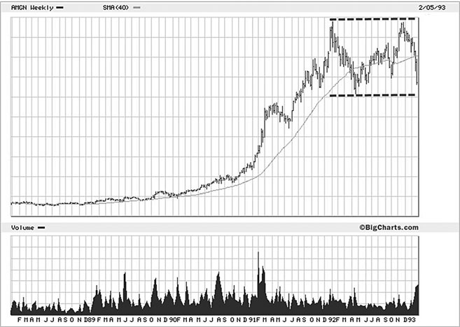

*Amgen Stage 3 (1993) — erratic price action, increased volatility, 200-day MA flattening. Use in wiki: [Stage Analysis](../concepts/stage-analysis.md). Confidence: high.*

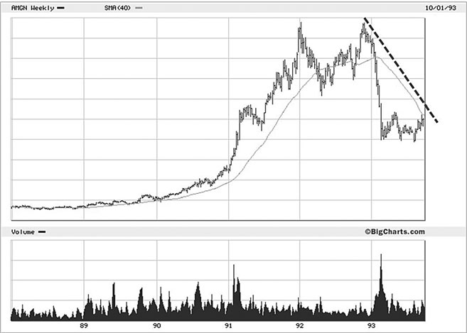

*Amgen Stage 4 — lower lows and lower highs, price well below declining 200-day MA. Use in wiki: [Stage Analysis](../concepts/stage-analysis.md). Confidence: high.*

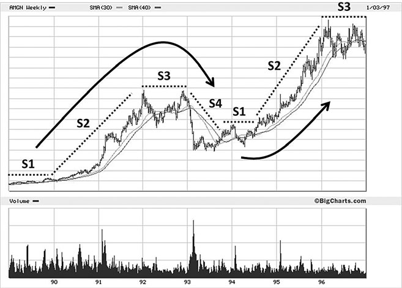

*Amgen annotated full cycle showing all four stages from 1989 to 1997. Use in wiki: [Stage Analysis](../concepts/stage-analysis.md). Confidence: high.*

### Relative Strength / Leadership (Chapter 9)

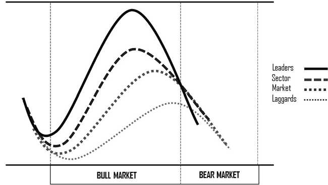

*Diagram: leaders bottom and begin advancing before their sector and before laggards. Use in wiki: [Market Leadership](../concepts/market-leadership.md), [Relative Strength Ranking](../indicators/relative-strength-ranking.md). Confidence: high.*

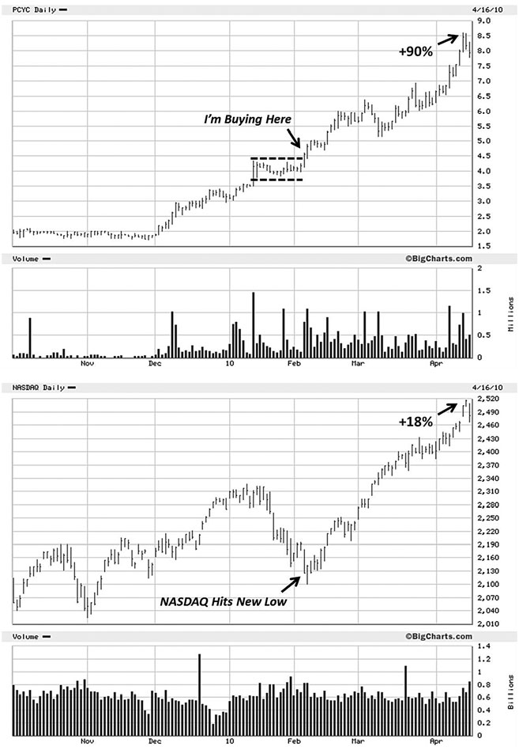

*PCYC outperforming Nasdaq before its 1,500% advance — RS strength leading price. Use in wiki: [Relative Strength Ranking](../indicators/relative-strength-ranking.md). Confidence: high.*

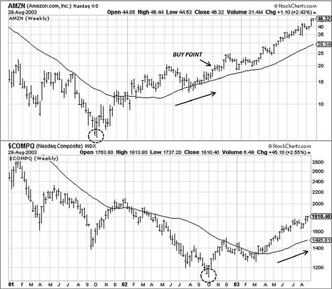

*Amazon bottoming months before the Nasdaq and advancing 240%. Use in wiki: [Market Leadership](../concepts/market-leadership.md). Confidence: high.*

### Earnings Quality (Chapter 8)

*Table showing Code 33: three consecutive quarters of simultaneous EPS, sales, and margin acceleration. Use in wiki: [Earnings Quality](../concepts/earnings-quality.md). Confidence: high.*

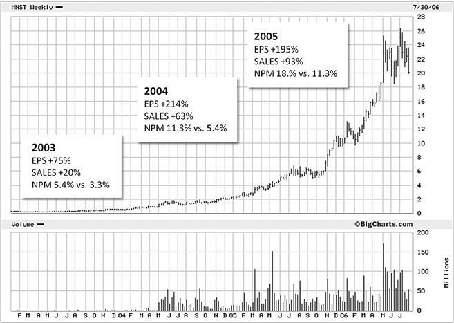

*Monster Beverage annual Code 33 acceleration with corresponding price advance. Use in wiki: [Earnings Acceleration](../concepts/earnings-acceleration.md). Confidence: high.*

*Illustrative scenario: inventories and receivables rising sharply relative to sales — earnings deterioration warning. Use in wiki: [Earnings Quality](../concepts/earnings-quality.md). Confidence: medium.*

### VCP Pattern (Chapter 10)

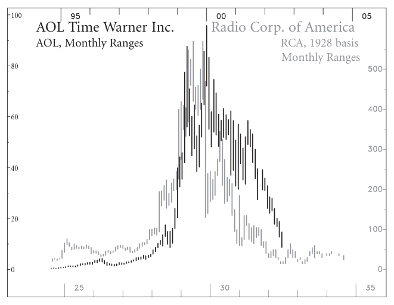

*Volatility Contraction Pattern — successive tighter pullbacks with contracting volume; vector illustration. Use in wiki: [VCP](../setups/volatility-contraction-pattern.md). Confidence: high.*

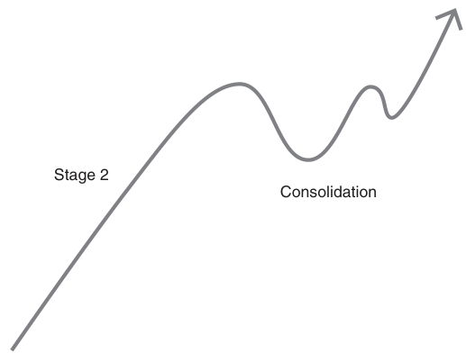

*Second VCP or cup-and-handle variant illustrating the contraction sequence. Use in wiki: [VCP](../setups/volatility-contraction-pattern.md). Confidence: high.*

### Apple Catalyst Turnaround

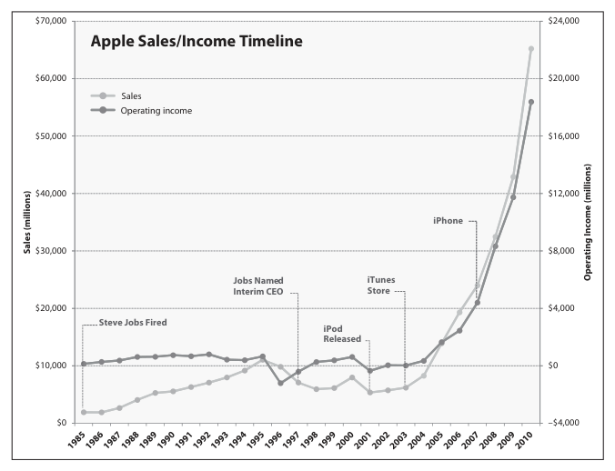

*Apple annotated timeline marking iPod (2001), iTunes (2003), and iPhone (2007) catalysts alongside stock price. Use in wiki: source note only. Confidence: high.*

### Industry Lifecycle

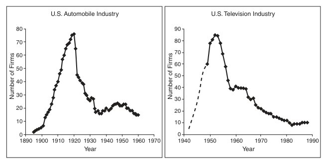

*Number of firms in U.S. automobile and television industries showing secular growth then consolidation. Use in wiki: [Stage Analysis](../concepts/stage-analysis.md). Confidence: high.*

---

## Trading-Relevant Implications

- **Buy Stage 2 only.** Never initiate in Stage 1, 3, or 4.
- **Earnings acceleration is the primary fundamental filter** — not absolute EPS levels or P/E ratios.
- **IBD RS Ranking ≥70 is required** — a non-negotiable screen before any pattern analysis. This is NOT the RSI oscillator.
- **VCP is the entry method** — wait for the tightest contraction with lowest volume, then buy the breakout on volume.
- **Risk before reward** — always determine the stop price before entry; never move stops wider after entry.
- **Base count matters** — reduce position size or avoid bases 4–5 entirely; reset resets the clock.

---

## Contradictions with Existing Wiki Pages

| Issue | Detail |
|-------|--------|
| RSI name collision | Minervini's "Relative Strength" = IBD RS Ranking (percentile vs. market), not the RSI momentum oscillator. Disambiguation note added to [RSI](../indicators/rsi.md). |
| Pivot point semantics | Minervini uses "pivot point" as the breakout buy level from a base. Livermore uses "pivotal point" as a trend reversal signal. Note added to [Pivotal Point Trading](../strategies/pivotal-point-trading.md). |
| P/E ratio | Minervini deprioritises P/E as a filter — contradicts value-investing frameworks. Flagged as growth-strategy posture. |
| Diversification | Minervini's 4–20 stock concentration directly contradicts MPT-based diversification. Flagged as strategy posture. |

---

## Pages Updated During Ingest

- [SEPA Strategy](../strategies/sepa-strategy.md) — new page
- [Stage Analysis](../concepts/stage-analysis.md) — new page
- [Trend Template](../concepts/trend-template.md) — new page
- [Volatility Contraction Pattern](../setups/volatility-contraction-pattern.md) — new page
- [Relative Strength Ranking](../indicators/relative-strength-ranking.md) — new page
- [Earnings Acceleration](../concepts/earnings-acceleration.md) — new page
- [Earnings Quality](../concepts/earnings-quality.md) — new page
- [Mark Minervini](../entities/people/mark-minervini.md) — new page
- [Risk Management](../concepts/risk-management.md) — Minervini section appended
- [Position Sizing](../concepts/position-sizing.md) — Minervini section appended
- [Trading Psychology](../concepts/trading-psychology.md) — Minervini section appended
- [Market Leadership](../concepts/market-leadership.md) — Minervini section appended
- [Pivotal Point Trading](../strategies/pivotal-point-trading.md) — terminology note appended
- [RSI](../indicators/rsi.md) — disambiguation note appended
- [Support and Resistance](../concepts/support-resistance.md) — MA-as-dynamic-support section appended
- [Trading Edge](../concepts/trading-edge.md) — SEPA as edge example appended
- [Breakout After Normal Reaction](../setups/breakout-after-normal-reaction.md) — VCP relationship note appended

---

## Follow-Up Questions

- Stan Weinstein's four-stage model (*Secrets for Profiting in Bull and Bear Markets*, 1988) is cited as foundational — ingest Weinstein for additional context on Stage Analysis.
- The 220% avg/year figure covers 1994–2000 (dot-com era) — performance vs. a buy-and-hold Nasdaq strategy in the same period would provide context.
- IBD RS Ranking requires a paid subscription — evaluate free proxy (12-month return percentile vs. S&P 500) for reproducibility.
- 160 images extracted; 145 catalogued here only (15 linked to specific wiki pages) — additional images available for future review in `raw/inbox/trade_like_a_stock_market_wizard/assets/stock-trading/`.
