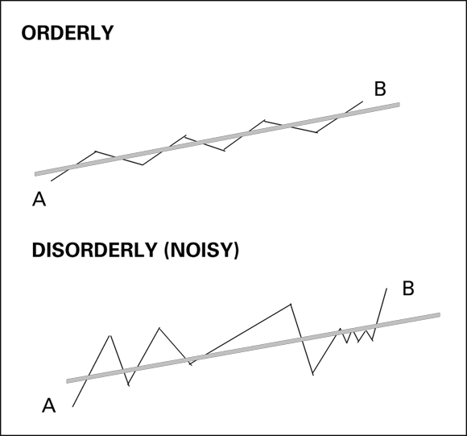

# Technical Analysis For Dummies — Barbara Rockefeller (2020)

## One-Sentence Takeaway

Technical analysis is a probabilistic, rules-based discipline in which consistent profitability depends less on indicator selection than on trade management — specifically stop-loss discipline, expectancy-positive rules, and treating every trade as a scientific hypothesis to be disproved.

## Source Metadata

- **Raw folder:** `raw/inbox/Technical_Analysis_For_Dummies/`
- **Images:** 104 extracted (stored in `raw/inbox/Technical_Analysis_For_Dummies/assets/stock-trading/`)
- **Source type:** Book
- **Author:** Barbara Rockefeller
- **Publisher:** John Wiley & Sons, Inc.
- **Published:** 2020 (4th edition)
- **ISBN:** 978-1-119-59655-4
- **Ingested:** 2026-06-24
- **Examples span:** historical; market statistics as-of 2018–2019 at latest (treat as stale)

> **Research posture:** This is an introductory-to-intermediate survey text. Performance statistics (S&P 500 historical returns, Timer Digest rankings) are as of 2018–2019 and must not be treated as current. Elliott Wave, Gann, and Hurst cycles receive chapter-level introductions only — deeper coverage requires dedicated sources. All indicator default parameters (e.g., 14-period ATR, 20-period Bollinger, 12/26/9 MACD) are presented as industry conventions, not optimised values.

---

## Chapter Map

| Part | Chapter | Title | Core topic |
|------|---------|-------|-----------|
| 1 | 1 | Introducing Technical Analysis | TA philosophy, scope, buy-and-hold critique |
| 1 | 2 | Tapping into the Wisdom of the Crowd | Supply/demand auction model, crowd behaviour |
| 1 | 3 | Trade What You See: Market Sentiment | Sentiment gauges, volume basics |
| 1 | 4 | Gaining Critical Advantage from Indicators | Indicator families, noise reduction, benchmark levels |
| 1 | 5 | Managing the Trade | Stop-loss taxonomy, position sizing, 5-step plan |
| 2 | 6 | Reading Basic Bars | OHLC construction, trend identification |
| 2 | 7 | Special Bars — An Early Warning System | Inside/outside bars, spikes, gaps |
| 2 | 8 | Redrawing the Price Bar: Japanese Candlesticks | Candlestick anatomy, doji, engulfing, multi-bar patterns |
| 3 | 9 | Seeing Patterns | Continuation and reversal patterns, measured move |
| 3 | 10 | Drawing Trendlines | Rule-based trendlines, internal trendlines |
| 3 | 11 | Transforming Channels into Forecasts | Regression channels, breakouts, pivot point S/R |
| 4 | 12 | Using Dynamic Lines | SMA, EMA, WMA, multiple MAs, MACD |
| 4 | 13 | Measuring Momentum | Momentum oscillator, RSI, Stochastic |
| 4 | 14 | Estimating Volatility | Bollinger Bands, ATR, ATR bands as stops |
| 4 | 15 | Ignoring Time to Create Better Timing | Tick bars, constant-range bars, Point-and-Figure |
| 4 | 16 | Combining Techniques | Indicator confluence, semi-system/setup/guerrilla trading |
| 4 | 17 | Judging Cycles and Waves | Wyckoff, Hurst, seasonality, Gann, Elliott Wave |
| 4 | 18 | The Mind-Blowing Ichimoku | Ichimoku components, signals, trading rules |
| 5 | 19 | Ten Secrets of the Top Technical Traders | Probability, backtesting, stops, business mindset |
| 5 | 20 | Ten Rules for Working with Indicators | Confirmation, breakout principle, convergence/divergence |

---

## Key Claims

| Claim | Evidence type | Date / Scope | Confidence | Linked pages |
|-------|---------------|--------------|------------|--------------|
| S&P 500 averaged ~8%/year over 30 years to 2018 | Published index data | 1988–2018 (stale) | Medium | [Risk Management](../concepts/risk-management.md) |
| 1927–2018: 25 S&P bull markets averaged +127% return over ~3 years | Historical analysis | 1927–2018 (stale) | Medium | [Market Structure](../concepts/market-structure.md) |
| JP Morgan (early 2019): quant strategies manage ≥$1.5T in US equities; discretionary traders ~10% of trading | JP Morgan estimate | Early 2019 (stale) | Low-medium | [Market Structure](../concepts/market-structure.md) |
| Timer Digest top ten timers in 2018 gained 12.86%–40.32% vs S&P −6.24% | Timer Digest 2018 | 2018 (stale) | Low-medium | [Trading Edge](../concepts/trading-edge.md) |
| MA default parameters (12/26/9 MACD; 14 ATR; 20 Bollinger) are well-tested over decades | Author's assertion; industry convention | As of 2020 | Medium | [MACD](../indicators/macd.md), [Average True Range](../indicators/average-true-range.md), [Bollinger Bands](../indicators/bollinger-bands.md) |
| Stop-loss discipline is more important than indicator selection | Author's synthesis across sources | General | Medium-high | [Risk Management](../concepts/risk-management.md) |
| Breakout from a pattern on volume >25% above the 50-day average volume is required for confirmation | Author's rule | General | Medium | [Chart Patterns](../concepts/chart-patterns.md) |

---

## Part 1 — Foundations

### TA Philosophy (Ch. 1)

Rockefeller defines technical analysis as the use of price, volume, and derivative indicators to forecast probable future price direction. Core premise: all known fundamental information is already reflected in price; patterns repeat because human psychology is consistent (source: TA4D 2020).

Key distinctions:
- TA analyses what traders *do*, not what they *should* do
- Buy-and-hold is critiqued as sacrificing return during bear phases
- TA is probabilistic — no indicator is right 100% of the time; expectancy over many trades is what matters

### Auction Model / Crowd Behaviour (Ch. 2)

Price is set at the margin by the last willing buyer and seller, like an eBay auction. Supply exceeds demand at resistance; demand exceeds supply at support. Crowd behaviour produces self-fulfilling patterns because enough traders act on the same chart signals (source: TA4D 2020).

Normal market: price oscillates in a range. Breaking normal: a trend emerges when one side overwhelms the other with conviction (volume). Extreme crowd sentiment (everyone bullish) precedes reversals — no buyers left to push price higher.

### Volume as Sentiment (Ch. 3)

Volume measures the *conviction* behind a price move. Key rules (source: TA4D 2020):
- Volume should expand in the direction of the trend
- Rising price on falling volume = weakening trend (divergence)
- Volume spike at a high = climactic buying; at a low = climactic selling
- On-Balance Volume (OBV) tracks cumulative buying/selling pressure

### Indicator Overview (Ch. 4)

Indicators are grouped into four families (source: TA4D 2020):
1. **Trend-following** — moving averages, MACD, ADX
2. **Momentum/oscillators** — RSI, Stochastic, ROC, CCI
3. **Volatility** — Bollinger Bands, ATR, standard deviation
4. **Volume** — OBV, Accumulation/Distribution, CMF

The "benchmark level" concept: indicators need a calibrated threshold (e.g., RSI 70/30, Stochastic 80/20) to generate actionable signals. Thresholds may need adjustment by security and timeframe.

### Trade Management (Ch. 5)

Rockefeller's 5-step trade management plan (source: TA4D 2020):
1. Identify the trend
2. Identify support and resistance levels
3. Define the entry rule
4. Define the stop-loss rule *before* entry
5. Define the profit target or trailing stop rule

Stop-loss taxonomy:
- **Fixed stop**: price level (e.g., below prior swing low)
- **Percentage stop**: fixed % below entry (simple, but ignores volatility)
- **ATR stop**: N × ATR below entry (volatility-adjusted; preferred)
- **Trailing stop**: moves up with price; locks in gains
- **Time stop**: exit if price fails to move in N bars

Recovery math: a 50% loss requires 100% gain to break even; a 25% loss requires only 33% (source: TA4D 2020). This asymmetry justifies strict loss limits.

---

## Part 2 — Price Bars

### OHLC Bars (Ch. 6)

Each bar encodes Open, High, Low, Close. The position of the close within the bar's range reveals sentiment (source: TA4D 2020):
- Close near high = bullish (buyers in control at session end)
- Close near low = bearish
- Close at midpoint = indecision

Special bars (Ch. 7):
- **Inside bar**: High and Low entirely within prior bar. Signals indecision / contraction before breakout.
- **Outside bar (engulfing)**: High and Low exceed prior bar. Signals strong reversal momentum.
- **Key reversal bar**: New high (or low) followed by close below (or above) prior close on high volume.
- **Spike**: Sudden price extension far outside normal range; often climactic.
- **Gap types**: Breakaway, runaway (measuring), exhaustion. Runaway gaps are *not* filled in a healthy trend; exhaustion gaps typically are.

### Japanese Candlesticks (Ch. 8)

*Body = open-to-close range. Wicks (shadows) = High and Low extensions. White/green body: close above open. Black/red body: close below open. (source: TA4D 2020)*

Key single-candle signals (source: TA4D 2020):
- **Doji**: open ≈ close; indecision; most significant at extremes of trends

*Long-legged doji, gravestone doji (bearish at highs), dragonfly doji (bullish at lows). (source: TA4D 2020)*

- **Hammer / hanging man**: small body at top, long lower wick. Hammer (bullish reversal at low); hanging man (bearish at high)
- **Shooting star**: small body at bottom, long upper wick — bearish reversal signal at highs
- **Marubozu**: full-body candle, no wicks — strong directional conviction

Multi-candle patterns:
- **Bullish engulfing**: small red body followed by larger green body that fully engulfs prior — strong reversal signal
- **Dark cloud cover / piercing line**: reversal patterns at highs/lows respectively
- **Morning star / evening star**: three-candle reversal patterns; middle candle gaps away from trend
- **Three white soldiers / three black crows**: three consecutive strong directional candles — continuation confirmation

Candlesticks work best when combined with support/resistance levels and volume confirmation (source: TA4D 2020).

---

## Part 3 — Patterns

### Chart Patterns (Ch. 9)

Continuation patterns (source: TA4D 2020):
- **Flag and pennant**: short consolidation on declining volume after a strong move; breakout should exceed prior move's momentum
- **Rectangle / trading range**: horizontal S/R bounds; breakout direction unpredictable — wait for confirmation
- **Ascending triangle**: rising lows + horizontal resistance = bullish bias; breakout above resistance
- **Descending triangle**: falling highs + horizontal support = bearish bias
- **Symmetrical triangle**: converging trendlines; directionally neutral

Reversal patterns (source: TA4D 2020):
- **Head and shoulders (H&S)**: three peaks, middle highest; neckline break = entry signal; measured move = head-to-neckline distance projected down
- **Inverse H&S**: same structure inverted at lows; bullish
- **Double top / double bottom**: two tests of S/R with volume divergence on second test
- **Rounding top / saucer bottom**: slow multi-month reversals; less common

**Measured move rule**: the price move following a breakout is estimated to equal the height of the pattern at its widest point (source: TA4D 2020).

### Trendlines and Channels (Ch. 10, 11)

Trendline rules (source: TA4D 2020):
- Requires minimum two confirmed touch points; three touches = confirmed trendline
- Connect *closing prices* for Rockefeller's rule-based method (not wicks)
- Slope reflects trend momentum; a flattening slope = deceleration
- Internal trendlines connect the majority of bars (ignoring extremes); useful for identifying the "average" trend

Channels (Ch. 11):
- Draw parallel line to the trendline touching the opposite extreme
- Prices oscillate between channel lines; breakout above upper channel = acceleration; breakdown below lower = trend failure
- **Regression channel**: statistically fitted (least-squares); more objective than hand-drawn

*False breakout: price pierces channel boundary intraday but closes back inside — do not act on intraday penetrations alone. (source: TA4D 2020)*

**Pivot point support/resistance** (Ch. 11):

*Standard pivot point = (H + L + C) / 3. S1 = 2×P − H. R1 = 2×P − L. S2/R2 extend further. Used by floor traders as intraday S/R benchmarks. (source: TA4D 2020)*

---

## Part 4 — Dynamic Analysis

### Moving Averages (Ch. 12)

*Two-MA crossover system: faster MA (e.g., 10-day) crossing above slower MA (e.g., 40-day) generates a buy signal. Lag is the main drawback. (source: TA4D 2020)*

Types (source: TA4D 2020):
- **SMA (Simple)**: equal weighting; most used; most lagging
- **EMA (Exponential)**: more weight on recent prices; faster response; better for trending markets
- **WMA (Weighted)**: linear weighting toward most recent; rarely used

Common periods: 10, 20, 50, 100, 200 (day); 5, 10, 20 (week). 200-day MA is the most widely watched institutional benchmark.

MA use cases:
- **Single MA as dynamic S/R**: price bouncing off MA in a trend
- **MA crossover**: entry signal (slower/faster combination)
- **Price vs. MA**: price above long-period MA = bullish regime

### MACD (Ch. 12)

*MACD line (12-period EMA minus 26-period EMA), Signal line (9-period EMA of MACD), Histogram (MACD minus Signal). (source: TA4D 2020)*

Default parameters: 12/26/9 (industry standard; well-tested over decades — source: TA4D 2020).

Signals:
- **Crossover**: MACD crossing above signal line = bullish; below = bearish
- **Zero-line cross**: MACD crossing zero confirms trend direction change
- **Divergence**: price making new high/low while MACD does not = momentum divergence; high-probability reversal warning
- **Histogram widening/narrowing**: momentum acceleration/deceleration

### Momentum and Oscillators (Ch. 13)

Rate of Change (ROC) / Momentum:
- Momentum = Close(today) − Close(N periods ago)
- ROC = (Close(today) / Close(N periods ago) − 1) × 100
- Rising momentum with rising price = healthy trend; divergence = warning

RSI (Ch. 13 — Relative Strength Index):
- Default: 14-period; overbought = 70, oversold = 30
- Divergence between RSI and price is more reliable than level extremes alone
- In strong trends, RSI can remain overbought for extended periods — do not short solely on overbought reading
- TA4D uses 14-period as default; Rockefeller notes 9-period gives faster but noisier signals (source: TA4D 2020)

Stochastic Oscillator:
- %K = (Close − Lowest Low(N)) / (Highest High(N) − Lowest Low(N)) × 100
- %D = 3-period SMA of %K (signal line)
- Default: 14-period lookback; overbought = 80, oversold = 20
- Crossover of %K above %D in oversold zone = buy signal; below %D in overbought = sell
- Slow Stochastic smooths %K first to reduce whipsaws; preferred by most practitioners (source: TA4D 2020)

### Volatility (Ch. 14)

**Bollinger Bands:**

*Upper band = 20-period SMA + 2σ. Lower band = 20-period SMA − 2σ. Width reflects volatility; squeeze precedes expansion. (source: TA4D 2020)*

Rules (source: TA4D 2020):
- Price touching or breaching a band is *not* a reversal signal on its own — it indicates an extreme, not a turn
- Band "walk": in a strong trend, price can ride the upper band for many periods
- **Bollinger squeeze**: bands narrow to historically tight width → volatility expansion likely; direction unknown — wait for breakout
- Combines well with RSI: band touch + RSI divergence + candle reversal pattern = higher-confidence entry

**Average True Range (ATR):**

*ATR = average of True Range over N periods. TR = max(H−L, H−prior C, prior C−L). ATR bands = MA ± N×ATR. (source: TA4D 2020)*

Default: 14-period ATR. Uses:
- Stop placement: initial stop = entry − 2×ATR (prevents stop being hit by normal volatility noise)
- Trailing stop: raise stop to close − 2×ATR after each profitable session
- Position sizing: risk % / (N×ATR) = shares to trade (volatility-adjusted sizing)

### Point and Figure (Ch. 15)

*P&F chart ignores time; plots X columns (rising) and O columns (falling) only when price moves by the box size. Reversal requires 3-box move in opposite direction. (source: TA4D 2020)*

Advantages:
- Filters out noise and time; only significant price moves recorded
- Patterns (double top, catapult) generate specific price targets via box count
- Useful for identifying support/resistance zones objectively

Limitation: does not incorporate volume; ignores intraday reversals below box size.

### Combining Techniques (Ch. 16)

Rockefeller's confirmation principle (source: TA4D 2020): a signal is stronger when two or more independent indicators agree. Independence matters — two indicators calculated from the same price data (e.g., RSI + Stochastic) provide less confirmation than one trend-follower (MA) plus one momentum oscillator (RSI) plus a volume indicator (OBV).

Trading approaches on a complexity spectrum:
- **Full system**: mechanical rules; all entries, exits, stops defined; backtestable
- **Semi-system**: defined rules with discretionary override allowed
- **Setup**: pattern-based trigger, discretionary management
- **Guerrilla trading**: very short-term, opportunistic; mentioned but not fully defined in source

### Cycles, Wyckoff, Elliott Wave (Ch. 17)

Wyckoff model (source: TA4D 2020):
- Markets cycle through accumulation → markup → distribution → markdown
- Large operators (institutions) accumulate during trading ranges before the markup phase
- Volume analysis is central: low-volume consolidation during accumulation; expanding volume on markup
- Historical antecedent to Stan Weinstein's Stage Analysis (see [Stage Analysis](../concepts/stage-analysis.md))

Elliott Wave (source: TA4D 2020 — introductory treatment):
- Impulse wave: 5 waves in trend direction (1-2-3-4-5); corrective wave: 3 waves counter-trend (A-B-C)
- Wave 3 is typically the longest and strongest; Wave 3 cannot be the shortest impulse wave
- Fibonacci ratios govern typical wave relationships (38.2%, 61.8%, 100%)
- Highly subjective in real-time application; multiple valid counts possible; use as context, not mechanical system
- TA4D does not present evidence for Elliott Wave predictive accuracy — treat with low confidence

Hurst cycles and Gann: mentioned in table of contents; covered at introductory level in source — not extracted.

Seasonality / calendar effects: September historically weakest month for US equities; January effect; pre-election year effect — all presented as statistical tendencies, not reliable trading rules (source: TA4D 2020).

### Ichimoku (Ch. 18)

*Five components: Tenkan-sen (9-period midpoint), Kijun-sen (26-period midpoint), Senkou Span A (average of Tenkan+Kijun, plotted 26 periods forward), Senkou Span B (52-period midpoint, plotted 26 forward), Chikou Span (close plotted 26 periods back). (source: TA4D 2020)*

Key rules (source: TA4D 2020):
- **Cloud (Kumo)**: price above cloud = bullish; below = bearish; inside = indecision
- **Cloud thickness**: thicker cloud = stronger support/resistance
- **Tenkan/Kijun cross**: Tenkan crossing above Kijun above the cloud = strong buy signal ("golden cross in cloud"); below cloud = weak signal
- **Chikou Span**: if Chikou Span is above price from 26 periods ago, confirms bullish bias
- **Senkou A vs. B**: when Span A crosses above Span B, cloud turns bullish (green cloud); opposite = bearish (red cloud)

Ichimoku integrates trend, momentum, and support/resistance into one system; commonly used on daily charts but applicable to any timeframe (source: TA4D 2020).

---

## Part 5 — Ten Lists

### Ten Secrets of Top Technical Traders (Ch. 19)

Distilled from author's synthesis (source: TA4D 2020):
1. Appreciate probability — no system works 100%; focus on expectancy
2. Backtesting matters — test every rule before trading with real capital
3. The trend is your friend — never trade against the primary trend without strong justification
4. Entries count as much as exits — a bad entry cannot be rescued by exit management alone
5. Stops are not optional — a system without stops is not a system
6. Treat trading as a business — track P&L, analyse performance, set rules in advance
7. Keep learning — market structure evolves; continue updating knowledge
8. Technical tools never go out of date — human psychology does not change
9. Diversify — across instruments, timeframes, and systems
10. Accept some math — position sizing and expectancy calculations are unavoidable

### Ten Rules for Working with Indicators (Ch. 20)

(source: TA4D 2020):
1. Don't jump the gun — wait for the indicator to confirm, not anticipate
2. Defeat math gremlins — verify indicator calculations; software errors occur
3. Embrace patterns — chart patterns and indicator signals work best together
4. Use support and resistance — indicators gain meaning at key levels
5. Follow the breakout principle — a valid breakout on volume is the core entry trigger
6. Watch for convergence and divergence — multiple indicators agreeing = higher confidence; diverging = caution
7. Backtest or practice-trade honestly — no look-ahead bias; use out-of-sample data
8. Accept that indicators will fail — no indicator works in all regimes
9. Get over secret indicators — no hidden formula; discipline and consistency are the edge
10. Open your mind — be willing to revise when the market contradicts your view

---

## Key Figures

| Figure | Description | Relevant wiki page |
|--------|-------------|-------------------|
| fig_p201_029.png | Candlestick anatomy (body, wicks, bullish/bearish) | [Candlestick Charting](../concepts/candlestick-charting.md) |
| fig_p203_030.png | Three doji types (long-legged, gravestone, dragonfly) | [Candlestick Charting](../concepts/candlestick-charting.md) |
| fig_p276_056.png | False breakout in channel | [Trendlines and Channels](../concepts/trendlines-channels.md) |
| fig_p285_059.png | Pivot point formula table | [TA4D Pivot Points](../indicators/ta4d-pivot-points.md) |
| fig_p312_065.png | Two-MA crossover system | [Moving Averages](../indicators/moving-averages.md) |
| fig_p320_069.png | MACD with signal line and histogram | [MACD](../indicators/macd.md) |
| fig_p358_080.png | Bollinger Bands squeeze and walk | [Bollinger Bands](../indicators/bollinger-bands.md) |
| fig_p360_081.png | ATR bands as trailing stops | [Average True Range](../indicators/average-true-range.md) |
| fig_p379_085.png | P&F chart patterns | [Point and Figure](../concepts/point-and-figure.md) |
| fig_p433_096_vec.png | Ichimoku component terminology | [Ichimoku](../concepts/ichimoku.md) |

---

## Wiki Pages Created or Updated

### New indicator pages
- [Moving Averages](../indicators/moving-averages.md)
- [MACD](../indicators/macd.md)
- [Bollinger Bands](../indicators/bollinger-bands.md)
- [Average True Range](../indicators/average-true-range.md)
- [Stochastic Oscillator](../indicators/stochastic-oscillator.md)
- [TA4D Pivot Points](../indicators/ta4d-pivot-points.md)

### New concept pages
- [Dow Theory](../concepts/dow-theory.md)
- [Price Bars](../concepts/price-bars.md)
- [Candlestick Charting](../concepts/candlestick-charting.md)
- [Chart Patterns](../concepts/chart-patterns.md)
- [Trendlines and Channels](../concepts/trendlines-channels.md)
- [Volume Analysis](../concepts/volume-analysis.md)
- [Ichimoku](../concepts/ichimoku.md)
- [Point and Figure](../concepts/point-and-figure.md)

### New entity
- [Barbara Rockefeller](../entities/people/barbara-rockefeller.md)

### Updated pages
- [Support and Resistance](../concepts/support-resistance.md) — breakout authentication rules, pivot point S/R
- [Market Structure](../concepts/market-structure.md) — auction model, crowd dynamics, quant dominance note
- [Risk Management](../concepts/risk-management.md) — 5-step plan, stop taxonomy, ATR stop method, recovery table
- [Trading Psychology](../concepts/trading-psychology.md) — loss denial, guru trap, business mindset, probability framing
- [Trading Edge](../concepts/trading-edge.md) — expectancy framework, confirmation principle, backtesting role
- [RSI](../indicators/rsi.md) — 14-period default, divergence emphasis, stochastic comparison
- [Ascending Triangle Breakout](../setups/ascending-triangle-breakout.md) — volume confirmation rule
- [Stage Analysis](../concepts/stage-analysis.md) — Wyckoff as historical antecedent
- [Pivotal Point Trading](../strategies/pivotal-point-trading.md) — disambiguation: TA4D pivot point = floor-trader S/R formula, not Livermore pivotal point
- [Glossary](../glossary.md) — entries: doji, marubozu, kumo, tenkan-sen, kijun-sen, chikou span, ATR, ROC, P&F, Bollinger squeeze

---

## Contradictions and Disambiguation

| Issue | Detail |
|-------|--------|
| "Pivot point" naming collision | TA4D pivot point = floor-trader formula (H+L+C)/3 and derived S/R levels. Minervini uses "pivot point" as the breakout entry level from a base. Livermore uses "pivotal point" as a trend reversal signal. Three distinct uses — see [Pivotal Point Trading](../strategies/pivotal-point-trading.md) for disambiguation. |
| RSI name collision | TA4D RSI = Wilder's momentum oscillator (14-period). Minervini's "Relative Strength" = IBD RS Ranking (percentile rank vs. market). See [RSI](../indicators/rsi.md) for disambiguation. |
| Diversification tension | TA4D Chapter 19 recommends diversification across instruments and systems. Minervini recommends 4–20 stock concentration. These are compatible if interpreted as applying to different strategy types (portfolio vs. single-system). |
| Elliott Wave confidence | TA4D presents Elliott Wave as a popular framework but provides no evidence of predictive accuracy. All Elliott Wave content extracted at low confidence. |

---

## Needs Review

- All market performance statistics (S&P returns, bull market counts, Timer Digest rankings) are as of 2018–2019 — treat as historical reference data only, not current benchmarks
- Elliott Wave, Gann, and Hurst cycles are introductory in TA4D; dedicated sources needed for deeper treatment
- [Barbara Rockefeller](../entities/people/barbara-rockefeller.md) entity page is seed status — limited biographical detail in source
- "Guerrilla trading" is mentioned in Ch. 16 but not fully defined; not extracted to a standalone page
- Wyckoff model covered briefly in Ch. 17; Stan Weinstein's original work (1988) is the applied modern version and remains un-ingested
- 104 images extracted; 10 linked directly in this source note; remaining 94 available in `raw/inbox/Technical_Analysis_For_Dummies/assets/stock-trading/` for future review

---

## Related Source Notes

- [How to Trade in Stocks — Jesse Livermore](2026-06-13-how-to-trade-in-stocks-jesse-livermore.md) — Livermore's Pivotal Point strategy is a precursor to TA4D's pattern-based entry framework; tape reading aligns with price bar and volume analysis
- [Trade Like a Stock Market Wizard — Mark Minervini](2026-06-18-trade-like-a-stock-market-wizard.md) — SEPA Trend Template uses the same 200-day/50-day MA framework covered in TA4D Ch. 12; VCP aligns with TA4D's volatility contraction and breakout confirmation rules
- [Reminiscences of a Stock Operator](2026-06-19-reminiscences-of-a-stock-operator.md) — Livermore's tape reading and line-of-least-resistance concept aligns with TA4D's trend-following and volume analysis foundations
